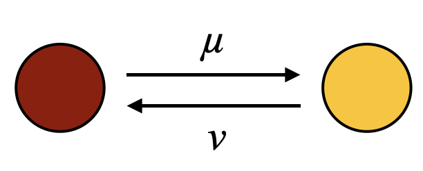

Simulating Genetic Drift under the Wright-Fisher Model
======================================================

The Wright-Fisher (WF) model is arguably the most comonly used framework for modelling genetic drift. Although we didn't explicitly name it in class, all of our excercises durring lecture were based on this model. Briefly, this model considers a bi-allelic locus within a population of haploid, randomly-mating individuals with non-overlapping generations. This means that after each generation, the entire population is replaced by its offspring. In its simplest form, this model also assumes a constant population size across generations and no selection. Note that, although the WF model assumes a group of *haploid* individuals, it turns out that the dynamics predicted by models for diploid populations with two sexes are remarkably similar to those under Wright-Fisher. Since the haploid model is simpler mathematically, it is often used as a more practical yet very close approximation of diploid models. 
<br><br>
In today's practical we will simulate the evolution of allele frequencies under the WF model and explore what such simulations can tell us about the evolutionary process.

## The Basic Model

In its most basic form, the WF model considers a population of constant size 2N with no mutation or selection. Lets start with a population composed of 2N = 50 individuals, and a allele frequencies of p = 0.64 and q = 0.46. 


To obtain the allele frequencies of the next generation we can sample 50 individuals at random from our population, with the probability of sampling a red allele being *p* and a yellow one *1-p*. We can do this in R as follows:

```R
sample(c("R","Y"), 50, rep=T, prob=c(0.64, 0.36))

```
This produces an output similar to the one below:
```R
[1] "Y" "R" "R" "R" "R" "Y" "R" "R" "R" "Y" "Y" "R" "Y" "Y" "Y" "R" "R" "R" "R" "R" "R" "Y" "R" "R" "Y" "R" "R" "R" "Y" "Y"
[31] "Y" "R" "R" "R" "R" "Y" "R" "Y" "R" "R" "R" "R" "R" "Y" "Y" "R" "R" "R" "R" "Y"
```
We can ask R to count the number of Red and Yellow alleles in our new population and calculate their frequencies
```R
alleles<-sample(c("R","Y"), 50, rep=T, prob=c(0.64, 0.36))
table(alleles)/50
 R   Y 
0.54 0.46 
```
Our new allele frequency (*p*) is 0.54 (quite a jump!). We can repeat this same excercise using our new allele frequencies to obtain the next generation.
```R
alleles<-sample(c("R","Y"), 50, rep=T, prob=c(0.54, 0.46))
table(alleles)/50
 R   Y 
0.56 0.44 
```
And so on and so forth....
<br><br>
To obtain allele frequencies over a large number of generations we can use a *loop* to execute the code above multiple times. 
<br>
First lets create an empty vector (ie. a group of numbers) that we will populate with allele frequencies fo each generation, and set the first value to 0.64.
```R
p_vec<-c()
p_vec[1]<-0.64
```
We already have *p* for the first generation (0.64). Now lets loop over generations 2-100.
```R
for(i in 2:100){
  p_exp=p_vec[i-1] #the expected p is p from the previous generation
  alleles<-sample(c("R","Y"), 50, rep=T, prob=c(p_exp, 1-p_exp))
  freqs<-table(alleles)/50
  p_vec[i]<-freqs[1]
  }
  ```
  Finally, lets plot our allele frequencies over time (generations 1-100). 
  
  ```R
  plot(1:100, p_vec, type='l', xlab="Generation", ylab="Allele Frequency (p)", ylim=c(0,1), xlim=c(1,100))
  ```
  
  
  In order to draw generalities out of simulations we should simulate multiple times. To make this easier, we can create an R *function* that runs our simulation given some initial parameters, which we can then run many times. We can use our same code above, and replace some of the numbers for variables. 
  
  ```R
drift_traj<-function(N,p0,ngen){
  p_vec<-c()
  p_vec[1] <- p0 	 
  
  for( i in 2:ngen){
		p_exp <- p_vec[i-1]
		p_vec[i] <- rbinom(1,2*N,p_exp)/(2*N)
		}
	return(p_vec)
}
```
Note that instead of sampling all alleles and counting them, this time we sampled directly from the binomial distribution. This approach is exactly equivalent to what we used previously, but involves less coding, which. 
<br><br>

Lets test out our function
```R
drift1<-drift_traj(N=25, p0=0.64, ngen=50)
drift1
 [1] 0.64 0.70 0.70 0.66 0.62 0.56 0.70 0.72 0.78 0.74 0.66 0.62 0.68 0.74 0.72 0.68 0.76 0.72 0.80 0.78 0.80 0.88 0.88 0.84
[25] 0.80 0.76 0.82 0.92 0.86 0.94 0.92 0.96 0.96 1.00 1.00 1.00 1.00 1.00 1.00 1.00 1.00 1.00 1.00 1.00 1.00 1.00 1.00 1.00
[49] 1.00 1.00
```
Now lets run 100 simulations for 50 generations using a population size of 2N=60 and initial allele frequency p0 of 0.4

```R
## First lets define our parameters
nsim<-100
ngen<-50
N<-30
p0<-0.4


## Create an array (ie. table) with 100 columns and 50 rows to populate with our iterations
sims<-array(dim=c(ngen, nsim))

#Use a loop to run simulations

for(j in 1:nsim){
  sims[,j]<-drift_traj(N=N, p0=p0, ngen=ngen)
  }
```

Finally, lets plot
```R
#Create an empty plot by specifying "type=n" in the plot command
plot(0,0,xlab="Generation", ylab="Allele Frequency (p)", ylim=c(0,1), xlim=c(1,ngen), type="n")

#plot each simulation
for(i in 1:nsim){
  points(1:ngen, sims[,i], type="l", lwd=0.5)
  }
```

How does your plot look? Is it what you expected given what you know about genetic drift? Don't close the plot window just yet.
<br><br>
Now lets see how well our simulations match some theoretical expectations.
<br>
Although allele frequencies will deviate widely from the initial conditions in each independent simulation *on average* we expect p to remain constant *across simulations*. Lets check if this holds
```R
#Calculate the average allele frequency across simulations at generations 10, 25, and 50 

mean(sims[10,])
[1] 0.411
mean(sims[25,])
[1] 0.4148333
mean(sims[50,])
[1] 0.4265
```
As expected, the average allele frequencies at different points in our simulations hover around the initial value of 0.4.
<br><br>
Now try to do the same for the heterozygocity. 
<br>
First calculate the expected heterozygocity at a few different time points using the equation
<br>
$$H_t=H_{0}\Big(1-\frac{1}{2N}\Big)^{t}$$
<br>
Then calculate the observed heterozygocities for all simulations at these same time points and average them. Do they match?
<br><br>
<details>

<summary> click here to see the answer </summary>

Calculate expected heterozygocity at t = 25 and 50
  
```R
  N<-30
  p0<-0.4
  
  #calculate H0
  H0<-2*p0*(1-p0)

  #Expected H at t=25
  H0*(1-1/(2*N))^25
  [1] 0.3153264
                  
  #Expected H at t=50
  H0*(1-1/(2*N))^50
  [1]0.2071473
 ``` 
 Now calculate observed heterozygocities

```R
  hets25<-2*sims[25,]*(1-sims[25,])
  mean(hets25)
  [1] 0.3302167

  hets50<-2*sims[50,]*(1-sims[50,])
  mean(hets50)
  [1] 0.2163833
```
0.32 vs 0.33 and 0.21 vs 0.22. Pretty close!!
</details>

## Wright Fisher with Mutation
  
As we've discussed in the past under the model studied in the previous section one allele is always expected to become fixed at some point. This would predict that most natural populations should be genetically invariant, which is clearly not the case. In reality, as genetic drift eliminates genetic variants, mutation adds new ones to the population. To incorporate mutation into our model we can add two parameters, *u* and *v*, which represent the mutation rate from red to yellow and yellow to red, respecively.


  
We can use these mutation rates to calculate the expected value of *p* for the next generation.
  <br>
  $$p_{t+1}=p_t(1-u)+(1-p_t)v$$
  <br>
The first term of the sum represents the probability of a red allele *not* mutating to yellow, while hte second term reperesents the probability of a yellow allele mutating to red. We can now incorporate this expression into our code from the previous point to write a function that simulates genetic drift and mutation. 
  
  ```R
driftMut_traj <-function(N,u,v,p0,ngen){
p_vec<-c()
p_vec[1] <- p0 	 

	for( i in 2:ngen){
		p_exp<-p_vec[i-1]*(1-u) + (1-p_vec[i-1])*v 
		p_vec[i]<-rbinom(1,2*N,p_exp)/(2*N)
		}
	return(p_vec)
	}
```
Run a few simulations using similar parameters as in the previous point (perhaps with 200 instead of 50 generations) and mutation rates *u* = 0.005 and *v* = 0.007 mutations per generation. What do you notice? 
