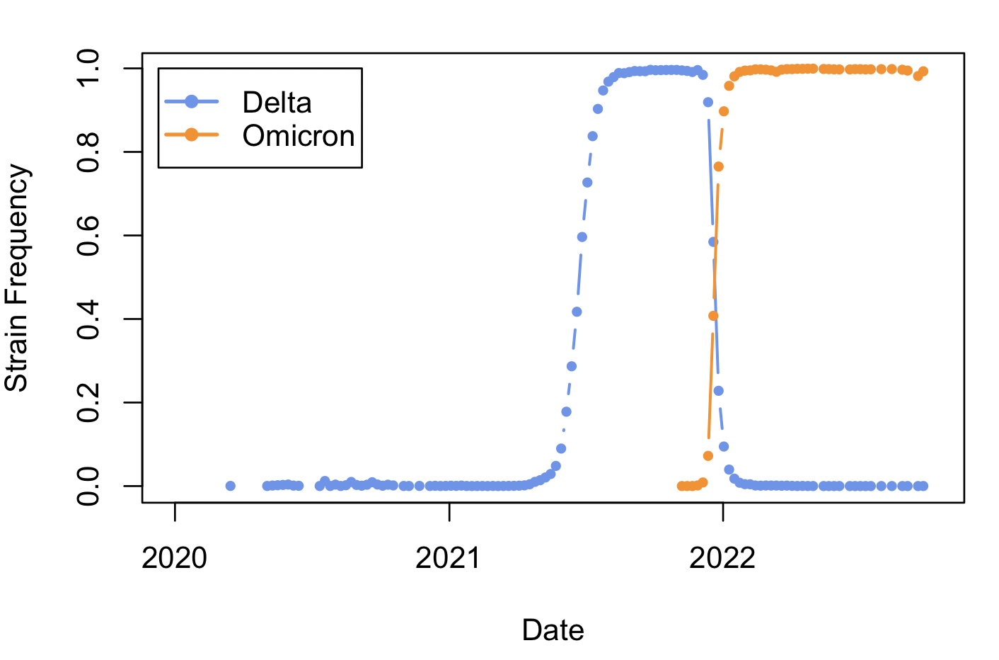
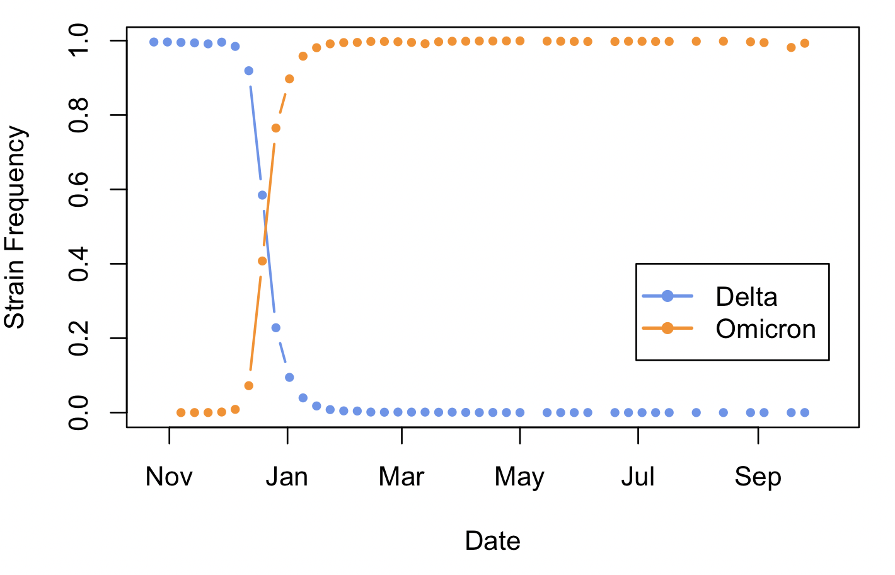

<!---
Single-locus selection
====================

Single-locus models that describe the trajectory of an allele under selection over time have played an important role in our understanding of how this force impacts genetic and phenotypic variation in biological systems. Today we will be using these models in two ways: First, we will use time-series data of genotype and phneotype frequencies to estimate selection coefficients from deterministic models of selection. Second, we will use simulations to evaluate the degree to which the theoretical results derived in class regarding the interaction of selection and drift, for which several symplifying assumptiosn were made, describe the behavior of a whright-fisher population under selection. 

## Estimating selection coefficients from genotype frequency time series
--->
Estimating selection coefficients from genotype frequency time series
====================
Selection coefficients (usually denoted as $s$) describe the extent to which selection deviates allele frequencies from a given neutral model (e.g. Hardy-Weinberg or Wright-Fisher). As such, they are a very useful tool to gain insight on the strenth of selection experienced by genotypes (and the phenotypes that they code for) in a given environment. In  class we have derived multiple mathematical expressions for the allele frequency change over time and $s$. Today we will be looking at a common way to estimate $s$ from time-series data of genotype frequencies using these equations. In general, our approach will consist on fitting models of allele frequency change to data in order to find the best-fitting values of $s$. We will be working in R, using the packages `minpack.lm`.

### Selection coefficients from haploid allele frequencies: The Omicron takeover

At the end of 2021 and beginning of 2022 the Delta variant of the SARS-Cov2 virus was the most prevalent strain worldwide. Around that time a new lineage named Omicron was first detected, and very quickly took over Delta and all other lineages, to the point where the overwhelming majority of viral strains recovered in 2022 by surveilance efforts belonged to the Omicron lineage. This fast takeover suggests that Omicron had a strong selective advantage over Delta. Our goal here will be to estimate the selective coefficient associated to Omicron's takeover.  
<br><br>
The data we will be using was downloaded in late 2022 from the Global Initiative on Sharing Avian Influenza Data (GISAID), a repository that compiles and maintains surveilance data on several infectious diseases. Download it from Canvas and read it into R. 

```R
covidFreqs=read.table("DeltaOmicron.tsv",  h=T)
```
This table contains the number of patients infected with the Delta and Omicron strains in the US for each week between December of 2019 and October of 2022, as well as the total number of cases reported for which the SARS-Cov2 strain was known. To make these data useable for population genetic model fitting we first need to make a few adjustments, namely converting dates to a format that R recognizes as dates (instead of character strings), and calculating the strain frequencies

```R
# Tell R that the "Dates" column contains dates
covidFreqs$Date=as.Date(covidFreqs$Date, format="%Y-%m-%d")

##Get strain frequencies
covidFreqs$DeltaFreq=covidFreqs$Delta/covidFreqs$TotalCases
covidFreqs$OmicronFreq=covidFreqs$Omicron/covidFreqs$TotalCases
```
Now that the data are formatted lets visualize them
```R
# Plot Delta
plot(covidFreqs$Date, covidFreqs$DeltaFreq, type="b", xlab="Date", ylab="Strain Frequency", lwd=1.5, col="cornflowerblue", pch=16, cex=0.75)

#Add Omicron
points(covidFreqs$Date, covidFreqs$OmicronFreq, type="b", lwd=1.5, col="darkorange", pch=16, cex=0.75)

#Add Legend
legend(as.Date("2019-12-10"),1, c("Delta","Omicron"), col=c("cornflowerblue","darkorange"), lwd=2, pch=16)
```


The data clearly show the fluctuating cycles typical of viral strain evolution. <br>

<b>Question 1:</b> Does the selection coefficient of the Delta variant relative to other strains appear to have been stable over time or has it changed?
<details>
<summary> Click here to see the answer</summary>
<br>
The fact that Delta increased rapidly and then decreased implies that its selection coefficient has changed over time, being initially positive as the strain rose in frequency and negative as it declined. 
</details>

Since the models we have considered assume $s$ stays constant over time, and we are mainly interested in the replacement of Delta by Omicron, we need to crop our dataset so that it only includes a relevant time window. <br>
<br>
<b>Question 2a:</b> Select a time window through which $s$ appears to have remained constant, and crop the data as detailed below to only include observations durring this time. 

```R
# Create a new table with only the data between two dates. Secify them below in the following format: "YYY-MM-DD". FOr example, Mar 22, 2024 would be "2024-03-22" 
minDate=as.Date("EARLIEST DATE")
maxDate=as.Date("LATEST DATE")
covidFreqs_crop=covidFreqs[covidFreqs$Date>minDate & covidFreqs$Date<maxDate,]

# Plot new range
plot(covidFreqs_crop$Date, covidFreqs_crop$DeltaFreq, type="b", xlab="Date", ylab="Strain Frequency", lwd=1.5, col="cornflowerblue", pch=16, cex=0.75)
points(covidFreqs_crop$Date, covidFreqs_crop$OmicronFreq, type="b", lwd=1.5, col="darkorange", pch=16, cex=0.75)
legend(as.Date("2022-06-30"),0.4, c("Delta","Omicron"), col=c("cornflowerblue","darkorange"), lwd=2, pch=16)
```
<!---

--->
<br>
<b>Question 2b:</b> Do the data in this new range seem appropriate to analyze with the models we covered in class? Why or why not?
<br><br>
Before we estimate $s$ we need to re-express our time axis so that it starts (ie. has a value of 0) close to the benining of our focal time window, and we need to convert it from days to generations. Recently Hart and collaborators ([2022](https://doi.org/10.1016/S1473-3099(22)00001-9)) estimated the generation time for SARS-Cov2 strains Alpha and Delta to be 5.5 and 4.7 days. Since we don't have a specific estimate for Omicron, 5 days per generation seems like a sensible assumption.<br>
<br>
<b>Question 3:</b> What does the generation time mean for a virus?
<!--
<details>
<summary> Click here to see the answer</summary>
<br>
In viruses, the generation time can be seen as the time between someone getting infected and pasing the virus to another person. 
</details>
-->

```R
#Create a new column with the dates converted to number of days after Oct 24
covidFreqs_crop$DateNumeric=covidFreqs_crop$Date-covidFreqs_crop$Date[1]

# Now transform that to number of generations assuming tGen = 5 days

genT=5
covidFreqs_crop$DateGen=as.numeric(covidFreqs_crop$DateNumeric/genT)
```
Now it is finally time to estimate $s$. To do so, we will use non-linear least squares to fit the expression for the expected allele frequency under Hardy-Weinberg given initial frequency $p(0)$ and selection coefficient $s$. 
$$p(t)=\frac{p(0)}{p(0)+(1-s)^t(1-p(0))}$$

Run the code below. Note that instead of assuming $p(0)$ corresponds to the frequency at which we first observed Omicron, we are also estimating this parameter. This is because strains need to rise to some frequency before we actually detect them, so the frequency at which we first observe a strain is not likely to be its actual initial frequency, the value of which may be of interest.

```R
covFit=nlsLM(OmicronFreq~p0/(p0+((1-s)^DateGen)*(1-p0)), data=covidFreqs_crop, start=list(p0=1e-5, s=0.01), trace=T)
```
Did everything go as expected? You have likely gotten a warning from R, stating that the algorithm ran for the pre-extablished maximum number of generations. <br><br>

<b>Question 4:</b> Should we keep the results of this model-fitting excersise? If no, what would you do differently to obtain more trustworthy results?
<!--
This is not ideal, as it raises the possibility that our algorithm didn'd find parameter values that fit the model appropriately, but rather just ran for a pre-specified maximum ammount of iterations and stopped. How would you solve this?
-->
<details>
  <summary> Click here to see code I used to solve this problem</summary>

<!--Since computational time is not an issue here, it is advisable that we run the algorithm for longer. To do so, we can specify a higher maximum number of iterations. --->

```R
covFit=nlsLM(OmicronFreq~p0/(p0+((1-s)^DateGen)*(1-p0)), data=covidFreqs_crop, start=list(p0=1e-5, s=0.01), trace=T, control=list(maxiter=500))
```
</details>
 
Using the code above the model seems to have converged this time. Lets take a look at the estimated parameters. 
```R
covFit

# Nonlinear regression model
#  model: OmicronFreq ~ p0/(p0 + ((1 - s)^DateGen) * (1 - p0))
#   data: covidFreqs_crop
#       p0         s 
#  3.238e-07 6.829e-01 
# residual sum-of-squares: 0.006012

# Number of iterations to convergence: 57 
# Achieved convergence tolerance: 1.49e-08
```
<b>Question 5:</b> The model estimated an initial allele frequency of $3\times10^{-7}$. What is the estimate for the seelction coefficient? What does this number mean in terms of the selective advantage of Omicron over Delta in (rough) quantitative terms? Would this explain why Omicron took over the world in a few weeks?
<br>
Now, before buying definitively into our results, we should visualize how well the model with our estimated parameters fits the data. 
```R
#First Get the expected genotype frequencies under the model

#Create vector with the number of generations
gen=1:max(covidFreqs_crop$DateGen)

#Extract parameter estimates from model
p0_exp=coef(covFit)[1]
s_exp=coef(covFit)[2]

#Use parameters to calculate expected allele frequencies under the model
exp=p0_exp/(p0_exp+((1-s_exp)^gen)*(1-p0_exp))
```

<b>Question 6:</b> How well does our very simple model that assumes no mutation and infinite population size fit the Omicron takeover?  

### Estimating Selection Coefficients in Diploids: The Peppered Moth
Haploid genomes are very ameanable for popualtion genetic modelling, since having a single copy of each locus simplifies the connection between genotype and phenotype quite a bit. Diploidy is, however, widespread in nature, so we will now use a similar strategy as above to estimate $s$ in a diploid system. We will be considering data of the peppered moth, <i>Biston betularia</i>, which exhibits two different color morphs: light grey and very dark grey wings and body. From crossing experiments and genome-wide association studies, it is known that the dark morph arises from the insertion of a transposable element upstream of the gene <i>cortex</i>, which results in an overmelanization of the body. A single copy of this insertion results in considerable melanization, so this allele can be considered dominant over the less melanized allele. 


In the late 1840s around the end of the Industrial Revolution in Britain, biologists noticed the melanic morph of <i> B. betularia</i> for the first time, existing at low frequencies. By the turn of the century, the vast majority of moths observed in Britain were melanic, leading biologists to argue that this morph had a selective advantage over its grey counterpart in the environmental conditions created by industrialization. Specifically, they hypothesized that environmental pollution had both reduced the population of tree-bark lichens, and deposited black soot on surfaces, drastically reducing the availability of grey surfaces upon which grey moths could perch while camouflaged. Melanic moths, on the other hand, were well camouflaged on the new sooty surfaces. <br><br>

As the British economy shifted into post-industrialism, air polution was greatly reduced, both due to stronger emission regulations and the fact that the "dirtier" industry was outsourced to other countires. As this happened, a re-surgence of the grey morph was observed: Between the late 1960s and the early 2000s the frequency of the melanic morph dropped to very low levels. This ocurred independently in multiple cities in the UK and US (including Detroit!). The peppered moth therefore became an banner exaple of Darwinian evolution (i.e. positive selection): As conditions changed, the phenotypic (and genetic) makeup of populations evolved to match them. <br><br>

How strong does selection need to be for us to observe such a textbook example? Lets find out. On Canvas you will find a file with the morph frecuencies for <i>B. betularia</i> captured in Leeds, England between 1967 and 2003. Load it into R and calculate the morph frecuencies:

```R
# Load
mothDat=read.table("B_bet.tsv",h=T)

#Calculate frequencies
mothDat$FreqCarbonaria=mothDat$carbonaria/(mothDat$carbonaria+mothDat$typica)
mothDat$FreqTypica=mothDat$typica/(mothDat$carbonaria+mothDat$typica)

#Plot! 
par(mfrow=c(1,2))
plot(mothDat$Year, mothDat$FreqCarbonaria, pch=16, xlab="Year", ylab="Frequency of Melanic Morph", ylim=c(0,1))
plot(mothDat$Year, mothDat$FreqTypica, pch=21, bg="grey", xlab="Year", ylab="Frequency of Light Morph", ylim=c(0,1))
```

Although selection is acting on phenotypes, our models deal with allele frequency change over time. Therefore, wee need to obtail allele frequencies from our phenotype data. <br><br>

<b>Question 7:</b> Assuming this trait is controlled by a single locus with two alleles, and that the melanic morph is fully dominant over the light morph, use the genotype frequencies to calculate the frequency of the "light" allele. Explain your reasoning. 

<details>
  <summary> Click here to see code I used to do this</summary>

```R
mothDat$q=sqrt(mothDat$FreqTypica)
```
</details>

Now we have a time series of allele frequency change over time. All we need is a way to calculate the expected allele frequency series given a specific $s$ and $p_0$ in order to find the best-fitting values of these two parameters. As we saw in lecture, such an expression cannot be derived analytically in the diploid case. We can, however, obtain an expression for the change due to selection in a single generation:

$$ p_{(t+1)}=\frac{p^2+pq(1-hs)}{1-2pqhs-q^2s}$$

Where $p$ is the allele frequency at generation $t$ and $q=(1-p)$. <br><br>

With this equation, we can write what is known as a *recursion*, which in our case is basically a short computer program to numerically evaluate the change in allele frequency over many generations by repeatedly applying the expression for change over one generation.  
```R
pprimeTraj <- function(p0,s, h, ngen){

	ps=numeric(ngen+1)
	ps[1]=p0

	for(i in 2:(ngen+1)){
		p=ps[i-1]
		q=1-p
		wbar=1-2*p*q*h*s-q^2*s
		pp=(p^2+(1-h*s)*p*q)/wbar
		ps[i]=pp
	}
	names(ps)=0:ngen
	return(ps)
}

## Run an example recursion
rec=pprimeTraj(p0=0.01,s=0.2,h=0,ngen=50)
rec
         0          1          2          3          4          5          6          7          8          9         10         11         12         13         14         15         16         17         18 
0.01000000 0.01243812 0.01545215 0.01916824 0.02373500 0.02932486 0.03613404 0.04438021 0.05429714 0.06612497 0.08009560 0.09641300 0.11522923 0.13661880 0.16055525 0.18689502 0.21537340 0.24561549 0.27716182 
        19         20         21         22         23         24         25         26         27         28         29         30         31         32         33         34         35         36         37 
0.30950476 0.34212908 0.37454966 0.40634080 0.43715415 0.46672545 0.49487196 0.52148373 0.54651153 0.56995394 0.59184506 0.61224386 0.63122542 0.64887410 0.66527846 0.68052752 0.69470827 0.70790403 0.72019342 
        38         39         40         41         42         43         44         45         46         47         48         49         50 
0.73164985 0.74234131 0.75233046 0.76167471 0.77042660 0.77863401 0.78634061 0.79358610 0.80040664 0.80683510 0.81290141 0.81863280 0.82405410

## Plot it
plot(0:50, rec, pch=16, xlab="Generations", ylab="Allele Frequency")
```
<b>Question 8:</b> Take a moment to look over the above function and its output. Can you tell what it does? Briefly explain how this function produces a time series of allele frequencies under selection. 
<br>
To actually fit a recursion, we need to have a function that produces the expected allele frequency at the specific time points that we have sampled. .  


