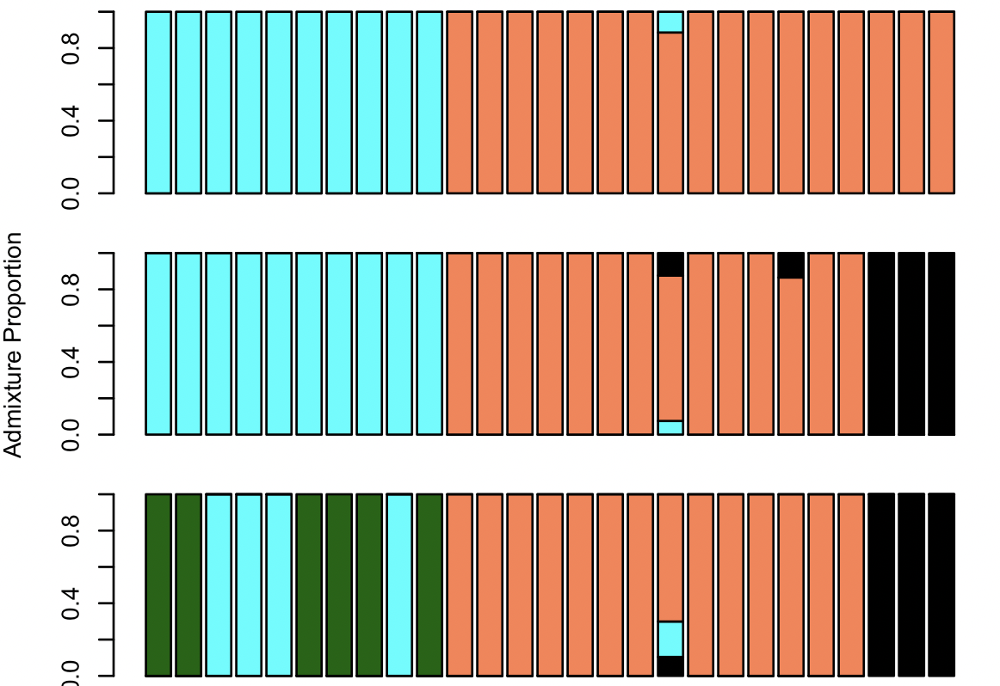

Evaluating Discrete Population Structure
=============================

Population structure is a universal feature of biological systems, and studying it can provide valuable informationon a variety of their features, ranging from their biogeographic history to their ecological dynamics. Today we will explore population history between populations of <i> Heliconius hermathena</i>, a rare, sparsely distributed butterfly species from the Brazilian Amazon, using data generated by [Massardo et al. (2020)](https://bmcbiol.biomedcentral.com/articles/10.1186/s12915-020-00797-1).


There are multiple subspecies of <i>H. hermathena</i> most of which have quite restricted and fragmented ranges in compariosn to other species of <i>Heliconius</i>. We will focus on <i>H. h. sabinae</i> and <i>H. h. sheppardi</i>, which inhabit the Northwestern Amazon and Japurá/Caquetá river basins (red, yellow, and purple dots in the map above). In today's practical we will explore the extent of population structure between sampled localities, and define a set of populations that meet the assumptions of discrete population structure models. 

## Setup

Today we will be working on Greatlakes, using data from the paper cited above. The data for today have already been downloaded, quality-trimmed, and mapped to the reference genome for <i>Heliconius melpomene</i> using the code from [Week 4](../Week4).<br><br>
Log into the cluster, and request a job with 8 processors and 24 Gb RAM. Once the job starts create the following variables:
```bash
ref=/scratch/eeb401s002f22_class_root/eeb401s002f22_class/shared_data/RefGenomes/Hmel2.5/Heliconius_melpomene_melpomene_Hmel2.5.scaffolds.fa
listDir=/scratch/eeb401s002f22_class_root/eeb401s002f22_class/shared_data/heliconius_bams
```

## Calculating genotype likelihoods

First we will use our bam files to calculate the genotype likelihoods for each individual at each site, which we will then use for downstream analyses. We can do this en Angsd. For today's analyses we will not gain any information from invariable sites. Therefore, to save time and storage space, we can ask Angsd to make a decision on whether a particular site is variable (this is called "calling SNPs"), and to only print out geontype likelihods at variable sites. We do so by the `-SNP_pval` flag. Angsd will then do a statistical test for whether each site is variable, and keep only sites with a pvalue below what we specify. In this case we will use 0.0001.

```bash
angsd -P 8 -b "$listDir"/All_hermathena.filelist -r Hmel201001o -GL 1 -doCounts 1 -doMajorMinor 1 -doMaf 2 -SNP_pval 1e-3  -doGlf 2 -out All_hermathena_GenLik -uniqueOnly 1 -remove_bads 1 -only_proper_pairs 1 -minMapQ 20 -minQ 20
```
Note that, again, we are using the `-r` flag to restrict our analyses to a single chromosome, in this case in the interest of time. Lets unpack the rest of flags:

`-P 8` Asks Angsd to use 8 processors.<br>
`-GL 1` Specifies the genotype likelihood model to be used.<br>
`-doCounts 1` Asks Angsd to count reads, which is needed for GL estimation.<br>
`-doMajorMinor 1` and `-doMaf 2` Ask Angsd to internally estimate allele frequencies. This is needed to call SNPs, as we're testing whether the minor allele frequency at a site is different from 0.<br>
`-out All_hermathena_GenLik` specifies the name of the output files <br>
The remaining flags turn on various quality filters. Can you guess (or remember) what most of them mean?<br>
<br>
Angsd should be done after a few minutes. How many sites did it end up retaining? We should now have a file named All_hermathena_GenLik.beagle.gz, which we will use to conduct PCA and estimate admixture proportions. 

## Principal Component Analysis

A very common first step when exploring the degree of genetic structure in a dataset is conducting principal component analysis, or PCA. PCA is a widely used statistical technique for <i>dimensionality reduction</i>, a procedure by which a multivariate dataset is summarized by a smaller number of variables that encapsulate the major axes of variation present in the original dataset. In PCA this is achieved by using the covariances between variables to obtain a set of new, uncorrelated variables that summarize the data, which are called Principal Components. In other words, we start with a large number of somewhat correlated variables, and obtain a new set of uncorrelated variables, a few of which hopefully contain a large ammount of the variation present in the data. In the case of population genetics each locus in our dataset is a variable, and our goal is to go from thousands or millions of variables to 3-4 principal components that encapsulate the most relevant variation in the data. A more in-depth discussion of PCA is beyond the scope of this practical, but the [Wikipedia](https://en.wikipedia.org/wiki/Principal_component_analysis) entry for PCA is a very complete resource if you are interested in learning further. <br><br>

Lets now use our genotype likelihoods file to run a PCA using `PCAngsd`, a python program that conducts PCA based off of genotype likelihoods. 

```bash
python3 $softwareDir/pcangsd/pcangsd/pcangsd.py -b All_hermathena_GenLik.beagle.gz -t 8 -o All_hermathena
```

PCAngsd will produce a file called `All_hermathena.cov`, which contains our covariance matrix. We can now use this matrix to conduct PCA in R. Download the covariance matrix to your local machine, and run the code below in R. YOu will also ned a table with information on wach individual's population assignment. We will use this table to color the PCA points according to their population assignment. I have previously ordered this table in the same order as the list of bam files we passed to Angsd, to make sure samples are in the same order across output files. 

```R
## Read in the data
covar=read.table("All_hermathena.cov", stringsAsFact=F)
pop=read.table("Individuals.txt", h=T)

#Decompose covariance matrix. This is where we actually do the PCA. 

eig=eigen(covar, symm=TRUE)
```
The `eig` object consists of a series of vectors, which are our principal components, and a series of associated variances, which correspond to the ammount of vriance each component is accounting for. The components are organized by the ammount of variance they explain. It is important to consider how much variation a PC explains when interpreting the results of PCA. To have this information handy, we can re-organize the `eig` object into a table with PCs on the columns, where the title of each PC contains information on the variance explained. 
```R
#Extract percentage of variance explained
val=eig$val/sum(eig$val);
PropVar=signif(val, digits=3)*100

#Create a table with PCs.
PC <- as.data.frame(eig$vectors)

# Do some fancy naming to get proportion of variance into the column labels. This bit of code is absolutely aesthetic, feel free to run blindly :-)
colnames(PC) <- gsub("V", "PC", colnames(PC))
for(i in 1:length(colnames(PC))){colnames(PC)[i]=paste(colnames(PC)[i]," (",PropVar[i],"%)",sep="")}

## Finally, plot PC1 vs PC2. Note that we are using the locality of each sample to specify its color. 
## This is a quick trick to color points by some category. 

plot(PC[,1:2], bg=as.factor(pop$Loc), pch=21)
legend("bottomleft", c("Barcelos", "Manaus", "PF"), pt.bg=1:3, pch=21)
```
How does your plot look? Do the different localities appear to be structured? Submit your plot on Canvas, we will discuss it as a class when everyone is done. 


## Admixture Proportions

As we talked in class, we can use the Hardy-Weinberg expectations to assign individuals, or fractions of their genomes, toto one of a pre-defined number of hypothetical ancestral populations. This excercise is often known as estimating admixture proportions, as the probability of assigning an individual to a particular ancestral population can be interpreted as the proportion of its genome that descends from such population. This is a usefull tool to understand genetic structure, as it provides a comparison of the genetic makeup of individuals. The most commonly used way to estimate admixture proportions is the so called "STRUCTURE" model, named after the first program to implement it. Today we will use a variation of this model implemented in the program NGSadmix, which uses genotype likelihoods as imput, thus accounting for technical uncertainty.<br>
<br>
Lets run NGSadmix assuming $k=2$ ancestral populations. 
```bash
$softwareDir/ngsAdmix/NGSadmix -P 8 -likes All_hermathena_GenLik.beagle.gz -K 2 -outfiles  All_hermathena_K2
```
NGSadmix will fit the STRUCTURE model using maximum likelihood, and produce two files, one called `All_hermathena_K2.qopt`, which is a table with the assignment probabilities (or admixture proportions) of each individual to the two hypothetical populations., and one called `All_hermathena_K2.fopt.gz`, which  contains the best-fitting allele frequencies for the hypothetical ancestral populations. <br><br>

Download the All_hermathena_K2.qopt file to your computer and run the code below in R to plot it:

```R
admix=read.table("All_hermathena_K2.qopt")
barplot(t(admix), col=c("coral","cyan"), ylab="Admixture Proportion")
```
How does this result compare with what you obtained with PCA? Can you think of ways to explain the similarities and/or differences between both methods? Submit your image on Canvas for discussion as a class. <br><br>
<br><br>
The number hypothetical populations to which we assign individuasl in STRUCTURE-type analyses need to be assumed prior to running the anlysis. WIth this in mind, it is alywas usefult to explore the behavior of our data under multiple values of $k$. Try to run NGSadmix for $k=1\text{and}3$ by yourself and plotting the results. What do you observe? How does this compare with the results frem PCA? 

<details>
  <summary> Click here to see the code</summary>
  ```bash
  
  #Run ngsADmix
$softwareDir/ngsAdmix/NGSadmix -P 8 -likes All_hermathena_GenLik.beagle.gz -K 3 -outfiles  All_hermathena_K3
$softwareDir/ngsAdmix/NGSadmix -P 8 -likes All_hermathena_GenLik.beagle.gz -K 4 -outfiles  All_hermathena_K4
<br><br>
 Now in R plot results

  ```R
# Set up the plot for a multi-panel figure. 
par(mfrow=c(3,1), mar=c(1,4.1,1,1))
 
#read and plot k=2 
admix2=read.table("All_hermathena_K2.qopt")
barplot(t(admix2), col=c("coral","cyan"))

#read and plot k=3 
admix3=read.table("All_hermathena_K3.qopt")
barplot(t(admix3), col=c("cyan","coral", "black"),  ylab="Admixture Proportion")

#read and plot k=4 
admix4=read.table("All_hermathena_K4.qopt")
barplot(t(admix4), col=c("black","cyan", "coral", "darkgreen"))
```



 </details>

How does your plot look? How does it relate to PCA?

