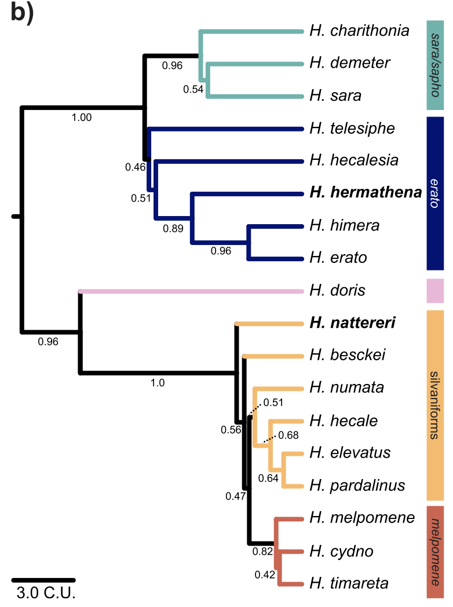
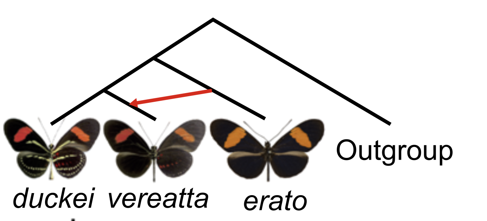

Testing for Gene Flow Between Populations
==================

The relationship between evolutionary relationships and patterns of genetic variation observed in a group of (partially) isolated populations can be very informative about the history of divergence and gene flow among them. In today's practical we will be evaluating the levels of gene flow between recently diverged species of the genus <i>Heliconius</i>, and its relationship with color pattern variation in this group. We will again be focusing on <i>Heliconius hermathena</i>. Within this species, most population exhibit a red stripe on the forewing, accompanied by thinner yellow stripes on both the forewing and hindwing. The sole exception to this pattern is the subspecies <i>H.h. vereatta</i>, which lacks the thinner yellow stripe. This coloration is almost identical to that displayed by the co-ocurring <i>H. erato</i> and <i>H. melpomene</i>, suggesting that these three species are mimicking each other's colorations, which serve to warn potential predators about the butterflies' cyanogenic toxins. <br>
<br>


Could this resemblance be due to hybridization between closely related populations leading to the horizontal transfer of coloration genes between lineages? Today we will be exploring this possibility based on patterns of allelic variation and their concordance/discordance with pre-established species trees. 

## The Data

We will use data from three focal populations: <i>H. h. vereatta</i>, its close neighbor <i>H. h. duckei</i>, which displays <i>H. hermathena</i>'s hallmanrk yellow wing pigmentation, and <i>H. erato</i>, which is closely related to <i>H. hermathena</i> and co-occurs with <i>H. h. vereatta</i>, which makes an interesting suspect in the context of hybridization associated with coloration similarities. In addition, we will use an outgroup to identify ancestral alleles.  which will be composed of individuals from two closely-related species: <i>H. charitonia</i> and <i>H. telesiphe</i>.Using combining multiple outgroup species allows us to better identify ancestral alleles.
<br><br>



Whole-genome resequencing data from 14 <i>H.h. vereatta</i>, 8 <i>H. h. duckei</i>, 5 <i>H. erato</i>, 2 <i>H. charitonia</i>, and 2 <i>H. telesiphe</i> were downloaded from the SRA, trimmed, and mapped to the <i>H. melpomene</i> reference genome as specified in the Week 2 practical. <br><br>

To begin, log into the cluster, request an interactive job with 12 processors and 24 Gb RAM, and once it is assigned  load the `Bioinformatics` and `angsd` modules and create the usual variables:
```bash
ref=/scratch/eeb401s002f22_class_root/eeb401s002f22_class/shared_data/RefGenomes/Hmel2.5/Heliconius_melpomene_melpomene_Hmel2.5.scaffolds.fa
listDir=/scratch/eeb401s002f22_class_root/eeb401s002f22_class/shared_data/heliconius_bams
```

## Genome-wide patterns of gene flow

Our main goal today will be to evaluate the extent of gene flow between <i>H. h. vereatta</i> and <i>H. erato</i>. 


We will begin by assessing 
