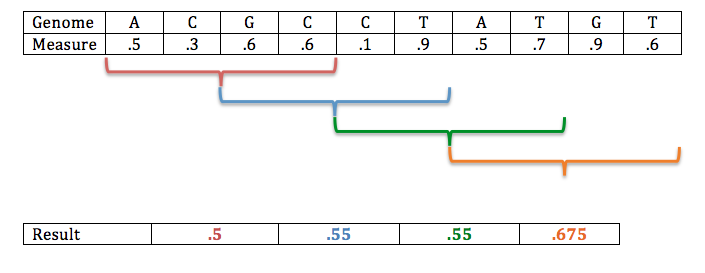

Scanning the Genome for Signatures of Selection
==================

Selection most often acts on phenotypes, yet only genotypes are transferred across multiple generations. Because of this, identifying regions of the genome that have experienced selection is an important application of evolutionary genetics. In today's practical we will be looking for regions that show signatures of selection in a population of <i>Heliconius hermathena</i>, which appears to have experienced a recent change in its color pattern, possibly mediated by selection. Most <i>H. hermathena</i> populations exhibit a red stripe on the forewing, accompanied by thinner yellow stripes on both the forewing and hindwing. The sole exception to this pattern is the subspecies <i>H. h. vereatta</i>, which lacks the thinner yellow stripe. This coloration is almost identical to that displayed by the co-ocurring <i>H. erato</i> and <i>H. melpomene</i>, suggesting that these three species are mimicking each other's colorations, which serve to warn potential predators about the butterflies' cyanogenic toxins. <br>
<br>


Has  <i>H. h. vereatta</i>'s distinct hindwing pigmentation arisen due to recent selection? Todaw we will be exploring the spatial distribution of multiple measures of genetic variation across the 


## The Data

We will use data from three focal populations: We will first focus on <i>H. h. vereatta</i>, its close neighbor <i>H. h. duckei</i>, which displays <i>H. hermathena</i>'s hallmanrk yellow wing pigmentation. <i>Heliconius</i> butterflies are well-known for their incomplete species barriers, which allow closely related species to exchange alleles in sympatry. Therefore, we will also keep <i>H. erato</i> in mind, as it is closely related to <i>H. hermathena</i> and co-occurs with <i>H. h. vereatta</i>, with whom it shares a striking resemblance in terms of coloration. In addition, we will use an outgroup to identify ancestral alleles,  which will be composed of individuals from two closely-related species: <i>H. charitonia</i> and <i>H. telesiphe</i>. Combining multiple outgroup species allows us to better identify ancestral alleles.
<br><br>


Whole-genome resequencing data from 18 <i>H.h. vereatta</i>, 7 <i>H. h. duckei</i>, 6 <i>H. erato</i>, 2 <i>H. charitonia</i>, and 2 <i>H. telesiphe</i> were downloaded from the SRA, trimmed, and mapped to the <i>H. melpomene</i> reference genome as we have done previously. Note that we are using a different reference genome than the last time we analyzed <i>H. hermathena</i> data. This is for two reasons: First, the <i>H. melpomene</i> reference has nearly-complete sequences of all of this species's chromosomes (the <i>H. hermathena</i> reference does not), which makes the visualization of patterns along entire chromosomes easier. Second, since we are using a multi-species dataset, some smaples will be considerably more closely related to the reference than others, which can result in systematically better read mapping for some populations than others, which in turn can bias estimations of between-population genetic parameters. <i>H. melpomene</i> is equally distant from all our focal and outgroup species, which amelliorates this type of <i>reference bias</i>.<br><br>

To begin, log into the cluster, request an interactive job with 12 processors and 24 Gb RAM, and once it is assigned  load the `Bioinformatics` and `angsd` modules and create the usual variables:
```bash
ref=/scratch/eeb401s002f22_class_root/eeb401s002f22_class/shared_data/RefGenomes/Hmel2.5/Heliconius_melpomene_melpomene_Hmel2.5.scaffolds.fa
listDir=/scratch/eeb401s002f22_class_root/eeb401s002f22_class/shared_data/heliconius_bams
```

## Identifying a region of interest

Our main goal today will be to evaluate the extent of gene flow between <i>H. h. vereatta</i> and <i>H. erato</i>, both at genome-wide and localized scales. We will do so in the framework of the four-taxon tree below:


The first step will be to calculate allele frequencies at each of our three focal populations, as well as in our multi-species outgroup. However, before this, we can 1. identify sites that are 1. variable (i.e. call SNPs), and 2. biallelic across our system, as these are the only informative sites for our analysis. We can do this by estimating allele frequencies across the system in Angsd. In the itnerest of time we will limit our analyses to chromosome 15 using the `-r` flag as we've done before. 
```bash
angsd -P 12 -b $listDir/hermathena_introgression.filelist -r Hmel215003o -ref $ref -GL 1 -out AllPops -doMajorMinor 4 -minInd 25 -doMaf 1 -SNP_pval 1e-3 -skipTriallelic -uniqueOnly 1 -remove_bads 1 -only_proper_pairs 1 -minMapQ 20 -minQ 20
```
You have seen most of the flags here already. Key new ones are the self-evident `skipTriallelic` and `-minInd`. Small numbers of individuals can produce impreciuse allele frequencies that can seriously influence our inferences, so we are using only sites genotyped at most (i.e. at least 25/30) individuals. In addition, we are using option 4 for the `doMajorMinor` flag, which sets the allele on the <i>H. melpomene</i> reference as the major allele. This ensures that we have a common reference allele in all our calculations. <br><br>

Lets quickly look at the output file from our Angsd run (note we use `zcat` to decompress the file first):

```bash 
zcat AllPops.mafs.gz | head

chromo	position	major	minor	ref	knownEM	pK-EM	nInd
Hmel215003o	355	C	T	C	0.021143	4.440892e-16	26
Hmel215003o	360	T	G	T	0.579119	0.000000e+00	26
Hmel215003o	367	T	A	T	0.978828	0.000000e+00	26
Hmel215003o	371	G	T	G	0.370531	0.000000e+00	26
Hmel215003o	373	G	A	G	0.341013	0.000000e+00	26
```
The output is a table with position information for each site, as well as the major, minor, and reference alleles, the allele frequency (`knownEM`), the p-value associated with testing whether the site was polymorphic, and the number of individuals genotyped at that site. We can use this output to generate a "sites" file to pass to Angsd so that it focuses only on the sites we chose. This can be easily done by pulling out the four first columns of the output file. 
```bash
zcat AllPops.mafs.gz | cut -f 1,2,3,4 | tail -n +2 > variable_sites.MAF.txt
```
This command line may seem a bit complex. All it is doing is running three commands serially and writing the final output to a file: First the allele frequency file (`AllPops.mafs.gz`) is decompressed using `zcat`, the output of this is then "piped" through to the `cut` command (this is indicated with the `|` character), which takes the first four columns, which are passed to the `tail` command, which is used to remove the first line of the file. Finally the resulting output is written to a file using the `>` character. <br><br>
We now need to index this file with Angsd
```bash
angsd sites index variable_sites.MAF.txt
```
And we're good to go. <br><br>

The next step is to calculate allele frequencies at our combined outgroup, and use these to identify sites for which we're confident the outgroup has the ancestral allele (this is key to the ABBA-BABA test). 

```bash
angsd -P 12 -b  $listDir/outgroup.filelist -r Hmel215003o -sites variable_sites.MAF.txt -ref $ref -GL 1 -out outgroup -doMajorMinor 3 -minInd 3 -doMaf 1 -uniqueOnly 1 -remove_bads 1 -only_proper_pairs 1 -minMapQ 20 -minQ 20
```

Download the resulting file (`outgroup.mafs.gz`) to your computer and open R, or open an R console direclty on the culster by loading the module `R`, and typing `R` into the terminal (I recommend the second option). In R we can chose sites for which the <i>H. melpomene</i> reference allele is fixed in the outgroup.
```R
### Load data
freqs=read.table("outgroup.mafs.gz", h=T)

### Pick sites with allele frequencies below 0.01 (Why don't be pick those with allele frequency equal to zero?)
fixed=which(freqs$knownEM<0.01)

## Check number of sites
length(fixed)

## Create and write new file 
fixed_tab=freqs[fixed,]
write.table(fixed_tab[,1:4], file="polarized_sites.MAF.txt", quote=F, row.names=F, col.names=F)
```
If you were working locally copy the output file back to the cluster, and index it with Angsd as we did a few momments ago. <br><br>

Now we-re ready to estimate allele frequencies at each of our focal populations. 

```bash 
angsd -P 12 -b  $listDir/duckei.filelist -r Hmel215003o -sites polarized_sites.MAF.txt -ref $ref -GL 1 -out duckei -doMajorMinor 3 -doMaf 1 -uniqueOnly 1 -remove_bads 1 -only_proper_pairs 1 -minMapQ 20 -minQ 20
angsd -P 12 -b  $listDir/vereatta.filelist -r Hmel215003o -sites polarized_sites.MAF.txt -ref $ref -GL 1 -out vereatta -doMajorMinor 3 -doMaf 1 -uniqueOnly 1 -remove_bads 1 -only_proper_pairs 1 -minMapQ 20 -minQ 20
angsd -P 12 -b  $listDir/erato.filelist -r Hmel215003o -sites polarized_sites.MAF.txt -ref $ref -GL 1 -out erato -doMajorMinor 3 -doMaf 1 -uniqueOnly 1 -remove_bads 1 -only_proper_pairs 1 -minMapQ 20 -minQ 20
```

Download the resulting three files (`duckei.mafs.gz`, `vereatta.mafs.gz`, `erato.mafs.gz`) to your local computer to work in R. We'll be drawing plots, so working directly on the cluster is not optimal in this case. 

## Genome-wide levels of gene flow

Lets begin by obtaining genome-wide (or chromosome-wide in this case) of the $D$ and $f_3$ statistics, which, as we saw in lecture, measure the how well the data fit a fully bifurcating tree versus a network model for population relationships. 

```R
## Read the data
duckei=read.table("duckei.mafs.gz", h=T)
vereatta=read.table("vereatta.mafs.gz", h=T)
erato=read.table("erato.mafs.gz", h=T)

## Extract the allele frequencies for easy calculations downstream
p1=duckei$knownEM
p2=vereatta$knownEM
p3=erato$knownEM

## Calculate ABBA and BABA statistics for each site
ABBA=((1-p1)*p2*p3)
BABA=(p1*(1-p2)*p3)
```
In class we defined 
$$ABBA=((1-p_1)p_2p_3(1-p_O))$$
$$BABA=(p_1(1-p_2)p_3(1-p_O))$$

Where $p_O$ is the allele frequency at the outgroup. However, in our code above we did not include $p_O$. Why do you think this is?

<details>
<summary> Click here to see the answer</summary>
We are liminting our analyses to sites fixed at the outgroup, so $(1-p_O)$ is always equal to 1. 
</details>

Having our ABBA and BABA estimates we can now calculate D. 
```R
D=(sum(ABBA)-sum(BABA))/(sum(ABBA)+sum(BABA))

> D
[1] 0.002422992
```
We get a small, yet positive value of D. This is consistent with gene flow between <i> H. erato</i> and <i> H. h. vereatta</i>. Lets now calculate $f_3$.

```R

## Extract the number of samples involved in the calculation of p3
n2=vereatta$nInd

## Calculate f3 per site
f3_sites=((p2-p1)*(p2-p3))-((p2*(1-p2))/(n2-1))

## Average across sites 
f3=mean(f3_sites)

> f3
[1] -0.0009072305
```
We find a negative value for $f_3$, which is, again, consistent with a more network-like (vs. tree-like) relationship between lineages. Our estimates of both $D$ and $f_3$ are consistent with gene flow between non-sister taxa. However, to evaluate whether we are recovering the signal left by a real evolutionary process and not just noise, we'd need to use a more rigorous statistical test approach to test how much our values depart from zero. This can be done using computational methods suchas jackknifing or bootstrapping. However, in the interest of time we will not do this today. 

## Distribution of gene flow along the genome

The results from the previous section suggest that there has been gene flow between species with similar color patterns. Where in the genome is the gene flow signal coming from? The answer to this question can help us understand multiple aspects of the dynamics of our system, such as how much of the genetic material exchanged between populations manages to persist in a new population after introgression, and what kinds of genes are in the regions that do/don't persist. 
<br><br>
A common way to visualize variation in statistics across the genome are <i>sliding window</i> analyses, wehre a statistic is calculated at mutiple small, adjacent regions (i.e. "windows") of the genome. This analysis can be easily implemented in R using a loop and the code we used above. Briefly, the algorithm consists of analyzing windows of a given size, and "sliding" a given ammount of base pairs to the next window. The iamge below may help understand the algorithm better. 



Now lets implement this algorithm in R (if you've closed your session load the frequency tables again):

```R 
## Define the window and step size
win=10000
step=5000

## Create some empty vectors to populate with ABBA and BABA values for each window
ABBA_w=c()
BABA_w=c()

## Obtain the starting points for each window, begining at the first position with data, based on the pre-defined step size. 
starts=seq(min(duckei$position),max(duckei$position), step)

## Loop over all the window start sites
for(i in 1:length(starts)){
	
## Extrat the allele frequencies at positions between the start and end site (ie. start+window size) of the window.
	subs_duckei=duckei[which(duckei$position >= starts[i] & duckei$position <= starts[i]+win),]
	subs_vereatta=vereatta[which(vereatta$position >= starts[i] & vereatta$position <= starts[i]+win),]
	subs_erato=erato[which(erato$position >= starts[i] & erato$position <= starts[i]+win),]
  
	w_p1=subs_duckei$knownEM
	w_p2=subs_vereatta$knownEM
	w_p3=subs_erato$knownEM

#Calculate ABBA and BABA for this window
	ABBA_w[i]=sum(((1-w_p1)*w_p2*w_p3))
	BABA_w[i]=sum((w_p1*(1-w_p2)*w_p3))

	}
```
We now have two vectors (`ABBA_w` and `BABA_w`) with the ABBA and BABA sites for each window. Lets plot:

```R
## Obtain the midpoint of each window for easier plotting
centers=starts+win/2

##Plot ABBA and BABA along Chromosome 15
plot(centers, ABBA_w, type="l", col="navy", xlab="Position (bp)", ylab="Statistic")
lines(centers, BABA_w, type="l", col="coral")
legend(8.5e6,3.5, c("ABBA", "BABA"), col=c("navy", "coral"), lty=1)
```
How do ABBA and BABA relate along the chromosome? Do they co-vary, show opposite patterns, or are unrelated? Can you think of any reasons that explain the observed pattern? 

<details> <summary> Click here to see the plot</summary>

From this plot it is clear that a region at around 1Mbp shows a clear excess of ABBA sites. Lets zoom in. 
</details>

Key to our goals is identifying sites that have an excess of ABBA vs. BABA sites. Can you spot any on the plot? To better visualize them, we can plot the difference between ABBA and BABA at rach window. 

```R
plot(centers, ABBA_w-BABA_w, type="l", col="navy", xlab="Position (bp)", ylab="ABBA-BABA")
```
<details> <summary> Click here to see the plot</summary>

Most of the variation in ABBA or BABA sites has flattened out, indicating that at most regions where these deviated from zero the number of each type of discordant site was very similar. The one exception is a single large peak around 1.5 Mbp with an excess of ABBA sites. 
</details>

Lets zoom in to to get a closer look.

```R 
plot(centers, ABBA_w-BABA_w, type="l", col="navy", xlab="Position (bp)", ylab="ABBA-BABA", xlim=c(1e6, 2e6))

## Add a thin line at zero
abline(h=0, lty=3,lwd=0.5)
```

An online portal named [lepbase](www.lepbase.org) contains a wide array for genomic resources for several species of Lepidoptera (butterflies and moths). If we look at what genes are in our region of interest, we will find, among others, the gene <i>cortex</i>, which has recently been found to underlie variation in melanic color pattern elements in a few species of lepidopterans, such as the famous Pepperd moth, and some species of <i>Heliconius</i> and <i>Papilio</i>. Lets highlight the region where <i>cortex</i> occurs on our plot.

```R
#Create an object with the begining and end of Cortex obtained from Lepbase
cortex=c(1413804,1424719)

#Plot a tiny gray rectangle to highlight this region
rect(cortex[1],-0.7,cortex[2],-0.35,col="grey65", border=NA)
```

What do you see? Does this plot give you some ideas about how <i>H. h. vereatta</i> may have evolved its mimetic color pattern? 

<details> <summary> Click here to see the plot</summary>

	This view confirms that there is a single peak around 1.45Mbp, right on top of <i>cortex</i>, suggesting that this gene, and possibly the darker melanic pattern observed in <i>vereatta</i> got to this subspecies via <i>introgression</i> (also known as horizontal gene transfer), from <i>H. erato<i/> or another closely related species. 
</details>

