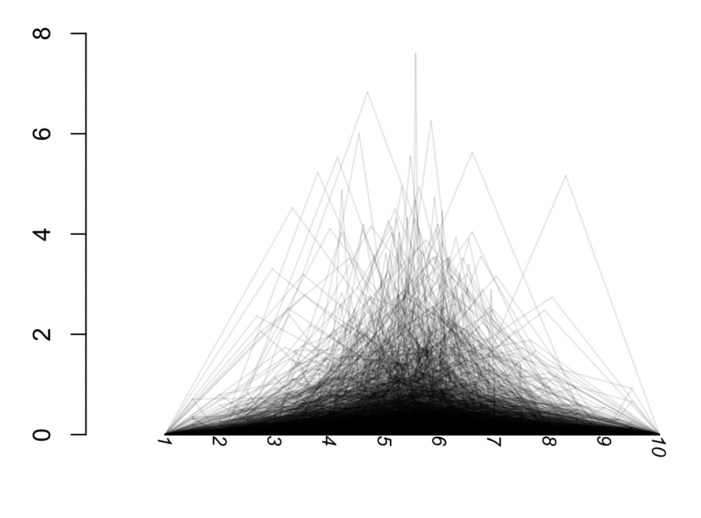

Simulating Coalescent Genealogies
======================================================

Today's lab will deal with simulating coalescent genealogies under the continuous time approximation of the Wright-Fisher model, which assumes large population sizes. From lectures you may recall that in coalescent theory provides us with a simple model for the <i> genealogical relationships</i> among a set of samples. The process described by this model starts in the present and runs backwards in time, tracking lineages as they <i>coalesce</i> into common ancestors. 
<br><br>
The basic algorithm for a coalescent simulation ca be written as follows:
<br>
1. Start with $i=n$ samples<br>
2. Randomly generate the time to the next coalescent event by sampling an exponential fistribution with parameter $\frac{i(i-1)}{2}$.<br>
3. Chose two samples to coalesce at random and merge them into a single parent lineage.<br>
4. Set $i$ to $i = i - 1$
5. If $i > 1$ go to step 2. 

## Required packages

Most of the code we will be using here does not require any additional packages to be luaded onto our R environment. However, we will be using the packages <i>ape</i> and <i>phangorn</i>to visualize our genealogies. Before you begin, please load these packages:
```R
library(ape)
library(phangorn)
```
If you get an error message saying there is no such package, it is probably due to ape not being installed on your machine. If this is the case please install it:
```R
install.packages("ape")
install.packages("phangorn")
```

## Running a single simulation

Let's begin by simulating a single genealogy for a set of 10 samples. First lets create a vector containing our samples, which we will name 1-10.

```R
n=10
lineages=1:n

> lineages
[1]  1  2  3  4  5  6  7  8  9 10
```
Let's create another vector with the names of the ancestral lineages (also called nodes) that our samples will coalesce into. Whenever two lineages coalesce durring our simulation, we will merge them by removing them from our lineages vector and replacing thm by an ancestral lineage. 

```R
nodes=(n+(n-1)):(n+1)   

> nodes
[1] 19 18 17 16 15 14 13 12 11
```

Note that for a tree with $n$ lineages there are $n-1$ nodes (9 in our case). We name our nodes with numbers between 11 and 19 ordered backwards just to match the format used by the ape package to plot trees.
<br>
Now lets create an empty table for our simulation results. 

```R
results=data.frame(nlineages=n:2, Tcoal=rep(NA,n-1), lcoal_1=rep(NA,n-1), lcoal_2=rep(NA,n-1),parent=rep(NA,n-1),surv_lineages=rep(NA,n-1))

> results
  nlineages Tcoal lcoal_1 lcoal_2 parent surv_lineages
1        10    NA      NA      NA     NA            NA
2         9    NA      NA      NA     NA            NA
3         8    NA      NA      NA     NA            NA
4         7    NA      NA      NA     NA            NA
5         6    NA      NA      NA     NA            NA
6         5    NA      NA      NA     NA            NA
7         4    NA      NA      NA     NA            NA
8         3    NA      NA      NA     NA            NA
9         2    NA      NA      NA     NA            NA
```
As the simulation runs it will populate the table with the genealogy's coalescence times and branching order. Note that we have already populated the column for the number of lineages. Since we are assuming only two lineages can coalesce at a time, the number of active lineages will decrease by one at every coalescent event. Below are details for what is contained in each column:
<br><br>
<b>nlineages:</b> The number of active lineages for each iteration. <br>
<b>Tcoal:</b> The coalescence time at which the next two lineages will merge. <br>
<b>lcoal_1:</b> One of the two coalescing lineages. <br>
<b>lcoal_2:</b> The other coalescing lineage. <br>
<b>parent:</b> The name of the parent lineage that they merged into. <br>
<b>surv_lineages:</b> The pool of lineages that remain active. <br><br>

Now lets run the simulation. 
```R
for(i in 1:(n-1)){ 	## For n lineages there are n-1 coalescence events.
	
	nl=results$nlineages[i] 
	rate=nl*(nl-1)/2
	tcoal=rexp(1, rate=rate)
	coal_lin=sample(lineages,2,rep=F)
	lineages=setdiff(lineages,coal_lin)
	lineages=c(lineages, nodes[i])
	
	results$Tcoal[i]=tcoal
	results$lcoal_1[i]=coal_lin[1]
	results$lcoal_2[i]=coal_lin[2]
	results$parent[i]=nodes[i]
	results$surv_lineages[i]=paste(lineages, collapse=" ")	
}
```
Take a moment to understand the code for the simulation. In broad terms, what it does is go down the table's rows and following the algorithm above, and then logs the results into the table. Can you identify which lines of code correspond to steps 2 and 3?

<details>

<summary> Click here to see the answer </summary>
  
```R
## Step 2: Sample the exponential distribution for a coalescent time. We first calculate the rate for for our exponential distribution 
  
rate=nl*(nl-1)/2
tcoal=rexp(1, rate=rate)
  
## Step 3: Randomly pick two samples to coalesce. We then remove them from our lineage pool using the setdiff() function and add one of the parental nodes into the lineage pool. 
  
coal_lin=sample(lineages,2,rep=F)
lineages=setdiff(lineages,coal_lin)
lineages=c(lineages, nodes[i])
```
  </details>
  
  Now our table has been populated with the results: 
  
  ```R
  > results
  nlineages       Tcoal lcoal_1 lcoal_2 parent       surv_lineages
1        10 0.001405185       4       7     19 1 2 3 5 6 8 9 10 19
2         9 0.036767380       1       5     18  2 3 6 8 9 10 19 18
3         8 0.020700632       3       8     17   2 6 9 10 19 18 17
4         7 0.039518071       2      18     16     6 9 10 19 17 16
5         6 0.020492251       6      10     15       9 19 17 16 15
6         5 0.048674298      17      15     14          9 19 16 14
7         4 0.239115796      16      14     13             9 19 13
8         3 0.375632971      19      13     12                9 12
9         2 2.782158583      12       9     11                  11
```
We can see how, as the simulation preogresses, lineages become merged into parent lineages. As the surv_lineages column shows, the coalescing lineages get removed from the active lineages, and the newly created parent lineage gets added.The time to the most recent comon ancestor (TMRCA) and the total tree length are informative parameters about genealogies. They can be calculated as:

$$T_{MRCA}=\sum_{i=2}^{n}T_{n}$$
 
$$T_{Total}=\sum_{i=2}^{n}iT_{n}$$

Try calculating these two values from the table. 

<details>

<summary> Click here to see the answer </summary>
  
```R
Tmrca=sum(results$Tcoal)
> Tmrca
[1] 3.564465

Ttotal=sum(results$Tcoal*results$nlineages)
> Ttotal
[1] 8.801194
```
</details>
Now lets visualize our tree. The code below converts the results table into an object of the class <i>phylo</i>, which is what the ape package uses to handle phylogenetic trees. This is not immediately related to our class, so feel free to just run the code below without much thought. As usual, if you are interested in understanding it further I'm happy to go over it. 

```R
sim2Tree=function(results){

	tree<-list()
	class(tree) <- "phylo"
	tree$tip.label<-1:n

	tree$Nnode<-n-1
	tree$node.label<-(n+1):(n+n-1)

	tree$edge=matrix(rep(NA,4*length(tree$node.label)), ncol=2)
	tree$edge.length=rep(NA,2*length(tree$node.label))

	height=cumsum(results$Tcoal)
	for(i in 1:(n-1)){
	
		#Populate topology
		tree$edge[2*i-1,]=as.matrix(results[i,c(5,3)])
		tree$edge[2*i,]=as.matrix(results[i,c(5,4)])
	
		#Populate branch lengths. If the daughter is a leaf then branch length is just node height. Otherwise, length is height minus height where daughter node was a parent
		if(results[i,3]<=n){tree$edge.length[2*i-1]=height[i]} 
		else{tree$edge.length[2*i-1]=height[i]-height[which(results$parent==results[i,3])]}
		if(results[i,4]<=n){tree$edge.length[2*i]=height[i]}
		else{tree$edge.length[2*i]=height[i]-height[which(results$parent==results[i,4])]}
	}
	return(tree)
}
```

Lets now run the function on our results and plot the tree:

```R
tree=sim2Tree(results)
plot(tree, direction="downwards", cex=0.75)
```

Look at the results table from our simulation. Can you match the events described on each row with the tree you've plotted?

## Multiple Simulations

Lets now run our simulation many times to explore how our model behaves. To this end, we can re-purpose the code used above into a function that we can run many times. 
```R
simCoaltree=function(n=10){

	lineages=1:n  
	nodes=(n+(n-1)):(n+1)
  
  results=data.frame(nlineages=n:2, Tcoal=rep(NA,n-1), lcoal_1=rep(NA,n-1), lcoal_2=rep(NA,n-1), parent=rep(NA,n-1), surv_lineages=rep(NA,n-1))

	for(i in 1:(n-1)){ 	## For n lineages there are n-1 coalescence vevents.
		nl=results$nlineages[i]
		rate=nl*(nl-1)/2
		tcoal=rexp(1, rate=rate)
		coal_lin=sample(lineages,2,rep=F)
		lineages=setdiff(lineages,coal_lin)
		lineages=c(lineages, nodes[i])
	
		results$Tcoal[i]=tcoal
		results$lcoal_1[i]=coal_lin[1]
		results$lcoal_2[i]=coal_lin[2]
		results$parent[i]=nodes[i]
		results$surv_lineages[i]=paste(lineages, collapse=" ")	
	}
	return(results)
}
```

Run the simulation 1000 times for 10 lineages. 
```R
res_list=list()

for(j in 1:1000){
	res_list[[j]]=simCoaltree(n=100)
}
```
This results in a list with 1000 results tables as the ones we created above. We can now calculate TMRCA and Ttotal from each tree using the lapply command, which runs the same function for each element of a list. This function returns results as a list, which we can turn into a vector using the unlist() function. 
```R
tmrcas=lapply(res_list,function(x){sum(x$Tcoal)})
tmrcas=unlist(tmrcas)

ttots=lapply(res_list,function(x){sum(x$nlineages*x$Tcoal)})
ttots=unlist(ttots)

# Plot histograms of both parameters
hist(ttots, main="100 samples", xlab=expression("T"["MRCA"]))
hist(tmrcas, main = "100 samples", xlab=expression("T"["Total"]))
```
How well do our simulations match the theoretical expectations from coalescent theory? The expected values for both parameters are below:

$$E[T_{MRCA}]=\sum_{i=2}^{n}E[T_{i}]=\sum_{i=2}^{n}\frac{2}{i(i-1)}=2-\frac{2}{n}$$
 
$$E[T_{Total}]=\sum_{i=2}^{n}iE[T_i]=2\sum_{i=2}^{n}\frac{1}{i-1}=2\sum_{i=1}^{n-1}\frac{1}{i}$$

Now instead of 100 samples run simulations for 5, 10, and 500 (500 may take a couple of minutes). How do TMRCA and Ttotal change?

## Visualizing trees

Finally, lets visualize the trees resulting from our simulation. We can use the apply command to convert our tables to trees. THe package phangorn has a function called densiTree(), which plots multiple everlaid trees. We can use this function to look for general patterns in our tree set. 

```R
trees=lapply(res_list,function(x){sim2Tree(x)})
class(trees)="multiPhylo"

library(phangorn)
densiTree(trees, alpha=0.1, col="black", direction="downwards")
```
What do you see? Do you notice any general pattenrs about the topologies or coalescence times? 

<details>
<summary> Click here to see the plot</summary>



</details>
