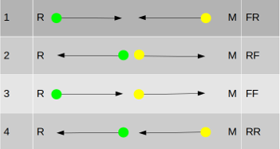

Handling Illumina data on the Greatlakes HPC Cluster
====================================================

This week we will begin working with data. As we discussed in lecture, one of the most comonly used genotyping strategies in current population genetic studies consists on using the Illumina technology to sequence short fragments of DNA, which we will call <b>reads</b>. These short reads are them aligned against a previously generated reference genome, which allows us to 1. find their location in the genome, and 2. obtain genotypic information for our individual(s) of interest. 
<br><br>In this practical we will learn how to:<br>
* Interact with a remote high performance computing (HPC) cluster through the terminal.
* Download data from the NCBI's [Datasets](http://www.ncbi.nlm.nih.gov/datasets) and [SRA](http://www.ncbi.nlm.nih.gov/sra) (SRA) repositories, where sequence data are publicly ccessible.
* Conduct quality-control analyses on Illumina data.
* Align these data against a reference genome.
* Generate basic quality metrics of mapped data.
<br><br>
## Study System

Today we will be using data from a sample of snowshow hares (<i>Lepus americanus</i>), which was collected by Jones et al. ([2020](https://doi.org/10.1086/710022)). Briefly, the authors collected tissue samples, and generated sequence data using a technique called target enrichment, where a sequencing library for the whole genome is prepared, and then only the molecules corresponding to some specific genomic regions are extracted and sequenced. A commonly used example of this approach is [exome enrichment](https://en.wikipedia.org/wiki/Exome_sequencing), where the aim is to only sequence coding regions of the genome. This <i>reduced representation</i> approach is often used to reduce cost and computational effort when sequencing the entire genome is not necessary.


## Interacting with the Greatlakes Cluster
Given the scale of data involved, population genetic analyses very often require much larger computational resources than what a typical personal computer can provide. Fortunately, our institution has a very powerful <i>high-performance computing (HPC) cluster</i>, called [Greatlakes](http://greatlakes.arc-ts.umich.edu/), which is very well suited for the types of analyses we will be doing in class. We usually don't interact with compute clusters the way we do with personal computers. Instead of using the mouse and keyboard to give the computer instructions, and receiving results on a screen, all directly connected with the computer, we will be remotely logging into the cluster and interacting with it through the <i>command line</i>. That means we will be typing commands into a prompt, and receiving results as text on that same window, similar to how we have interacted with R in previous sessions. To start using the command line open the Terminal (on Mac this is found under Applications -> Utilities, on most Linux distributions it can be opened by pressing Ctrl-Alt-T). A window like this should open:


<br>
This window is where we will type commands and receive outputs from Greatlakes. 
<br><br>

<b>Note:</b> If you are using Windows, you can use software such as [Putty](https://documentation.its.umich.edu/node/350) to log into Greatlakes.
<br><br>
The first step to do so is logging into Greatlakes. To do so we must use a command called `ssh` and our UM credentials.

```bash
ssh uniqname@greatlakes.arc-ts.umich.edu
```
You will then be asked for your password (this is the same password you use to log into other UM services, such as your email). Type it it and hit enter. <b>Don't worry if the cursor doesn't move as you type, this is normal</b>. If you entered your password correctly, you should connect to Greatlakes. Before letting you in, the cluster will ask for Duo two-factor authentication, giving you multiple options to do so. 

```bash
Enter a passcode or select one of the following options:

 1. Duo Push to XXX-XXX-NNNN
 2. Phone call to XXX-XXX-NNNN
 3. SMS passcodes to XXX-XXX-NNNN
 ```
 
Choose your preferred option and type its number (or enter a passcode), and hit enter. After authenticating you should see a welcome screen, and a command prompt ready for you to type. On the terminal we can run analyses, but also perform routine tasks such as moving between directories or creating new folders.files. Before we start analyzing data, lets create some directories for our work. We can use the `mkdir` command for this. 
```bash
 mkdir Week3
 ```
 This will create a directory called "Week3". To make sure this worked, we can use the `ls` command to list all the files and directories at our current location
 ```bash
 ls
 
 Week3
```
Running this command confirms we've succesfully created our folder. Lets now move into this folder, where we can run our commands. 

```bash
cd Week3
```
Until now, we've been working on the <i>head node</i> of the cluster. This is a computer meant for logging in and running menial tasks, such as moving/copying files and creating new directories. To run computationally intensive tasks, 
we use <i>compute nodes</i>, which are more powerful, and exclusively allocatod for this purpose. To gain access to a compute node, we can use the `srun` command:
```bash 
srun --account eeb401s002w24_class --time 1:30:00 --mem 8G --tasks-per-node 4 --pty bash
```
This command asks for acces to a compute node with 8Gb RAM and four processors for 1.5 hours. The resources used will come from our class allocation (`--account eeb401s002w24_class`). An alternative way to use compute nodes is writing a script with instructions and asking the cluster to run it all at once. This way we can run many different such <i>batch jobs</i> simultaneously. This can be done using the `sbatch` command. Throughout the course we will be using compute nodes <i>interactively</i>, as detailed above, mainly for pedagogical purposes, but it may be good to explore batch jobs for your own analyses, as they allow users to take advantag of the cluster's full capabilities.
<br><br>
A few momments after running `srun` you should get a message saying the requested resources have been allocated, together with a command prompt in which you can type. This is where we will work today. Before we start, we need to load some <i>modules</i>, which contain the programs that we will use. This is analogous to loading packages in R. 
```bash
module load Bioinformatics bwa sratoolkit samtools fastqc
```

## Downloading sequence data from NCBI
The first step in most bioinformatic pipelines is transferring the data to our work environment. If you have generated these data yourself this may involve transferring it from the sequencing facility's computer to yours. If you are using publicly available data, it needs to be downloaded from a repository. In this case, we will be using data hosted by the USA's National Center for Biotechnology Information (NCBI). Raw data from next-generation (i.e. massively parallel) sequencing runs is hosted at the NCBI's Short Read Archive (SRA). To find our data, we can go to the [SRA Website and use its search engine](http://www.ncbi.nlm.nih.gov/sra) and use its search engine. To start, type the name of today's study species (<i>Lepus americanus</i>). You should see about 300 results. It turns out most of these correspond to Jones et al's sequences. Pick one of the results titled "targeted Agouti sequencing of snowshoe hare" and click on it. These sequences correspond to a target enrichment experiment where the authors targeted a ~600kb (i.e. 600,000bp) region around the gene <i>Agouti</i>, which was previously shown to be involved in seasonal color change in these hares. 
<br><br>
You should now see the full record of the specific sequencing experiment that you clicked on. Here you will find information on the sequencing experiment, such as the technology used (Illumina in this case) or the experimental design (i.e. protocol) used to prepare libraries, as well as on the broader project in which the sequencing ocurred, and the sample from which DNA was obtained. You can click on the project number (PRJ...) and sample number (SAMN...) to go to their specific records in NCBI's BioProject and BioSample databases. At the end, you will find details on the specific sequencing run from which the sequences came.  


<b>Question 1:</b> What specific Illumina instrument was used to generate these sequences?

To download these specific sequences, we can use a set of programs  specifically created by the NIH to interact with the SRA, called the SRA toolkit, using the sequencing run's unique accession number (SRR....). We first need to download the file in a format specific to the SRA, which is very compact and makes download faster. 

``` bash
#Download data, replace the file ID for your specific accession number. 
prefetch fileID
```
<b>Question 2:</b> Use `ls` to list the contents of your current directory. Where do you think your file was downloaded to?
<br><br>
Now lets convert to the file to a format that we can align to a reference genome. In this case, we will use the very comon <i>fastq</i> format, which inclkudes both the sequencess and their associated <i>quality scores</i> (i.e. error probabilities). 
```bash
#Extract reads in fastq
fasterq-dump fileID
```
These sequences were generated using a technology called <i>paired-end</i> sequencing, where the beginind and end of each DNA fragment is sequenced. Therefore, after running the commands above, you should find two separate fastq files, one containing the beginings, and another the eands of the sequenced DNA fragments. Use `ls` to verify they are there. 
<br><br>
Lets now take a look inside these files. 
```bash
less fileID_1.fastq
# To exit the less screen just hit the 'q' key.
```
Note how each sequence is represented by four lines:
```bash
@SRR11020240.1 1 length=101
ATCGATGATTAAATCACCCTAATTTGCATTGTCTGAGCTAATCACCGATGATTTATTTACCTGCTATGTTTACACGAAGTGGATAGCAACGATTAAGTTTA
+SRR11020240.1 1 length=101
AAFFFJJJFJJJJJJJJJJFJJJJFJJJJJJJJJJJJJJJJJJJJJJJJAJ-FJJJJJJJFJJJFFJF7FFJJJJFJFFJJJJFJFJJJFJJA7JJFF<FF
```
The first and third lines include information about the read, in this case the file name, read number, and read length. The second line contains the sequence, and the fourth line contains the quality for each base. To save space, numerical values are encoded as letters istead of numbers. Each letter represent a specific error rate. For instance, the letter A corresponds to an error rate of ~0.00064, and the letter F to ~0.0002. You can read more about the fastq format [here](https://help.basespace.illumina.com/files-used-by-basespace/fastq-files), and about the error rate encoding [here](https://help.basespace.illumina.com/files-used-by-basespace/quality-scores). 
<br><br>
<b>Question 3:</b> Before we continue, it is useful to count the number of reads in our files. You can use the command `wc -l file.fastq` to count the number of lines in a file. Use this to calculate the numer of reads in each of your files. How many reads are in each file? Is this waht you expected? Why or why not?

## Assessing read quality and trimming reads

As we covered in class, Illumina sequences have some probability of including technical artifacts, mostly in the form of sequencing errors and contamination introduced by the library preparation process. Therefore, it is advisable to evaluate the quality of our reads and to process them in order to remove low-quality and contaminated segments of reads. 
<br><br>
To assess read quality we can use aprogram called [fastQC](https://www.bioinformatics.babraham.ac.uk/projects/fastqc/). 
```bash
fastqc --threads 4 fileID_1.fastq fileID_2.fastq
```
This will produce two files called fileID_1_fastqc.html and fileID_2_fastqc.html. These files can be visualized in an internet browser. To do so they need to be downloaded to your local machine. Open a new terminal window by clicking on "Shell -> New Window" on the top menu bar. In the new terminal window type:
```bash
scp "marquezr@greatlakes.arc-ts.umich.edu:Week3/*.html" ~/Desktop
```
This command copies all files with the extension ".html" in the folder Week3 to your Desktop. If you're using Windows you may need to use an FTP server such as [FileZilla](https://filezilla-project.org/) to transfer files to your desktop. <b>Wait here while everyone catches up, and we will inspect this file as a group.</b>
<br><br>
Overall our reads seem to be OK, but fastQC did detect some issues. We will first lead with low quality bases and adapter contamination. There are many many programs to deal with these kinds of artifacts. One that I particularly like is called [skewer](https://github.com/relipmoc/skewer). However, when choosing a program to address issues with read quality, it is key to keep the issues present in the specific data being analyzed. 
<br><br>
Run skewer as follows:

```bash
/scratch/eeb401s002w24_class_root/eeb401s002w24_class/shared_data/software/skewer/skewer -t 4 -q 30 -l 36 -o fileID fileID_1.fastq fileID_2.fastq
```
Note that we are passing four flags to skewer: `-t 4` specifies that it should use 4 CPUs, `-q 30` sets the minimum quality score per base at a score of 30, which corresponds to an error rate of 0.001, and `-l 36` sets the minimum read length to 36bp. The `-o` flag tells skewer what to name its output files. You should have gotten two new fastq files. Use the `ls` command to see their names.

<b>Question 4:</b> Run `fastqc` on these new files. This should generate two new html files. Download them to the desktop and check them out. Was the adapter contamination removed? How do you know? Feel free to include figures. 

## Read Mapping

Now that we have high-quality, uncontaminated read files, we can map them back to a reference genome. So our next step is, of course, downloading a suitable reference. For this practical, we are going to be using the genome assembly for the European hare, which is closely related to our focal Snowshoe hares. Genome assemblies can usually be found in NCBI's [Datasets](http://www.ncbi.nlm.nih.gov/datasets) repository. Go to this website, and in the search bar prompting "Enter a species" type "<i>Lepus europaeus</i>". You should now be looking at a summary of all the data available on NCBI for this species. Scroll down to the "Genome" section, and click on the link below "Reference Genome". This will take you to the record of the European hare's current reference genome assembly. You will find a lot of useful inforamtion here, but for now we are just concerned with downloading the assembly. The "download" button allows you to download the genome and its associated files (e.g. annotation, predicted protein sequences) manually to your computer. However, we can use the `curl` command, which is used to download files from the internet, to downlaod the genome assembly directly to Greatlakes. Conveniently, GenBank provides a web address from which we can download. You can see it by clicking the "curl" link.


To download the file, copy the address provided, and incorporate it into the following `curl`command
```bash
curl -OJX GET "ADDRESS/TO/GENOME" -H "Accept: application/zip"
```
Once the download is complete, you should have a file called `ncbi_dataset.zip`. To unzip it run
```bash
unzip ncbi_dataset.zip
```
You should now have a folder with the same name, and within it are several files, most of which contain sequence data (you may have to navigate into a couple of folders to get there):<br><br>
<b>GCF_033115175.1_mLepTim1.pri_genomic.fna:</b> The sequences for the entire genome assembly. This is the file we'll be using.<br>
<b>genomic.gff:</b> An annotation for the genome. This is a very long table with inforamtion of where all the genes in the genome are located.<br>
<b>rna.fna:</b> All the RNA sequences that can be transcribed from the genome.<br>
<b>cds_from_genomic.fna:</b> The coding sequences within the above RNA (i.e. only the parts of mRNA that get translated to amino acids).<br>
<b>protein.faa:</b> The protein sequences corresponding to the above CDS.<br>
<br>
Now that we have an assembly, we can map our clean reads back to it using program [bwa](https://github.com/lh3/bwa). The first thing we need to do is create an <i>index</i> file for `bwa`. This is, as it name suggests, similar to the index at the end of a book: a file containing information about where different sequence motifs exist in the genome, which helps `bwa` find matches to each read much more quickly than if it systematically checked every chromosome for every read. <br><br>
<b>Note:</b> This step takes a couple of hours to run, so it has been pre-run for you. If you were going to generate an index you would use:

```bash
bwa index ReferenceGenome.fna
```
Instead, you can copy all the files comprising the index from our shared class folder into your current directory (note that we refer to the current directory as `.`). 
```bash
cp /scratch/eeb401s002w24_class_root/eeb401s002w24_class/shared_data/ReferenceGenomes/GCF_033115175.1_mLepTim1.pri_genomic.* .
```
Finally, we can map the reads back to the genome with `bwa` (keep going with the lab as it runs).
```bash
bwa mem GCF_033115175.1_mLepTim1.pri_genomic.fna -t 4 -o fileID.sam  fileID-trimmed-pair1.fastq fileID-trimmed-pair2.fastq
```
As `bwa` runs, observe the output. You will notice that it first reads in a chunk of reads, and then after a couple of minutes it outputs the results of mapping them as: `# candidate unique pairs for (FF, FR, RF, RR): (##, ##, ##, ##)`. These numbers correspond to the numer of read pairs that map in each of the possible different orientations. For instance orientation FR is the case where the first read in the pair aligns "forwards" with the genome and the other one aligns in the reverse orientation,  FF the case where they both align forwards, RR both backwards, etc... The image below illustrates the four possible orientations. 



<b>Question 5:</b> With what frequency do you observe each orientation? Is this how you would expect your data to behave? Explain.
<br><br>

`bwa` should take abour 30 minutes to complete. In the interest of time, feel free to cancel the run by typing `ctrl+c`, and use `cp` to copy a pre-generated output file located at `/scratch/eeb401s002w24_class_root/eeb401s002w24_class/shared_data/W3/SRR11020214.sam` to your current directory. 
<br><br>
Since aligners (such as `bwa`) write their output files "as they go", and (like any piece of software) can have small bugs, they can sometimes leave information that is "untidy" or that doesn't make sense to other programs used in downstream analyses. With this in mind, it is advisable to "proofread" our aligned (`.sam`) file before we continue. This can be quickly done using [samtools](https://www.htslib.org/doc/samtools.html). 
```bash
samtools fixmate -m -@ 4 -O BAM fileID.sam fileID.fixed.bam
```
Note that we passed four flags to `samtools`: `-@ 4` tells it to use 4 cores, `-O BAM` tells it to output hte fiel in `.bam` format, which is a compressed version of `.sam`, and `-m` tells it to add a score for how well a read pair maps to the genome, in addition to the scores for each individual read assigned by `bwa`. This will become relevant in a couple of steps. 
<br><br>
The mapped reads in our file are organized in the order in which there were sequenced. We can save a considerable amount of space by organizing them according to the regions of the genome that they map back to. Having all reads that map to the same genomic region in the same place also makes downstream analyses much quicker. We will also create an index file that allows programs to reach specific regions of the file quickly without needing to read in the whole file.  

```bash
samtools sort -@ 4 -O BAM -o fileID.sorted.bam fileID.fixed.bam
samtools index fileID.sorted.bam
```
The resulting file (`fileID.sorted.bam`) contains the mapping information for all of our reads. Lets have a look at what this file contains. Since it is a pretty large file (we mappend over 1 million reads!), we can just print the first five lines.
```bash
samtools view fileID.sorted.bam | head -n 5 

SRR11020214.1054455     147     NC_084827.1     126     0       5S15M1D116M     =       168     -90     CTTCCCCCTAACCCCAACCCAACCCCTCACCCTTACCCTAACCCACACCCTCACCCTAACCCTAACCCTAACCCTAACCCTAACCCTAACCCTAACCCTACCCCTAACCCTAACCCTAACCCTAACCCTAACCCTA  A---7-777---7--7-7---7-77---7A------<<-7-F77---A77----<---7-7---AAFFJF7<<F-<A-F-<--F<----<---<-AA7-7-AFFF--JJFFFFJJJJJFJ7JFJJJFFA<-AFAAA  NM:i:8  MD:Z:9T5^T7A5A10T0A5A48A35      AS:i:89 XS:i:89 MQ:i:0  MC:Z:143M       ms:i:3848
SRR11020214.505749      147     NC_084827.1     143     0       3S144M  =       154     -133    CCTACCCCTCACCCTAACCCTACCCCTAACCCTACCCCTAACCCTAACCCTACCCCTAACCCTCCCCCTCACCCTACCCCTAACCCTAACCCTAACCCTAACCCTAACCCTAACCCTAACCCTAACCCTAACCCTAACCCTAACCCT       AF)AAJA7))-FAA7-F<JF<-FFFA---<JF7--AA7---<JA---FFFF7-JFF77-7JA7--FFF7--AJA---7AA---JFA<--FJF-7-AFF--AFJJJJJJJJJJJJJJJJJJJJJJJJJJJJFJJJJJJJJJJJFFFAA       NM:i:8  MD:Z:6A12A11A17A10A0A4A6A70     AS:i:104        XS:i:107        MQ:i:0  MC:Z:150M       ms:i:5905
SRR11020214.838407      147     NC_084827.1     143     0       3S126M  =       164     -105    CCTACCCCTAACCCCACCCCCAACCCCAACCCTAACCCTAACCCTAACCCTAACCCTAACCCTAACCCTAACCCTAACCCTAACCCTAACCCTAACCCTAACCCTAACCCTAACCCTAACCCTAACCCT JA---F77---F-7-A-7F7---JFA-A-JJF-<-JF7-A<JFF7AAJFF<--JFF-<-JJA-A-JJF-F7JJJFF-JJJFF7JJJFA<JJJFFFJJJFJFJJJJFFJJJJJJJJJJJFJJJJJFFFAA NM:i:4  MD:Z:11T1A3T5T102       AS:i:106        XS:i:111        MQ:i:0  MC:Z:129M       ms:i:5232
SRR11020214.911280      147     NC_084827.1     143     0       4S118M  =       155     -106    CCCTACCCCTAACCCTACCCCTACCCCTACCCCTAACCCTAACCCTAACCCTAACCCTAACCCTAACCCTAACCCTAACCCTAACCCTAACCCTAACCCTAACCCTAACCCTAACCCTAACC        A7F7A-7-77--F-<A-<7-A-7-<77---F-<---A-JAFJJJA--AJAA---JFJAA<JJJFAFJJFF--JJJF<FJJJJ<FJJJJAFJJJJFFJJJJJFJJJJJFJJJJJFJJJFFAAA        NM:i:3  MD:Z:13A5A5A92  AS:i:103        XS:i:110        MQ:i:0  MC:Z:124M       ms:i:5013
SRR11020214.925008      147     NC_084827.1     143     0       3S126M  =       164     -105    CCCACCCCTACCCCTAACCCTACCCCTAACCCCACCCCTAACCCTAACCCTAACCCCAACCCTACCCCTAACCCTAACCCTAACCCTAACCCTAACCCTAACCCTAACCCTAACCCTAACCCTAACCCT A7---JJ7---JFA-<-FA7-7-JJ<-7-JA7-7-JJA7--JFA-A-JF<-7-JF7-<-JFA-7-JF<-A7JJF-<-JJFAA-JJFFJAJJJJFFJJJFJ7JJJJJJJJFFJFJJJFJFJJJJJFFFAA NM:i:6  MD:Z:7A11A9T1A21T7A64   AS:i:96 XS:i:99 MQ:i:0  MC:Z:129M       ms:i:5212
```
As you can see, our file is a tab-separated table with lots of mapping information. For example, column 1 contains the read name, column 3 the chromosome to which our read mapped, and column 4 the position at which it mapped. Further columns include the sequence, its quality values, and other metrics related to alignment. You can find what each column contains [here](https://en.wikipedia.org/wiki/SAM_(file_format)). Column 2 is of special interest, as it contains a code that summarizes a lot of this information. These codes are known as <i>flags</i>. A useful resource to interpret them can be found [here](https://broadinstitute.github.io/picard/explain-flags.html).


Samtools also allows us to see all the reads mapped to a particular region of the genome. For example, lets look at the first five reads mapping to the chromosome labelled as "NC_084827.1", between bases 20,000 and 30,000

```bash
samtools view SRR11020214.sorted.bam NC_084827.1:20000-30000 | head -n 5

SRR11020214.24407       99      NC_084827.1     20709   10      101M    =       20728   119     ACAATTCATCACTGAAATCCAACCCCCAAAGTGATGTTATGAGGAGGTTATTTGGGGGCTGGCACTGTGGTGCAGCAACTTAAGCCAACACCTGCAGTGCC     AAFFFJJJJJJJJJJJJJJJJJJJJJJJJJJJJJJJJJJJJJJJFJJJJJJJJJJJJJJJJJJJJJJJJJJJJJJJJJJJJJJJJJJJJJJJJJJJJJJJJ   NM:i:0  MD:Z:101        AS:i:101 XS:i:96  MQ:i:10 MC:Z:92M1D7M    ms:i:3968
SRR11020214.274185      163     NC_084827.1     20719   44      150M    =       20778   208     ACTGAAATCCAACCCCCAAAGTGATGTTATGAGGAGGTTATTTGGGGGCTGGCACTGTGGTGCAGCAACTTAAGCCAACACCTGCAGTGCCAACATCCCATAGGGGCGCTGGTTCAAGCCCCCGGTGCTGCACTCCAATCCAGCTCCCTG    AAFFFJJJJJF<FFFAJJJJJJF<FA<FFJJJJJF<JJJFJJJJJJFJJJJJJJJAJJJJJFJJJJJ<JJJJJJJJ<<JJAJJJJJJJFJJJJ<JJJFJJJJJJFFJFJJJJ<FJFAJJJFAJJJ<FFJJJJJJJJJ-AJFJJA<JJFJJ    NM:i:0  MD:Z:150        AS:i:150        XS:i:145        MQ:i:46 MC:Z:149M       ms:i:5593
SRR11020214.24407       147     NC_084827.1     20728   10      92M1D7M =       20709   -119    CAACCCCCNAAGTGATGTTATGAGGAGGTTATTTGGGGGCTGGCACTGTGGTGCAGCAACTTAAGCCAACACCTGCAGTGCCAACATCCCATGGGGCGC       JJJJJFJJ#JJJJJJJJJJJJJJJJJJJJJJJJJJJJJJJJJJJJJJJFFJJJJJJJJJFJJJJJJFJJJJJJJJJJJJJJJJJJJJJJJJJJJFFFAA     NM:i:2  MD:Z:8A83^A7    AS:i:90 XS:i:92   MQ:i:10 MC:Z:101M       ms:i:4107
SRR11020214.986398      99      NC_084827.1     20769   44      35M1I114M       =       20787   167     GGCACTGTGGTGCAGCAACTTAAGCCAACACCTGCAAGTGCCAACATCCCATAGGAGCGCTGGTTCAAGCCCCCGGTGCTGCACTCCAATCCAGCTCCCTGCTAATGCGCCTGGGAAAGCAGCAGATGATGGTCCTAGTGTCTGGGTCGT    AAFFFFJJJAAAFFJAJJJFJFJFFJJJFJJJJJJJJFAJFAJJJJJJJFJJJF7-FFFJFJF7A<AFJFFFAF<JJAFJ<AAJAJJFJJFFJFJ<FFFJJF7AFA<FAJFJFAJFJFJJJJJJJJFJJFFFFFFJJFJFJJFFFJJAJF    NM:i:2  MD:Z:54G94      AS:i:137        XS:i:132        MQ:i:45 MC:Z:17M1I132M  ms:i:5974
SRR11020214.1063784     99      NC_084827.1     20769   44      35M1I114M       =       20787   167     GGCACTGTGGTGCAGCAACTTAAGCCAACACCTGCAAGTGCCAACATCCCATAGGAGCGCTGGTTCAAGCCCCCGGTGCTGCACTCCAATCCAGCTCCCTGCTAATGCGCCTGGGAAAGCAGCAGATGATGGTCCTAGTGTCTGGGTCGT    AAAFFJJJJJJJJJJJJJJJJJJJJJJJFJJJJJJJJJJJJJJJJJJJJJJJJJFFJJJJJJJJJJJJJJJJJJJJJJJJJJJJJJJJJJJJJJJJJJJJJJA<AAFJJJFJJJAAJJJJJJJJJJJJJJJJJFJJJ7JJJJJJJJJJJJ    NM:i:2  MD:Z:54G94      AS:i:137        XS:i:132        MQ:i:45 MC:Z:17M1I132M  ms:i:6017
```

<b>Wait here to discuss the output as a class.</b>
<br><br>
As noted, reads SRR11020214.986398 and SRR11020214.1063784 are identical, and map to the same position. This is proably because they correspond to PCR copies of the same molecule! As we saw in our fastQC run, our data had a relatively high level of reads that looked like PCR duplicates, so it is worth finding and marking them with a new flag that denotes their status as duplicates. Again, `samtools` has a command to do this called `markdup`. 
```bash
samtools markdup -@ 4 -O BAM fileID.sorted.bam fileID.sorted.deduped.bam

#Don't forget to index the new file!
samtools index fileID.sorted.deduped.bam
```
All this will do is go over all read mappings, and find instances of duplication. It will then keep the best-scoring pair of reads (based on the `fixmate` scores we calculated earlier), and mark their duplicates with the corresponding flags. <br><br>
Lets see how we did:
```bash
samtools view fileID.sorted.deduped.bam NC_084827.1:20000-30000 | head -n 5

SRR11020214.24407       99      NC_084827.1     20709   10      101M    =       20728   119     ACAATTCATCACTGAAATCCAACCCCCAAAGTGATGTTATGAGGAGGTTATTTGGGGGCTGGCACTGTGGTGCAGCAACTTAAGCCAACACCTGCAGTGCC     AAFFFJJJJJJJJJJJJJJJJJJJJJJJJJJJJJJJJJJJJJJJFJJJJJJJJJJJJJJJJJJJJJJJJJJJJJJJJJJJJJJJJJJJJJJJJJJJJJJJJ   NM:i:0  MD:Z:101        AS:i:101 XS:i:96  MQ:i:10 MC:Z:92M1D7M    ms:i:3968
SRR11020214.274185      163     NC_084827.1     20719   44      150M    =       20778   208     ACTGAAATCCAACCCCCAAAGTGATGTTATGAGGAGGTTATTTGGGGGCTGGCACTGTGGTGCAGCAACTTAAGCCAACACCTGCAGTGCCAACATCCCATAGGGGCGCTGGTTCAAGCCCCCGGTGCTGCACTCCAATCCAGCTCCCTG    AAFFFJJJJJF<FFFAJJJJJJF<FA<FFJJJJJF<JJJFJJJJJJFJJJJJJJJAJJJJJFJJJJJ<JJJJJJJJ<<JJAJJJJJJJFJJJJ<JJJFJJJJJJFFJFJJJJ<FJFAJJJFAJJJ<FFJJJJJJJJJ-AJFJJA<JJFJJ    NM:i:0  MD:Z:150        AS:i:150        XS:i:145        MQ:i:46 MC:Z:149M       ms:i:5593
SRR11020214.24407       147     NC_084827.1     20728   10      92M1D7M =       20709   -119    CAACCCCCNAAGTGATGTTATGAGGAGGTTATTTGGGGGCTGGCACTGTGGTGCAGCAACTTAAGCCAACACCTGCAGTGCCAACATCCCATGGGGCGC       JJJJJFJJ#JJJJJJJJJJJJJJJJJJJJJJJJJJJJJJJJJJJJJJJFFJJJJJJJJJFJJJJJJFJJJJJJJJJJJJJJJJJJJJJJJJJJJFFFAA     NM:i:2  MD:Z:8A83^A7    AS:i:90 XS:i:92   MQ:i:10 MC:Z:101M       ms:i:4107
SRR11020214.986398      1123    NC_084827.1     20769   44      35M1I114M       =       20787   167     GGCACTGTGGTGCAGCAACTTAAGCCAACACCTGCAAGTGCCAACATCCCATAGGAGCGCTGGTTCAAGCCCCCGGTGCTGCACTCCAATCCAGCTCCCTGCTAATGCGCCTGGGAAAGCAGCAGATGATGGTCCTAGTGTCTGGGTCGT    AAFFFFJJJAAAFFJAJJJFJFJFFJJJFJJJJJJJJFAJFAJJJJJJJFJJJF7-FFFJFJF7A<AFJFFFAF<JJAFJ<AAJAJJFJJFFJFJ<FFFJJF7AFA<FAJFJFAJFJFJJJJJJJJFJJFFFFFFJJFJFJJFFFJJAJF    NM:i:2  MD:Z:54G94      AS:i:137        XS:i:132        MQ:i:45 MC:Z:17M1I132M  ms:i:5974
SRR11020214.1063784     99      NC_084827.1     20769   44      35M1I114M       =       20787   167     GGCACTGTGGTGCAGCAACTTAAGCCAACACCTGCAAGTGCCAACATCCCATAGGAGCGCTGGTTCAAGCCCCCGGTGCTGCACTCCAATCCAGCTCCCTGCTAATGCGCCTGGGAAAGCAGCAGATGATGGTCCTAGTGTCTGGGTCGT    AAAFFJJJJJJJJJJJJJJJJJJJJJJJFJJJJJJJJJJJJJJJJJJJJJJJJJFFJJJJJJJJJJJJJJJJJJJJJJJJJJJJJJJJJJJJJJJJJJJJJJA<AAFJJJFJJJAAJJJJJJJJJJJJJJJJJFJJJ7JJJJJJJJJJJJ    NM:i:2  MD:Z:54G94      AS:i:137        XS:i:132        MQ:i:45 MC:Z:17M1I132M  ms:i:6017
```
<b>Question 6:</b> Was the problem solved? Explain. <b>Tip:</b> Compare the flags of each read in this file and the one without duplicates marked. Use the guide to SAM flags linked above to see what they mean.
<br><br>

## Evaluating bam/sam file statistics

Finally, lets gather some statsitics to see how our mapping went. We can obtain several metrics using the `flagstat` function of samtools, which summarizes the information in all of our reads' flags. 

```bash
samtools flagstat fileID.sorted.deduped.bam

2392731 + 0 in total (QC-passed reads + QC-failed reads)
2359298 + 0 primary
0 + 0 secondary
33433 + 0 supplementary
854364 + 0 duplicates
854364 + 0 primary duplicates
2384760 + 0 mapped (99.67% : N/A)
2351327 + 0 primary mapped (99.66% : N/A)
2359298 + 0 paired in sequencing
1179649 + 0 read1
1179649 + 0 read2
2315704 + 0 properly paired (98.15% : N/A)
2348546 + 0 with itself and mate mapped
2781 + 0 singletons (0.12% : N/A)
21406 + 0 with mate mapped to a different chr
8143 + 0 with mate mapped to a different chr (mapQ>=5)
```

Based on this, does it looks like our alignment went pretty well. Out of 2,392,731 total reads `bwa` was able to align 2,384,760 (99.67%) to the reference, and of the reads that were paired, 98.15% had both reads map to the same chromosome (we call this propperly paired). You may be wondering "Aren't all our reads supposed to be paired?" you have asked a great question. The reason why that is not the case, is that in a minority of cases `skewer` discarded one of the reads in a pair due to bad quality, but we still kept the surviving read. In this specific case, one read was discarded for $2,392,731-2,359,298=33,433$ read pairs (so very few). Fianlly, 854,364 reads (35.7%) reads were flagged as PCR duplicates, which we expected based on fastQC, and is common in target enrichment experiments. 

An additional metric of interest is the read depth (i.e. coverage) that we've obtained, as it is directly related to the confidence we will have in our genotypes. Furthermore, since we're dealing with target enrichment data, we expect some regions (our targets), to have higher coverage than others (the rest of the genome). This can be obtained using the `depth` function of `samtools`. The resulting file can be quite large, so in the itenrest of time we will focus only on Chromosome 10, where the <i>Agouti</i> gene is located. In the [Datasets](http://www.ncbi.nlm.nih.gov/datasets) record of the European hare genome, we can see that Chromosome 10 is represented by the sequence named "NC_084836.1". We can calculate depth for this specific region using the `-r` flag on samtools. 

```bash
samtools depth -@ 2 -r NC_084836.1 SRR11020214.sorted.deduped.bam > SRR11020214_Chr10.depth.txt

#note we are writing the output of our command to a file using the > character.

## Take a peek inside the file

head -n 5 SRR11020240.depth.txt

NC_084836.1	1216	1
NC_084836.1	1217	1
NC_084836.1	1218	1
NC_084836.1	1219	1
NC_084836.1	1220	1

# It is a table with three columns: crhomosome name, position, and depth. 
```

Finally, lets plot depth along our chromosome. First use `scp` to download the file to your computer, then open an R window to plot using the following commands:

```R
chr10_depth<-read.table("SRR11020214_Chr10.depth.txt") # read the data
colnames(chr10_depth)<-c("Chr","Pos","Depth") #name the columns

# Plot
plot(chr10_depth$Pos, chr10_depth$Depth, type="l", col="dodgerblue", lwd=0.5, xlab="Position (bp)", ylab="Coverage")

#Agouti is located roughly between 101.7Mb and 102.0Mb from the start of the chromosome (1Mb=1,000,000bp). Lets zoom into a region around this interval (say 95Mb to 105Mb) by passing an "xlim" argument to the plot function.
plot(chr10_depth$Pos, chr10_depth$Depth, type="l", col="dodgerblue", lwd=0.5, xlab="Position (bp)", ylab="Coverage", xlim=c(9.5e7, 1.05e8))
```
<b>Question 7a:</b> Include your plot in your report. Does it look like what you'd expect for data targeting <i>Agouti</i>? Explain. 
<b>Question 7b:</b> Now produce a plot for depth along chromosome 1. How does it compare to the plot for Chr. 10? Does this make sense (and why)? 
<br><br>
