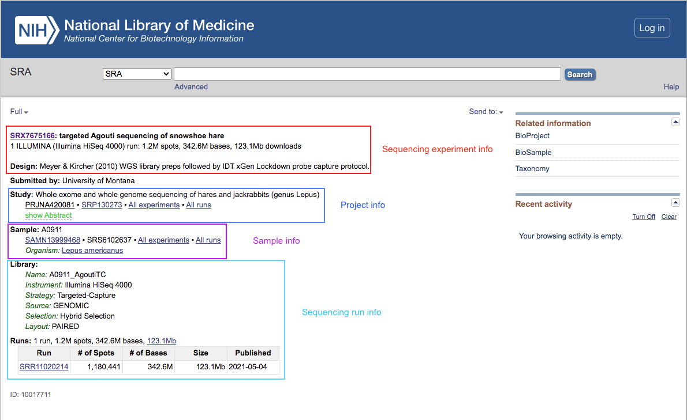
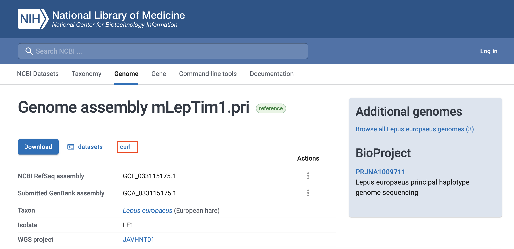

Handling Illumina data on the Greatlakes HPC Cluster
====================================================

This week we will begin working with data. As we discussed in lecture, one of the most comonly used genotyping strategies in current population genetic studies consists on using the Illumina technology to sequence short fragments of DNA, which we will call <b>reads</b>. These short reads are them aligned against a previously generated reference genome, which allows us to 1. find their location in the genome, and 2. obtain genotypic information for our individual(s) of interest. 
<br><br>In this practical we will learn how to:<br>
* Interact with a remote high performance computing (HPC) cluster through the terminal.
* Download data from the NCBI's [Datasets](http://www.ncbi.nlm.nih.gov/datasets) and [SRA](http://www.ncbi.nlm.nih.gov/sra) (SRA) repositories, where sequence data are publicly ccessible.
* Conduct quality-control analyses on Illumina data.
* Align these data against a reference genome.
* Generate basic quality metrics of mapped data.
<br><br>
## Study System

Today we will be using data from a sample of snowshow hares (<i>Lepus americanus</i>), which was collected by Jones et al. ([2018](https://doi.org/10.1126/science.aar5273)). Briefly, the authors collected tissue samples, and generated sequence data using a technique called target enrichment, where a sequencing library for the whole genome is prepared, and then only the molecules corresponding to some specific genomic regions are extracted and sequenced. A commonly used example of this approach is [exome enrichment](https://en.wikipedia.org/wiki/Exome_sequencing), where the aim is to only sequence coding regions of the genome. This <i>reduced representation</i> approach is often used to reduce cost and computational effort when sequencing the entire genome is not necessary.


## Interacting with the Greatlakes Cluster
Given the scale of data involved, population genetic analyses very often require much larger computational resources than what a typical personal computer can provide. Fortunately, our institution has a very powerful <i>high-performance computing (HPC) cluster</i>, called [Greatlakes](http://greatlakes.arc-ts.umich.edu/), which is very well suited for the types of analyses we will be doing in class. We usually don't interact with compute clusters the way we do with personal computers. Instead of using the mouse and keyboard to give the computer instructions, and receiving results on a screen, all directly connected with the computer, we will be remotely logging into the cluster and interacting with it through the <i>command line</i>. That means we will be typing commands into a prompt, and receiving results as text on that same window, similar to how we have interacted with R in previous sessions. To start using the command line open the Terminal (on Mac this is found under Applications -> Utilities, on most Linux distributions it can be opened by pressing Ctrl-Alt-T). A window like this should open:


<br>
This window is where we will type commands and receive outputs from Greatlakes. 
<br><br>

<b>Note:</b> If you are using Windows, you can use software such as [Putty](https://documentation.its.umich.edu/node/350) to log into Greatlakes.
<br><br>
The first step to do so is logging into Greatlakes. To do so we must use a command called `ssh` and our UM credentials.

```bash
ssh uniqname@greatlakes.arc-ts.umich.edu
```
You will then be asked for your password (this is the same password you use to log into other UM services, such as your email). Type it it and hit enter. <b>Don't worry if the cursor doesn't move as you type, this is normal</b>. If you entered your password correctly, you should connect to Greatlakes. Before letting you in, the cluster will ask for Duo two-factor authentication, giving you multiple options to do so. 

```bash
Enter a passcode or select one of the following options:

 1. Duo Push to XXX-XXX-NNNN
 2. Phone call to XXX-XXX-NNNN
 3. SMS passcodes to XXX-XXX-NNNN
 ```
 
Choose your preferred option and type its number (or enter a passcode), and hit enter. After authenticating you should see a welcome screen, and a command prompt ready for you to type. On the terminal we can run analyses, but also perform routine tasks such as moving between directories or creating new folders.files. Before we start analyzing data, lets create some directories for our work. We can use the `mkdir` command for this. 
```bash
 mkdir Week3
 ```
 This will create a directory called "Week3". To make sure this worked, we can use the `ls` command to list all the files and directories at our current location
 ```bash
 ls
 
 Week3
```
Running this command confirms we've succesfully created our folder. Lets now move into this folder, where we can run our commands. 

```bash
cd Week3
```
Until now, we've been working on the <i>head node</i> of the cluster. This is a computer meant for logging in and running menial tasks, such as moving/copying files and creating new directories. To run computationally intensive tasks, 
we use <i>compute nodes</i>, which are more powerful, and exclusively allocatod for this purpose. To gain access to a compute node, we can use the `srun` command:
```bash 
srun --account eeb401s002w24_class --time 1:30:00 --mem 8G --tasks-per-node 4 --pty bash
```
This command asks for acces to a compute node with 8Gb RAM and four processors for 1.5 hours. The resources used will come from our class allocation (`--account eeb401s002w24_class`). An alternative way to use compute nodes is writing a script with instructions and asking the cluster to run it all at once. This way we can run many different such <i>batch jobs</i> simultaneously. This can be done using the `sbatch` command. Throughout the course we will be using compute nodes <i>interactively</i>, as detailed above, mainly for pedagogical purposes, but it may be good to explore batch jobs for your own analyses, as they allow users to take advantag of the cluster's full capabilities.
<br><br>
A few momments after running `srun` you should get a message saying the requested resources have been allocated, together with a command prompt in which you can type. This is where we will work today. Before we start, we need to load some <i>modules</i>, which contain the programs that we will use. This is analogous to loading packages in R. 
```bash
module load Bioinformatics bwa sratoolkit samtools fastqc
```

## Downloading sequence data from NCBI
The first step in most bioinformatic pipelines is transferring the data to our work environment. If you have generated these data yourself this may involve transferring it from the sequencing facility's computer to yours. If you are using publicly available data, it needs to be downloaded from a repository. In this case, we will be using data hosted by the USA's National Center for Biotechnology Information (NCBI). Raw data from next-generation (i.e. massively parallel) sequencing runs is hosted at the NCBI's Short Read Archive (SRA). To find our data, we can go to the [SRA Website and use its search engine](http://www.ncbi.nlm.nih.gov/sra) and use its search engine. To start, type the name of today's study species (<i>Lepus americanus</i>). You should see about 300 results. It turns out most of these correspond to Jones et al's sequences. Pick one of the results titled "targeted Agouti sequencing of snowshoe hare" and click on it.  
<br><br>
You should now see the full record of the specific sequencing experiment that you clicked on. Here you will find information on the sequencing experiment, such as the technology used (Illumina in this case) or the experimental design (i.e. protocol) used to prepare libraries, as well as on the broader project in which the sequencing ocurred, and the sample from which DNA was obtained. You can click on the project number (PRJ...) and sample number (SAMN...) to go to their specific records in NCBI's BioProject and BioSample databases. At the end, you will find details on the specific sequencing run from which the sequences came.  


<b>Question 1:</b> What specific Illumina instrument was used to generate these sequences?

To download these specific sequences, we can use a set of programs  specifically created by the NIH to interact with the SRA, called the SRA toolkit, using the sequencing run's unique accession number (SRR....). We first need to download the file in a format specific to the SRA, which is very compact and makes download faster. 

``` bash
#Download data, replace the file ID for your specific accession number. 
prefetch fileID
```
<b>Question 2:</b> Use `ls` to list the contents of your current directory. Where do you think your file was downloaded to?
<br><br>
Now lets convert to the file to a format that we can align to a reference genome. In this case, we will use the very comon <i>fastq</i> format, which inclkudes both the sequencess and their associated <i>quality scores</i> (i.e. error probabilities). 
```bash
#Extract reads in fastq
fasterq-dump fileID
```
These sequences were generated using a technology called <i>paired-end</i> sequencing, where the beginind and end of each DNA fragment is sequenced. Therefore, after running the commands above, you should find two separate fastq files, one containing the beginings, and another the eands of the sequenced DNA fragments. Use `ls` to verify they are there. 
<br><br>
Lets now take a look inside these files. 
```bash
less fileID_1.fastq
# To exit the less screen just hit the 'q' key.
```
Note how each sequence is represented by four lines:
```bash
@SRR11020240.1 1 length=101
ATCGATGATTAAATCACCCTAATTTGCATTGTCTGAGCTAATCACCGATGATTTATTTACCTGCTATGTTTACACGAAGTGGATAGCAACGATTAAGTTTA
+SRR11020240.1 1 length=101
AAFFFJJJFJJJJJJJJJJFJJJJFJJJJJJJJJJJJJJJJJJJJJJJJAJ-FJJJJJJJFJJJFFJF7FFJJJJFJFFJJJJFJFJJJFJJA7JJFF<FF
```
The first and third lines include information about the read, in this case the file name, read number, and read length. The second line contains the sequence, and the fourth line contains the quality for each base. To save space, numerical values are encoded as letters istead of numbers. Each letter represent a specific error rate. For instance, the letter A corresponds to an error rate of ~0.00064, and the letter F to ~0.0002. You can read more about the fastq format [here](https://help.basespace.illumina.com/files-used-by-basespace/fastq-files), and about the error rate encoding [here](https://help.basespace.illumina.com/files-used-by-basespace/quality-scores). 
<br><br>
<b>Question 3:</b> Before we continue, it is useful to count the number of reads in our files. YOu can use the command `wc -l file.fastq` to count the number of lines in a file. Use this to calculate the numer of reads in each of your files. How many reads are in each file? Is this waht you expected? Why or why not?

## Assessing read quality and trimming reads

As we covered in class, Illumina sequences have some probability of including technical artifacts, mostly in the form of sequencing errors and contamination introduced by the library preparation process. Therefore, it is advisable to evaluate the quality of our reads and to process them in order to remove low-quality and contaminated segments of reads. 
<br><br>
To assess read quality we can use aprogram called [fastQC](https://www.bioinformatics.babraham.ac.uk/projects/fastqc/). 
```bash
fastqc --threads 4 fileID_1.fastq fileID_2.fastq
```
This will produce two files called fileID_1_fastqc.html and fileID_2_fastqc.html. These files can be visualized in an internet browser. To do so they need to be downloaded to your local machine. Open a new terminal window by clicking on "Shell -> New Window" on the top menu bar. In the new terminal window type:
```bash
scp "marquezr@greatlakes.arc-ts.umich.edu:Week3/*.html" ~/Desktop
```
This command copies all files with the extension ".html" in the folder Week3 to your Desktop. Wait here while everyone catches up, and we will inspect this file as a group. 
<br><br>
Overall our reads seem to be OK, but fastQC did detect some issues. We will first lead with low quality bases and adapter contamination. There are many many programs to deal with these kinds of artifacts. One that I particularly like is called [skewer](https://github.com/relipmoc/skewer). However, when choosing a program to address issues with read quality, it is key to keep the issues present in the specific data being analyzed. 
<br><br>
Run skewer as follows:

```bash
/scratch/eeb401s002w24_class_root/eeb401s002w24_class/shared_data/software/skewer/skewer -t 4 -q 30 -l 36 -o fileID fileID_1.fastq fileID_2.fastq
```
Note that we are passing four flags to skewer: `-t 4` specifies that it should use 4 CPUs, `-q 30` sets the minimum quality score per base at a score of 30, which corresponds to an error rate of 0.001, and `-l 36` sets the minimum read length to 36bp. The `-o` flag tells skewer what to name its output files. You should have gotten two new fastq files. Use the `ls` command to see their names.

<b>Question 4:</b> Run `fastqc on these new files. This should generate two new html files. Download them to the desktop and check them out. Was the adapter contamination removed? How do you know? Feel free to include figures. 

## Read Mapping

Now that we have high-quality, uncontaminated read files, we can map them back to a reference genome. So our next step is, of course, downloading a suitable reference. For this practical, we are going to be using the genome assembly for the European hare, which is closely related to our focal Snowshoe hares. Genome assemblies can usually be found in NCBI's [Datasets](http://www.ncbi.nlm.nih.gov/datasets) repository. Go to this website, and in the search bar prompting "Enter a species" type "<i>Lepus europaeus</i>". You should now be looking at a summary of all the data available on NCBI for this species. Scroll down to the "Genome" section, and click on the link below "Reference Genome". This will take you to the record of the European hare's current reference genome assembly. You will find a lot of useful inforamtion here, but for now we are just concerned with downloading the assembly. The "download" button allows you to download the genome and its associated files (e.g. annotation, predicted protein sequences) manually to your computer. However, we can use the `curl` command, which is used to download files from the internet, to downlaod the genome assembly directly to Greatlakes. Conveniently, GenBank provides a web address from which we can download. You can see it by clicking the "curl" link.



To download the file, copy the address provided, and incorporate it into the following `curl`command
```bash
curl -OJX GET "ADDRESS/TO/GENOME" -H "Accept: application/zip"
```
Once the download is complete, you should have a file called `ncbi_dataset.zip`. To unzip it run
```bash
unzip ncbi_dataset.zip
```
You should now have a folder with the same name, and within it are several files, most of which contain sequence data (you may have to navigate into a couple of folders to get there):<br><br>
<b>GCF_033115175.1_mLepTim1.pri_genomic.fna:</b> The sequences for the entire genome assembly. This is the file we'll be using.<br>
<b>genomic.gff:</b> An annotation for the genome. This is a very long table with inforamtion of where all the genes in the genome are located.<br>
<b>rna.fna:</b> All the RNA sequences that can be transcribed from the genome.<br>
<b>cds_from_genomic.fna:</b> The coding sequences within the above RNA (i.e. only the parts of mRNA that get translated to amino acids).<br>
<b>protein.faa:</b> The protein sequences corresponding to the above CDS.<br>
<br>

using the program "bwa". The reference genome file is located in `/scratch/eeb401s002f22_class_root/eeb401s002f22_class/shared_data/RefGenomes/LepAme_RefGenome_GCA_004026855.1.fa`.

```bash
#Index the genome file. This only needs to be done once. It takes a few hours, so it has been done for you. 

# bwa index /scratch/eeb401s002f22_class_root/eeb401s002f22_class/shared_data/RefGenomes/LepAme_RefGenome_GCA_004026855.1.fa

## Now map the reads back to the genome

bwa mem -t 4 -o fileID.sam /scratch/eeb401s002f22_class_root/eeb401s002f22_class/shared_data/RefGenomes/LepAme_RefGenome_GCA_004026855.1.fa fileID-trimmed-pair1.fastq fileID-trimmed-pair2.fastq
```
The mapped reads in our output file are organized in the order in which there were sequenced. We can save a considerable amount of space by 1. organizing them according to the regions of the genome that they map back to, and 2. compressing the file. We can achieve this using the program "samtools". In addition, we will create an <i>index</i> file, which allows programs to quickly access specific regions of our file without reading it all in first. 

```bash
samtools sort -O BAM -o fileID.sorted.bam fileID.sam
samtools index fileID.sorted.bam
#We can remove the unsorted file

rm fileID.sam
```
The resulting file (`fileID.sorted.bam`) contains the mapping information for all of our reads. Lets have a look at what this file contains. Since it is a pretty large file (we mappend over 1 million reads!), we can just print the first five lines.

```bash
samtools view fileID.sorted.bam | head -n 5 

 
SRR11020240.450129	163	PVJM010000001.1	5412	60	150M	=	5460	198	GCAAACTGGTTAAGCCACTATGGAAGTCTGTCTGGAGATTCCTCAGAAACCTGAATATAACCCTACCATACAACCCAGCCATACCTCTCCTTGGAATTTACCCAAAGGAAATTAAATTGGCAAACAAAAAAGCTGTCTGCACATTAATAT	AAAF<JFJJJJJJJJJJJFJJJJJFJJJFJJJJJJJJJJJJJJJJJJJAJJJJJFFJFJJJJJJJJJJJJJJJJJJJJJJJJJJJJJJJJJJJJJJJJJJJJJJJJJJJJJJJJJJJJJJJJJJJJJJJJJJJJFJFJFFJJFFFFJJJJ	NM:i:0	MD:Z:150	MC:Z:150M	AS:i:150	XS:i:128	XA:Z:PVJM010200518.1,-755,150M,5;PVJM010242128.1,-656,150M,6;
SRR11020240.979244	163	PVJM010000001.1	5412	60	150M	=	5460	198	GCAAACTGGTTAAGCCACTATGGAAGTCTGTCTGGAGATTCCTCAGAAACCTGAATATAACCCTACCATACAACCCAGCCATACCTCTCCTTGGAATTTACCCAAAGGAAATTAAATTGGCAAACAAAAAAGCTGTCTGCACATTAATAT	AAAFFJJJJJJJJJJJJJJJJJJJJJJJJJJJJJJJJFJJJJJJJJJJJJJJJJJJJJJJJJJJJJJJJJJJJJJJJJJJJJJJJJJJJJJJJJJJJJJJJJJJJJJJJJJJJJJJJJJJJJJJJJJJJJJJJJJJJJJJJJJJJJJJJJ	NM:i:0	MD:Z:150	MC:Z:150M	AS:i:150	XS:i:128	XA:Z:PVJM010200518.1,-755,150M,5;PVJM010242128.1,-656,150M,6;
SRR11020240.450129	83	PVJM010000001.1	5460	60	150M	=	5412	-198	ACCTGAATATAACCCTACCATACAACCCAGCCATACCTCTCCTTGGAATTTACCCAAAGGAAATTAAATTGGCAAACAAAAAAGCTGTCTGCACATTAATATTTATTGCAGCTCAATTCACAATAGCTGAGACCTGGAACCAATCCAAAT	FFFA7F<<AFA-<JJFJJJJFJ<JAJJJJJFJJJJAA<J<JJJJJJJFJJJJJJJJJJJJJJJJJJFJJJJJJJJJJJAF-JJJFF7JJJJJFJJJJJJJJJJJJJJJJJJJJJJFFFJJJJJJJJJJJJJJJJJJJJJJJFFJJFFAAA	NM:i:1	MD:Z:113T36	MC:Z:150M	AS:i:145	XS:i:125	XA:Z:PVJM010021171.1,-4762,150M,5;PVJM010077295.1,+8871,150M,5;PVJM010080142.1,-5293,150M,6;
SRR11020240.979244	83	PVJM010000001.1	5460	60	150M	=	5412	-198	ACCTGAATATAACCCTACCATACAACCCAGCCATACCTCTCCTTGGAATTTACCCAAAGGAAATTAAATTGGCAAACAAAAAAGCTGTCTGCACATTAATATTTATTGCAGCTCAATTCACAATAGCTGAGACCTGGAACCAATCCAAAT	JJJJFJJJJJJJJJJJJJJJFFJJAJFJJJJJJJJJJJJJJJJJJJJJJFJJJJJJJJJJJJJJJJJJJJJJJJJJJJJJJJJJJJJJJJJJJJJJJJJJJJJJJJJJJJJJJJJJJJJJJJJJJJJJJJJJJJJJJJJJJJJJJFFFAA	NM:i:1	MD:Z:113T36	MC:Z:150M	AS:i:145	XS:i:125	XA:Z:PVJM010077295.1,+8871,150M,5;PVJM010021171.1,-4762,150M,5;PVJM010080142.1,-5293,150M,6;
SRR11020240.419008	99	PVJM010000001.1	9848	60	150M	=	9943	245	TTATATTATTGGCCCTATTTTGCTTCTGCAATGAATTTCATTGCCTGCATTGTAAAATCAGCAGGCAGCAAAGTTTCTGCTAATGATTTAATATACTGTCTGATCAGTTTGGACAAAAGTCATAGTAAGAACTACAAGGCAATTTTATCG	AAFF-AFJJAJJJFJJJJJJJA7-FJJJJJJJJJJJJJJJ<JJFJJAFJJJJFJJFJJJJ<FFJJFJJJJJJJAJJJFFJJJJJAJ--AFJJJJJJJJJJJJJJJJ-FJ-7<FJ<JJJJAFJ7JJJ-F7FFAJJJFJJ7FJAFFJJ-F--	NM:i:2	MD:Z:106T42A0	MC:Z:150M	AS:i:144	XS:i:22

```
As you can see, our file is a tab-separated table with lots of mapping information. For example, column 1 contains the read name, column 3 the chromosome to which our read mapped, and column 4 the position at which it mapped. Further columns include the sequence, its quality values, and other metrics related to alignment. Column 2 is of special interest, as it contains a code that summarizes a lot of this information. These codes are known as flags. A useful resource to interpret them can be found [here](https://broadinstitute.github.io/picard/explain-flags.html).

Samtools also allows us to see all the reads mapped to a particular region of the genome. For example, lets look at the first five reads mapping to the chromosome labelled as "PVJM010000002.1", between bases 10,000 and 20,000

```bash
samtools view fileID.sorted.bam PVJM010000002.1:10000-20000 | head -n 5

SRR11020240.906012	99	PVJM010000002.1	10134	60	150M	=	10174	190	ACACATTCAAAGGTACTTTAAAATGTTGGTGGAAAATGGAATTAAAAGATAAGTTTTTTTGGTACAAAAATTTTTGAAATCCTTGCATATGTATATTATGCAAAAAGTACATATGGATCTGAAAACTGAATTGCACCAAGCATGAACTTT	AAFFFFJFJJJJJJJJJJJJJJJJJJJJJJJJ<JFJJJFAJJJJJJJJJJJJFJJJJJJJ-FJFJJFJJJJJJJJAFFJJFJFJJJJJJJJJFJJJJJJJJJJJFJJJJJJFJJFFJ<-FF<77<AAFFJFFF7JF<JJJ<AFAFJFJJJ	NM:i:0	MD:Z:150	MC:Z:150M	AS:i:150	XS:i:28
SRR11020240.906012	147	PVJM010000002.1	10174	60	150M	=	10134	-190	ATTAAAAGATAAGTTTTTTTGGTACAAAAATTTTTGAAATCCTTGCATATGTATATTATGCAAAAAGTACATATGGATCTGAAAACTGAATTGCACCAAGCATGAACTTTTTGAAGTGCTCTTGCACAAACTACAGAAAATGGCCCTTCT	JJJFJJJJJFAJJJJJJJJJFFAJJJJJJJJJJJJJJAFJJJJFJJJJJJJJJJJJJJJJJJJJJJJJJJJJJJJJJJJJJJJJJJJJJJJJJJJJJJJJFJJJJJJJJJJJJJJJJJJJJJJJJJJJJJJJJJJJJJJJJJJJJAAFAA	NM:i:1	MD:Z:118A31	MC:Z:150M	AS:i:145	XS:i:26
SRR11020240.570046	163	PVJM010000002.1	11544	60	20M2D130M	=	11616	222	TACACAGAGAGAGGAGAGGCAGAGAGAGAGAGAGAGAGAGAGGTCTTCCATCTGCTGGTTCACTCCCTAATTGGCCACAATGGCCGGAGCCATGACGATTTGAAGCCAGGAGCCAGAAGCTTCCTCCCGGGTCTCCCATGCGGGTGCAGG	AAFFFJJJJJJJJJJJJJJJJJJJJJJJJJJJJJJJJJJJJJJJJJJJJJJJJJJJJJJJJJJJJJJFJJJJJJJJJJJFJJJJJJJJJJJJJJJJJJJJJFJJJJJJJJJJJJJJJJJJJJJJJJJJJJJJJJJJJJJJJJJJJJJFJJ	NM:i:3	MD:Z:20^AG121AMC:Z:150M	AS:i:137	XS:i:90
SRR11020240.570046	83	PVJM010000002.1	11616	60	150M	=	11544	-222	TTGGCCACAATGGCCGGAGCCATGACGATTTGAAGCCAGGAGCCAGAAGCTTCCTCCCGGGTCTCCCATGCGGGTGCAGGGGCCTAAGGGCTTGGGCCATCTTCTACTGCTTTCCCAGGCCTCAGCAGAGAGCTGGATTGGAAGTGGAGC	AFJJJJJJJF-FJJJJJFJJJJJJJJJJJJJJJJJJJJJJJJJJJJJJJJFJJJJJJJJJJAJFJJFJJJJJJJJJJJJJJJJJJJJJJJJJJJJJJJJJJJJJJJJJJJJJJJJJJJJJJJJJJJJJJJJJJJJJJJJJJJJJJFFFAA	NM:i:10	MD:Z:71A12C4A13T0C16A0T15C0A5A4	MC:Z:20M2D130M	AS:i:103	XS:i:81
SRR11020240.728680	99	PVJM010000002.1	12091	60	150M	=	12120	179	CTGTTTCTAAGAACAAATTTAGAAACCACTGCATTATTACATGTACCACAGGGAAAGAAGAGAGGGAATATCATAAGGATCCATATCTGAAACATCACTGTTAGTAGCCAGCATGAGAAATCCCAGATAATGTACTGCATATAATAATGG	AAFFFJJJJJJJJJJJJJJJJJJJJJJJJJJJJJJJJJJJJJJJJJJJJJJJJJJJJJJJJJJJJJJJJJJJJJJJJJJJJJJJJJJJJJJJJJJJJJJJJJJJJJJJJJJJFJJJJJJJJJFJJJJJJJJJJJJJJJJJJJJJJJJJJJ	NM:i:0	MD:Z:150	MC:Z:150M	AS:i:150	XS:i:0
```

## Evaluating bam/sam file statistics

Finally, lets gather some statsitics to see how our mapping went. We can obtain several metrics using the "flagstat" function of samtools, which summarizes the information in all of our reads' flags. 

```bash
samtools flagstat fileID.sorted.bam

2933857 + 0 in total (QC-passed reads + QC-failed reads)
2898178 + 0 primary
0 + 0 secondary
35679 + 0 supplementary
0 + 0 duplicates
0 + 0 primary duplicates
2920653 + 0 mapped (99.55% : N/A)
2884974 + 0 primary mapped (99.54% : N/A)
2898178 + 0 paired in sequencing
1449089 + 0 read1
1449089 + 0 read2
2810828 + 0 properly paired (96.99% : N/A)
2881004 + 0 with itself and mate mapped
3970 + 0 singletons (0.14% : N/A)
64084 + 0 with mate mapped to a different chr
42093 + 0 with mate mapped to a different chr (mapQ>=5)

```

Based on this, does it look like our alignment went well?

An additional metric of interest is the read depth that we've obtained. Since this is directly related to the confidence we will have in our genotypes, it is important to know how much cooverage we've obtained. This can be obtained using the "depth" function of samtools. The resulting file can be quite large, so in the itenrest of time lets look only at the first 1,000,000 sites covered. 

```bash
samtools depth SRR11020240.sorted.bam | head -n 1000000 > SRR11020240.depth.txt
#note we are writing the output of our command to a file using the > character.

## Take a peek inside the file

head -n 5 SRR11020240.depth.txt

PVJM010000001.1	5412	2
PVJM010000001.1	5413	2
PVJM010000001.1	5414	2
PVJM010000001.1	5415	2
PVJM010000001.1	5416	2

# It is a table with three columns: crhomosome name, position, and depth. 
```

Finally, lets plot depth along out chromosome. First use `scp` to download the file, then open an R window to plot using the following commands:

```R
depth<-read.table("SRR11020240.depth.txt")
hist(depth[,3], breaks=0:max(depth[,3]), xlab="Coverage", ylab="Frequency")
```
