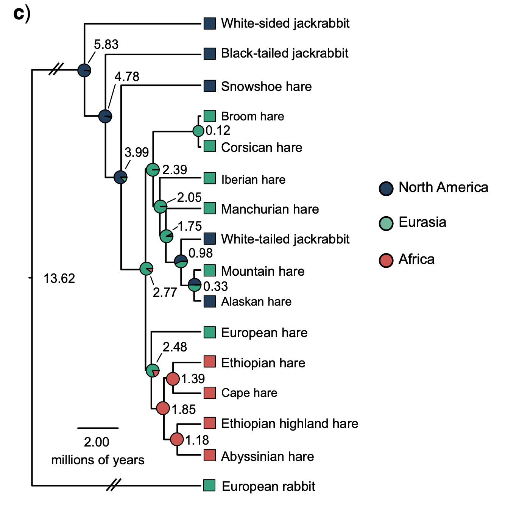

Estimating and Using Site Frequency Spectra
===================================

As we discussed in lecture, the site frequency spectrum (SFS; also known as allele frequency spectrum) is a widely-used and very informative statistic to summarize genetic variation within a population. Today's practical will deal with estimating the SFS using different approaches, and using it to calculate other summary statistics, namely the various estimators of $\theta$ that we covered in class.
<bc><bc>

## Known genotypes and ancestral states

Let's begin with the easiest possible case: The file called "W4Matrix.txt" contains data simulated under tha standard neutral coalescent model $(\theta=5000)$ across a hypothetical chromosome of similar length to the human chromosome 1 (250,000,000bp long). We've also assumed that these sites have a very high rate of recombination between them, so that most (or all) segregating sites do not share a genealogy with other sites. Since our theoretical expectation for the SFS, $\eta_i=\frac{\theta}{i}$, is <i>across all possible genealogies</i>, then these data should closely resemble the expectation. Download this file to your computer. 
<br><br>
Since we know the ancestral states, calculating the SFS for this dataset is quite easy. We just need to count the number of derived alleles at each site, and tabulate our counts. We can do this in R:

```R
# Read in the file. You may need to add the path to your data matrix file. 
genotypes=read.table("W4Matrix.txt")

# Quickly count the number of rows and columns 
nrow(genotypes)
ncol(genotypes)
```
<b>Question 1:</b> How many individuals are in our matrix? How many sites?
<br><br>
On to calculating the SFS. Since we score derived alleles as 1 and ancestrals as 0, we can quickly count the number of derived allele copies at each site by summing over each site's genotypes. We can use the `colSums()` function, which gives the sum for each column of a matrix or data frame. We can then use the `table` function to generate counts for each mutation pattern (i.e. number of derived alleles) across sites. 

```R
counts=colSums(genotypes)
SFS=table(counts)

## Plot!
barplot(SFS, xlab="Derived Allele count", ylab="Number of Sites", col="black")
```

How does the SFS look? Does it appear to follow the theoretical expectation? We can assess this visaully by plotting our observed and expected SFS alongside each other. The first step is generating our expected SFS.

<b>Question 2:</b> How would you obtain the expected SFS? Recall $\theta=5,000$.
<!---
<details>

<summary> Click here to see the answer </summary>
```R
expSFS=5000/1:19
```
</details>
--->
Now lets plot our observed and expected SFS alongside each other. 
```R
expSFS="insert your code here"
ObsExp=matrix(c(expSFS,SFS), nrow=2, byrow=T)

## Plot. Real good match!
barplot(ObsExp, beside=T, col=c("grey15", "grey65"), xlab="Derived Allele count", ylab="Number of Sites", names=1:19)
legend("topright", c("Expected", "Observed"), fill=c("grey15", "grey65"))
```
Now lets estimate $\theta$ using the equations we discussed in class. Fu and Li's estimator is simply the numver of singletons:
$$\hat{\theta}_{FL}=\eta_1$$
```R
Theta_FL=SFS[1]

Theta_FL
[1] 5088
```

Pretty close! Now lets calculate Watterson's estimator, which is equal to the number of segregating sites controlled by sample size:

$$\hat{\theta}_{W} = \frac{S}{\sum\frac{1}{i}} = \frac{\sum \eta_i}{\sum\frac{1}{i}}$$ 

<b>Question 3:</b> Try to write this one out on your own. Provide your code and answer in your report. 

<details>
   <summary> Click here to see the answer (without code)</summary>
   $$\theta_W=5020.38$$

<!---
```R
n=20
Theta_W=sum(SFS)/sum(1/1:(n-1))
  
> Theta_W
[1] 5020.38
```
--->

</details>

Finally, lets calculate Tajima's estimator. Try to do this one on your own as well. It is a bit more complicated, since you'll have to use a loop, but it is worth giving it a try. 
```math
\hat{\theta}_{\pi}= \frac{\sum d_{i,j}}{n(n-1)\big{/}2}=\frac{\sum i(n-i)\eta_i}{n(n-1)\big{/}2}
```
<details>
   <summary> Click here to see the answer (with code)</summary>

```R
n=20
dist=c()

for(i in 1:(n-1)){dist[i]=i*(n-i)*SFS[i]}

Theta_pi=sum(dist)/((n*(n-1)/2))
  
Theta_pi
[1] 4969.742
```

</details>

So overall it seems like our Theta estimators are relatively close to the expected value. It is nice when simulations behave like the model that generated them :-).  

## Using Real Data
  
Now lets estimate teh SFS from some real data. We will again use data from the snowshoe hare system that we worked with on Week 3, but instead of using sequences enriched  for the region around a single gene, we will use sequences enriched for the entire exome. In the interest of time, the reads for 6 snowshoe hares and two individuals from outgroup species (more on this below) have already been mapped back to the snowshoe hare genome. The procedure used for this was very similar to what we did on Week 3. Below is an example of the code used for one file, in case you find it useful.
<br><br>
<b>Download, trim, and QC reads</b>
  
  ``` bash
  
#Set variables for the number of threads, memory, and sample name
threads=8
mem=2G
sample=SRR6485258

#Download and dump reads. Note how we gave it more memory and threads so it goes faster
prefetch $sample
fasterq-dump -m $mem -e $threads $sample

## Clean reads
../software/skewer/skewer -o $sample -t $threads -q 30 -l 36 "$sample"_1.fastq "$sample"_2.fastq

#Always good manners to compress our files
gzip "$sample"-trimmed-pair1.fastq & gzip "$sample"-trimmed-pair2.fastq

## fastqc

fastqc --threads $threads "$sample"-trimmed-pair*.fastq.gz

``` 
<b>Map back to the genome</b> (if reads look nice and clean). 

```bash
#!/bin/bash

module load Bioinformatics bwa samtools

threads=8
sample=SRR6485258

#set variable for the reference genome
ref=/scratch/eeb401s002w24_class_root/eeb401s002w24_class/shared_data/ReferenceGenomes/GCF_033115175.1_mLepTim1.pri_genomic.fna

#Map. Note how instead of running each step separately we "pipe" the output of one command into the next using the | symbol.
#This saves time and storage space, since the computer doesn't need to write intermediate files. 

bwa mem -t $threads $ref "$sample"-trimmed-pair1.fastq.gz "$sample"-trimmed-pair2.fastq.gz | samtools fixmate -m - - | samtools sort -@ $threads - | samtools markdup -@ $threads -O bam - "$sample".sort.mkdup.bam

samtools index "$sample".sort.mkdup.bam
samtools flagstat "$sample".sort.mkdup.bam > $sample.flagstat.txt
```
   
All of our samples had >99% read mapping and relatively low (~5-10%) duplication levels. We are now ready to go! Today we will be using a program called [Angsd](https://www.popgen.dk/angsd/index.php/ANGSD), which implements a wide variety of population genetic analyses based on genotype likelihoods, including direct SFS estimation through Maximum Likelihood instead of assuming genotypes and counting as we did above. 
<br><br>
<b> What is the ancestral allele though?</b>
<br><br>
Before we get into SFS estimation, you may have wondered: How will we know which allele is ancestral and which is derived? We can't travel in time and sequence the ancestor of our snowshoe hare population, so we'll need to make an educated guess. A common way to do this, is to use the allele present in a closely related species, often called an <i>outgroup</i> species. Of course, there is the possibility that a difference between our outgroup and focal species is due to mutation in the outgroup. To ameliorate this, we can use more than one outgroup species. Hypothetically the two outgroups could have experienced the same mutation at the same site in parallel, but this is highly unlikely, so we can safely assume that if two different outgroup species have the same allele, it is most likely the ancestral allele for our focal species. 
<br><br>
Fortunately, there is a pretty good phylogeny of hares available, and exome-enrichment data has been generated for several species in the genus (<i>Lepus</i>). Based on the phylogeny below, generated by Ferreira et al (2020; https://doi.org/10.1093/sysbio/syaa088), I chose the Black-tailed jackrabbit (<i>L. californicus</i>) and the Mountain hare (<i>L. timidus</i>) as outgroups. 


   
Reads from one individual of each species have already been mapped to the European hare genome as detailed above. A single individual was used in teh interest of time. However, when available, it is advisable to use multiple individuals per outgroup species. 
<br><br>

Sign into Greatlakes as we did last time, create a directory named `Week4`, move into it (`cd Week4`) and request a job. This time around we will need some more memory, and we'll again ask for 4 cores. 

```bash
salloc --account eeb401s002w24_class --time 1:30:00 --mem 48G --tasks-per-node 4
```

Lets first load the necessary modules, and create some variables to make our code tidyer. The variables just include the long <i>paths</i> to the folders where many of our files of interest will be found. 

```bash
module load Bioinformatics angsd samtools R

## Set some directories as variables

ref=/scratch/eeb401s002w24_class_root/eeb401s002w24_class/shared_data/ReferenceGenomes/GCF_033115175.1_mLepTim1.pri_genomic.fna
lists=/scratch/eeb401s002w24_class_root/eeb401s002w24_class/shared_data/W4/lists
bams=/scratch/eeb401s002w24_class_root/eeb401s002w24_class/shared_data/W4/bams

```
Type `ls $bams`. What do you see in there?
<br><br>

As mentioned above, the first step is to make our best guess about ancestral alleles. We can use read mappings from our outgroup to do this, and generate an "ancestral" genome sequence in `Angsd`. This "ancestral" genome looks just like the actual European hare reference genome, but has our best guess for the ancestral allele at each position. All Angsd does is go site by suite along the reference and pick the most frequent base across our outgroup sample reads at each site. This procedure takes around 15 minutes with our two outgroup samples, and only needs to be run once, so it has already been run for you using the code below (i.e. *don't run the code below*).  

```
angsd -b "$lists"/outgroup.filelist -ref $ref -doCounts 1 -doFasta 2 -out ancestral -P 4
samtools faidx ancestral.fa
``` 
The first command should save a file called `ancestral.fa`, for which we then create an <i>index</i> using `samtools`. The index of a fasta file is just a that table allows programs to access specific regions of the fasta quickly (i.e. without reading the entire file first). To make using this file easier create a variable with its path.
```
ancestral=/scratch/eeb401s002w24_class_root/eeb401s002w24_class/shared_data/W4/ancestral.fa
```
Finally, before begining SFS estimation we need to find the specific sites where we trust our ancestral state inferences. I have defined these sites as those where: both outgorup individuals (which are each from a different species) are homozygotes for the same base. An easy way to find these sites is to calculate allele frequencies for our outgroup across the genome, and identify sites that are fixed (i.e. minor allele frequency = 0), and genotyped for  both individuals.
<br><br>
In the interest of time, we will only use data from the first three chromosomes. To ask `Angsd` to do this, we need use a <i>regions file</i>, which is just a list of the chromosomes we want to focus on. Copy it to your current directory using 
```
cp /scratch/eeb401s002w24_class_root/eeb401s002w24_class/shared_data/W4/chr1-3.txt . 
```
Now estimate allele frequencies:
```bash
angsd -b "$lists"/outgroup.filelist -ref $ref -rf chr1-3.txt -GL 1 -out outgroup -doMajorMinor 1 -doMaf 1 -P 4 -uniqueOnly 1 -remove_bads 1 -only_proper_pairs 1 -minMapQ 20 -minQ 20
```
Lets unpack this command a little. <br><br>

The `-b` flag tells Angsd to use the bam files in a list that can be found at "$lists"/outgroup.filelist<br>
   `-ref` provides the reference geomne to which we mapped our reads.<br>
   `-GL` specifies the specific equation to ge used for genotypel likelihood calculations. <br>
   `-doMajorMinor` asks Angsd to identify the major (i.e. most common) and minor (i.e. least common) allele at each site.<br>
   `-doMaf` asks Angsd to estimate allele frequencies. <br>
   `-rf` gives a file with the regions that we will focus on. <br>
   `-out` Specifies the name of the output files.<br>
   <br>
After this there are multiple flags aimed at removing data that isn't in great shape, for example by setting minimum base and mapping quality thesholds, removing reads that don't map too well, and removing read pairs that don't map to the same chromosome.

Now, we can use `R` to process our allele frequency data. The `Angsd` output is probably several million rows long, so we will be using the package `readr`, which helps R process big datasets more efficiently.
<br><br>
To start an `R` session on the cluster simply type `R` and hit enter. Once that opens run the following commands:
```R
library(readr)

freq=read_delim("outgroup.mafs.gz", col_names=T, delim='\t')

head(freq) #Should have 7 columns

# Find sites where the minor allele freq. is very small (i.e. effectively zero), and where both individuals were genotyped

fixed=which(freq$knownEM<0.001 & freq$nInd==2)

# Note1: the allele frequency is called knownEM, since it was estimated from genotype likelihoods using an algorithm called "Expectation Maximization"
# Note2: since these are "maximum-likelihood" allele frequency estimates, we never get a frequency of 0, since there is always a very small probability of that site nt being fixed. THis is why we chose sites with very low allele frequencies (i.e. less than 0.001). 

#Create a new table that includes only the sites we identified as fixed and write out as a file called. we only need the chromosome and position of these sites, so we only write out the first two columns.


fixedSites=freq[fixed,]
write.table(fixedSites[,1:2], file="OutgroupFixedSites.txt", quote=F, row.names=F, col.names=F, sep='\t')

#End R session

q()
```
Our "good" sites are now in a file called `OutgroupFixedSites.txt`. To help Angsd access these regions quicnkly we need to, again, create an index. 
```
angsd sites index OutgroupFixedSites.txt
```

<b>Question 4:</b> In your own words, explain how we defined what the ancestral allele is at each site, and how we chose the sites where we can do this confidently.

<b>SFS Estimation using Maximum Likelihood</b>

It is finally time to estimate our SFS frequencies. The first step is to go over all our sites and calculate the likelihood of each site belonging to each possible SFS bin.

```bash
angsd -b "$lists"/ingroup.filelist -GL 1 -anc $ancestral -ref $ref -sites OutgroupFixedSites.txt -rf chr1-3.txt -dosaf 1 -out L_amer -uniqueOnly 1 -remove_bads 1 -only_proper_pairs 1 -minMapQ 20 -minQ 20
```
In addition to the flags you have already seen, there are a couple of new ones. <br><br>

The `-anc` specifies the file containing the "ancestral" genome.<br>
   `-sites` points to a file containing the sites to which our analysis will be restricted.<br>
   `-dosaf` asks Angsd to generate allele counts at each site and estimate their likelihood for each SFS bin.
<br><br>
Now that we have our counts, we can try to find the most likely SFS. Angsd comes with an auxiliary program that finds the maximum-likelihood SFS given the counts and likelihoods we estimated previously, called `realSFS`. 
   
   ```bash 
   realSFS L_amer.saf.idx > L_amer.ml.sfs.txt
   ```
Download the file called L_amer.ml.sfs.txt to the desktop as we did last time. You can read it into R using `sfs<-scan("L_amer.ml.sfs.txt"), and plot it as we did above. Note that this SFS has 13 entries, as it includes values for fixed sites both at the ancestral (first entry) and derived (last entry) allele. You should focus on values 2-12, which correspond to $\eta_1 - \eta_{11}$. <br>
<br>

<b>Question 5a:</b> Plot your SFS. Does it seem to match the expected SFS under the standard neutral model?<br> 
Hint:You can plot the expected SFS by estimating $\theta$ from your observed SFS, and using it to generate the expected SFS. $\theta_W$ and $\theta_{\pi}$ usually work best for this.<br>
<b>Question 5b:</b> Calculate the three $\theta\ estimators that we have covered in class. How do they compare? How would you explain the differences, both in terms of SFS shape and biologically?
<br><br>
   <b>What if we can't confidently infer the ancestral allele</b><br><br>
   
   I'm sure you can imagine several situations in which infering ancestral bases confidently may be difficult or problematic. As mentioned in class, in those cases, we can use a version of the SFS often called the <i>folded</i> or <i>minor</i> allele frequency spectrum. It is still a frequency spectrum, but uses the frequency of the minor (ie least comon) allele, regardless of which one is ancestral. Therefore, for n samples it goes from 1 to (n/2), instead of 1 to n. We can obtain this spectrum from the unfolded (ie. regular) SFS by just adding $\eta_i+\eta_{n-i}$. For example, for 10 samples, sites with 1 derived alleles get added to sites with 9 derived alleles, since in both cases the least common allele is at frequency 0.1. <br><br>
   
   We can easily estimate a folded spectrum on reafSFS by just adding the `-fold 1` flag. 
   
   ```bash
   
  realSFS -fold 1 L_amer.saf.idx > L_amer.ml.folded.sfs.txt
```
   <b>Question 6:</b> Plot your unfolded and folded SFS alongside each other. Does the latter look like the folded version of the former? Explain. 
