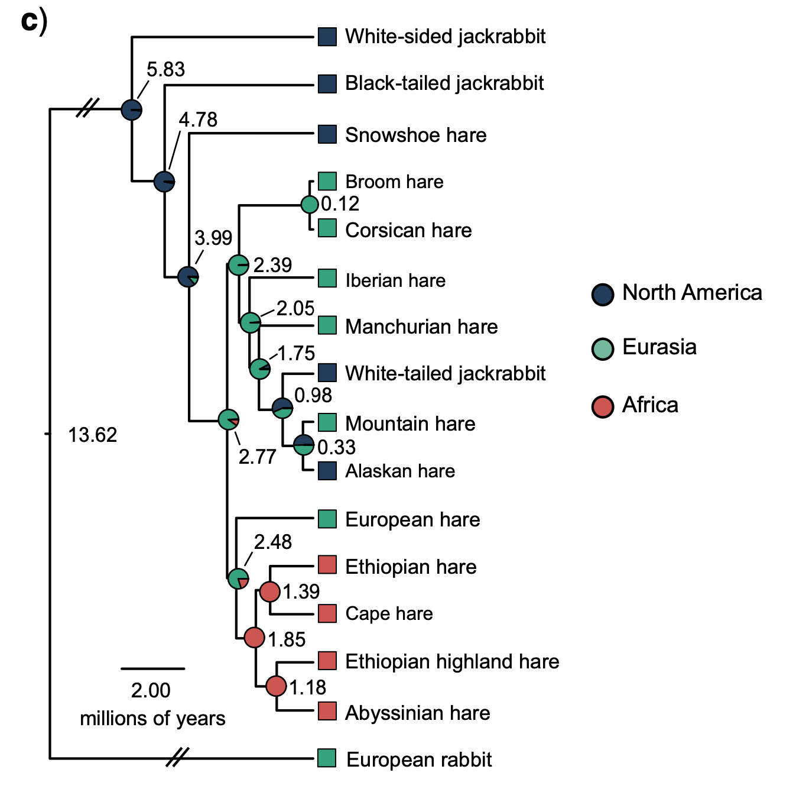

Estimating Site Frequency Spectra
===================================

As we discussed in lecture, the site frequency spectrum (SFS; also known as allele frequency spectrum) is a widely-used and very informative statistic to summarize genetic variation within a population. Today's practical will deal with estimating the SFS using different approaches, and using it to calculate other summary statistics, namely the various estimators of $\theta$ that we covered in class.
<bc><bc>

## Known genotypes and ancestral states

Let's begin with the easiest possible case: The file called "W4Matrix.txt" contains data simulated under tha standard neutral coalescent model ($\theta=300$) at 1,000 sites across a hypothetical genome. We've also assumed that these sites are very far from one another along the genome, to the point where they recombine freely. This means each site is part of a locus with a different genealogy. Since our theoretical expectation for the SFS, $\eta_i=\frac{\theta}{i}$, is <i>across all possible genealogies</i>, then these data should closely resemble the expectation. Download this file to your computer. 
<br><br>
Since we know the ancestral states, calculating the SFS for this dataset is quite easy. We just need to count the number of derived alleles at each site, and tabulate our counts. We can do this in R:

```R
# Read in the file. You may need to add the path to your data matrix file. 
genotypes=read.table("W4Matrix.txt")

# Generate counts. 
#Since we score derived alleles as 1 and ancestrals as 0, we can quickly count the derived alleles by adding all the genotypes at each site.
#The colSums() function gives the sum for each column of the matrix
counts=colSums(genotypes)

#Use the table() function to tabulate our results
SFS=table(counts)

## Plot!
barplot(SFS, xlab="Derived Allele count", ylab="Number of Sites", col="black")
```

How does the SFS look? Does it appear to follow the theoretical expectation? We can assess this visaully by plotting them alongside each other. 

```R
# First create a matrix with observed and expected SFS together. Recall Theta=300
ObsExp=matrix(c(300/1:19,SFS), nrow=2, byrow=T)

## Plot
barplot(ObsExp, beside=T, col=c("grey15", "grey65"), xlab="Derived Allele count", ylab="Number of Sites", names=1:19)
legend("topright", c("Expected", "Observed"), fill=c("grey15", "grey65"))
```
Now lets estimate $\theta$ using the equations we discussed in class. Fu and Li's estimator is simply the numver of singletons:
$$\hat{\theta}_{FL}=\eta_1$$
```R
Theta_FL=SFS[1]

> ThetaFL
[1] 309
```

Pretty close, now lets calculate Watterson's estimator, which is equal to the number of segregating sites controlled by sample size:

$$\hat{\theta}_{W} = \frac{S}{\sum\frac{1}{i}} = \frac{\sum \eta_i}{\sum\frac{1}{i}}$$ 

Try to write this one out on your own. What answer do you get?

<details>
   <summary> Click here to see the answer</summary>

```R
n=20
Theta_W=sum(SFS)/sum(1/1:(n-1))
  
> Theta_W
[1] 281.8696
```

</details>
  
Finally, lets calculate Tajima's estimator. Try to do this one on your own as well. It is a bit more complicated, since you'll have to use a loop, but it is worth giving it a try. 

$$\hat{\theta}_{\pi}= \frac{\sum d_{i,j}}{n(n-1)\big{/}2}=\frac{\sum i(n-i)\eta_i}{n(n-1)\big{/}2}$$
  
<details>
   <summary> Click here to see the answer</summary>

```R
n=20
dist=c()

for(i in 1:(n-1)){dist[i]=i*(n-i)*SFS[i]}

Theta_pi=sum(dist)/((n*(n-1)/2))
  
> Theta_pi
[1] 277.1421
```

</details>

So overall it seems like our Theta estimators are relatively close to the expected value. 

## Using Real Data
  
Now lets estimate teh SFS from some real data. We will again use the snowshoe hare sequences that we worked with on Week 3. In the interest of time, the reads for 6 snowshoe hares and two individuals from outgroup species (more on this below) have already been mapped back to the snowshoe hare genome. The procedure used for this was very similar to what we did on Week 3, with the only difference being that duplicated reads were marked after mapping, so that the programs that we will use in downstream analyses know to treat duplicates as such. Below is an example of the code used for one file:
  
  ``` bash
  
module load Bioinformatics sratoolkit bwa samtools picard-tools
  
## Download file
  
prefetch SRR11020246; fasterq-dump SRR11020246
  
## Quality-trim the reads
  
skewer -o SRR11020246 -t 4 SRR11020246_1.fastq SRR11020246_2.fastq
  
## Map and sort. Note that we are doing both steps in a single line of code. 
ref=/scratch/eeb401s002f22_class_root/eeb401s002f22_class/shared_data/RefGenomes/LepAme_RefGenome_GCA_004026855.1.fa

bwa mem -t 8 $ref SRR11020246-trimmed-pair1.fastq SRR11020246-trimmed-pair2.fastq | samtools sort -O BAM -@  4 -o SRR11020246.sorted.bam

  
## Add some info to the file prior to duplicate marking 
PicardCommandLine AddOrReplaceReadGroups I=SRR11020246.sorted.bam O=SRR11020246.sorted.RG.bam SORT_ORDER=coordinate RGLB="$ref" RGPU=NONE RGSM=SRR11020246 RGID=SRR11020246 RGPL=Illumina VALIDATION_STRINGENCY=LENIENT


# Mark duplicates
PicardCommandLine MarkDuplicates I=SRR11020246.sorted.RG.bam O=SRR11020246.sorted.deduped.bam M=SRR11020246.dupMetrics.txt AS=true CREATE_INDEX=true MAX_FILE_HANDLES=1000 VALIDATION_STRINGENCY=LENIENT REMOVE_DUPLICATES=false

# Remove intermediate files
rm SRR11020246.sorted.RG.bam
rm SRR11020246.sorted.bam
```
<br><br><br>
   
 We are now ready to go. Sign into the Greatlakes cluster as we did last time, create a directory named `Week4`, move into it (`cd Week4`) and request a job. This time around we will need some more memory. 
```bash
srun --account eeb401s002f22_class --time 1:30:00 --mem 48G --tasks-per-node 1 --pty bash
```
   
<b> What is the ancestral allele though?</b>
<br><br>
Before we start, you may have wondered: How will we know which allele is ancestral and which is derived? We can't travel in time and sequence the ancestor of our snowshoe hare population, so we'll need to make an educated guess. A common way to do this, is to use the allele present in a closely related species, often called an <i>outgroup</i> species. of course, there is the possibility that a difference between our outgroup and focal species is due to mutation in the outgroup. To ameliorate this, we can use more than one outgroup. Hypothetically the two outgroups could have experienced the same mutation at the same site in parallel, but this is highly unlikely, so we can safely assume that if two different outgroup species have the same allele, it is most likely the ancestral allele for our focal species. 
<br><br>
Fortunately, there is a pretty good phylogeny of hares available, and exome-enrichment data has been generated for several species in the genus (<i>Lepus</i>). Based on the phylogeny below, generated by Ferreira et al (2020; https://doi.org/10.1093/sysbio/syaa088), I chose the Black-tailed jackrabbit (<i>L. californicus</i>) and the Mountain hare (<i>L. timidus</i>). 


   
Reads from one individual of these species were mapped to the snowshoe hare genome as detailed above. I then used these read mappings to generate an "ancestral genome sequence", which looks just like the actual genome sequence, but has our best guess for the ancestral allele at each position. The proceudre to generate this is realtively straightworward, but in the itnerest of time we are going to skip it and go straight ahead to SFS estiamtion. 

Lets first load the necessary modules, and create some variables to make our code tidyer. The variables just include the long <i>paths</i> to the folders where many of our files of interest will be found. 

```bash
   module load Bioinformatics angsd R

## Set some directories as variables

ref=/scratch/eeb401s002f22_class_root/eeb401s002f22_class/shared_data/RefGenomes/LepAme_RefGenome_GCA_004026855.1.fa
lists=/scratch/eeb401s002f22_class_root/eeb401s002f22_class/shared_data/lists
bams=/scratch/eeb401s002f22_class_root/eeb401s002f22_class/shared_data/bams
```
Type `ls $bams`. What do you see in there?
<br><br>

OK, time to estimate our SFS frequencies. The first step is to go over all the genotyped sites and calculate the likelihood of all possible SFS at each site.

```bash
angsd -b "$lists"/ingroup.filelist -GL 1 -anc ancestral.fa -ref $ref -sites OutgroupFixedSites.txt -rf OutgroupFixed_chr.txt -dosaf 1 -out L_amer -baq 1 -C 50 -minMapQ 20 -minQ 20 -remove_bads 1 -only_proper_pairs 1 -doMajorMinor 1 -doHWE 1 -minHWEpval 0.001
```

Lets unpack this command a little. <br><br>

The `-b` flag tells Angsd to use the bam files in a list that can be found at "$lists"/ingroup.filelist<br>
   `-GL` specifies the specific equation to ge used for genotypel likelihood calculations. <br>
   `-anc` provides our "ancestral" reference geomne.<br>
   `-ref` provides the reference geomne to which we mapped our reads.<br>
   `-sites` points to a file that contains information on the sites that were identical between both outgroup species, and asks Angsd to onoy look at these sites. <br>
   `-rf` gives a file with the regions that include the "good" sites (see previous flag). This speeds up the process by letting Angsd know where to look for these sites. <br>
   `-dosaf 1` tells Angsd to calculate site allele frequencies and their associated likelihoods.<br>
   `-out` Specifies the name of the output files.<br>
   <br>
   After this there are multiple flags aimed at removing data that isn't in great shape, for example by setting minimum base quality thesholds, using only sites that don't deviate too much from HWE, or removing reads that don't map too well. 

<br><br>
   The command will take about 30 minutes to run. Since you may not want to wait this long, feel free to cancel the run (`ctrl+C`) and copy the output of this step into your directory: `cp /scratch/eeb401s002f22_class_root/eeb401s002f22_class/shared_data/L_amer.saf.* .`
   
   Now that we have our counts, we can try to find the most likely SFS. Angsd comes with an auxiliary program that maximizes the likelihood of the SFS, called realSFS. We can ask it to run for at most 200 iterations while trying to find the best SFS. In the interest of time, we will limit out analysis to the first 20,000,000 sites. 
   
   ```bash 
   realSFS -maxIter 200 -nSites 20000000 L_amer.saf.idx > L_amer.ml.sfs.txt
   ```
Download the file called L_amer.ml.sfs.txt to the desktop as we did last time. You can read it into R using `sfs<-scan("L_amer.ml.sfs.txt"), and plot it as we did above. Note that this SFS has 13 entries, as it includes values for fixed sites both at the ancestral (first entry) and derived (last entry) allele. You may want to plot values 2-12. <br>
<br>
How does the SFS look? Does it seem real?
<br><br>
   <b>What if we can't confidently infer the ancestral allele</b><br><br>
   
   I'm sure you can imagine several situations in which infering ancestral bases confidently may be difficult or problematic. In those cases, we can use a version of the SFS often called the <i>folded</i> or <i>minor</i> allele frequency spectrum. It is still a frequency spectrum, but uses the frequency of the minor (ie least comon) allele, regardless of which one is ancestral. Therefore, for n samples it goes from 1 to (n/2), instead of 1 to n. We can obtain this spectrum from the unfolded (ie. regular) SFS by just adding $\eta_i+\eta_{n-i}$. For example, for 10 samples, sites with 1 derived alleles get added to sites with 9 derived alleles, since in both cases the least common allele is at frequency 0.1. <br><br>
   
   We can easily produce a folded spectrum on reafSFS by just adding the `-fold 1` flag. 
   
   ```bash
   
  realSFS -maxIter 200 -nSites 20000000 -fold 1 L_amer.saf.idx > L_amer.ml.folded.sfs.txt
```
   Does this look better?
