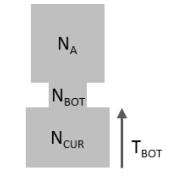

Demographic Inference
==========

The evolutionary history of a lineage is often marked by changes in population size. Therefore, estimating historical demographic changes can be a highly informative approach for evolutionary biologists. Coalescent theory provides a powerful framework for this, since the rate of coalescence depends on the (effective) population size. Today we will be impleenting two a widely-used approaches for demographic inference that rely strongly the coalescence theory: The "skyline" plot, and maximum likelihood parameter estimation via coalescent simulations. You will need to have installed some software on your local computer: <a href="https://www.beast2.org/" >BEAST2</a>, a very powerful suite of programs for the inference and analysis of evolutionary trees, and <a href="https://github.com/beast-dev/tracer/releases/tag/v1.7.2" >Tracer</a>, used to visualize the results of Bayesian MCMC analysis. If you haven't please install them. In addition, we will be using  <a href="http://cmpg.unibe.ch/software/fastsimcoal28/" >fastsimcoal2</a>, which is a very powerful coalescent simulator that also implements an algorithm for simulation-based maximum likelihood estimation. It is already on Greatlakes. 
<!---The third one is already on greatlakes. --->

## Skyline plot

In cases where we can confidently estimate the genealogy of a locus <i>that does not recombine</i>, we can use the coalescence times in this genealogy to estimate the population size at different intervals of our focal lineage's history. In many cases finding non-recombining loci longer than a few base-pairs is very difficult, since recombination is pretty ubiquitous across genomes. Although short DNA sequeces experience very little recombination within them, and are therefore sometimes used as fully-linked markers, estimating their genealogy accurately is often challenging, given they provide very little data to work with. However some types of genetic material, such as mitochondrial/chloroplast DNA or viral DNA/RNA sequences, do not recombine, or do so very infrequently and have relatively high mutation rates, so we can easily and confidently estimate their genealogies. For today's lab, we will be estimating recent changes in the population size of the SARS-Cov-2 virus, which causes covid 19, in the state of Michigan. 
<br><br>
The National Center of Biotechnology Information (NCBI) maintains a [database](https://www.ncbi.nlm.nih.gov/labs/virus/vssi/#/dashboard?taxid=2697049) with a large number of the SARS-Cov-2 sequenced by genetic surveillance efforts. Today we will be analyzing the 209 sequences from this database that were collected from patients in Michigan in late January of this year. The file `MI_Covid.aln.fasta` contains an alignment of all of these sequences. Ideally, we would analyze them all together. However, in the interest of time, we will be analyzing 100 randomly chose sequences. Since each of us will be analyzing a different random subset of 100 sequences, we'll be able to evaluate how much our results vary by our smaller sample size. 
  <br><br>
  Lets beging by sub-sampling our alignment. For this we will use the `ape` package in R. 
  ```R
  library(ape)

#Read in alignment. Remember to adjust your path!
aln=read.dna("MI_Covid.aln.fasta", format="fasta")

#Create a new alignment that only includes 100 random rows of the complete alignment
random=aln[sample(1:nrow(aln), 100, rep=F),]

#Write out the new file in nexus format. Remember to adjust your path!
write.nexus.data(random, file="MI_Covid.aln.100random.nex", format="DNA", interleaved=F)
```
  <b>Setting up the analysis in BEAUTi</b><br>
  
Now we'll set up a configuration file for BEAST to run our skyline plot analysis. This can be done using the program BEAUTi, which is distributed with BEAST. When you open BEAUTi, you'll find multiple different tabs at the top of the window. In the "Partitions" tab we will load our alignment. To do so go to `File -> Import Alignment`, and select your file with 100 random sequences. Once the file loads, you should see a new partition appear, with 100 taxa and 29,903 nucleotide positions. 
<br><br>
The "Tip Dates" tab can be used to give BEAST the dates at which out sequences were sampled, which can help callibrate the branch lengths from units of genetic distance to time, and provide a more accurate estimation of population size by relaxing the assumption that all samples were collected in the present. Since all of our sequences were collected within a short period of time (Jan 8-24), we will set all samples as having been collected at the same time, and use an experimentally-determinaed mutation rate to callibrate branches (see below). We can therefore skip the "Tip Dates" tab . 
<br><br>
In the "Site Model" tab we will specify our mutation model (also known as a model of DNA evolution). Since we are dealing with a relatively short DNA sequence with a high mutation rate, we will use a finitely-many alleles model with four possible states (A,T,G,C). This is commonly done for tree-inference, since we need sequences that evolve fast enough to generate enough information that allows us to infer the tree, so the possibility of a site mutating more than once must be taken into account. We will use a model commonly known as "HKY", which considers all <i>transversions</i>, that is changes between a purine (A, G) and a pyrimidine (C, T), are equally probable, and all <i>transitions</i>, changes between two purines or pyrimidines, as $\kappa$ (kappa) times as probable as transitions. In addition, we will add add an extra parameter called $\Gamma$ (Gamma) that allows for some sites to vary more than others. Specifically, it considers sites as part of four variation categories (something like not too variable, somewhat variable, variable, really variable). This may seem a little confusing if you are not familiar with tree inference methods. Fully understanding this model is not essential for our purposes beyond the fact that it is a finitely-many alleles model. If you are itnerested in learning mroe about this type of nucleotide substitution models, I highly recommend this [site](https://revbayes.github.io/tutorials/ctmc/). 
<br><br> 
To specify this model on BEAUTi change the "Subst Model" item to "HKY", and endet "4" in the number of Gamma categories.<br> 


<b>Question 1:</b> Why would an infinite-sites model not be a very good fit for this situation?

<br>The "Clock Model" tab deals with how we will callibrate our tree so that branches are in units of time. This can be done in two main ways: Either setting some of the nodes/tips to specific dates to estimate the mutation rate and the ages of the remaining nodes, or by assuming a mutation rate. We will use the mutation rate reported by Castillo Morales and collaborators ([2021](https://doi.org/10.1093/gbe/evab196)), who estimated a rate of ~0.0015 mutations per site per year (that is FAST!). Since months are a more appropriate time scale for our analyses, we will use $\frac{0.0015}{12}=0.000125$ mutations per site per month. Enter this rate into the text box. 
  <br><br>
We will be optimizing the parameters in our tree model using an algorithm known as Markov CHain Monte Carlo (MCMC), which relies on Bayesian statistics. Therefore, we must specify some of our prior beliefs about our system. While the analysis is running, we will briefly discuss this algorithm as a class. We can use most of the default priors, excepr for the one regarding the tree structure. The default is a Yule model, which describes a branching process more appropriate for modelling speciation than coalescence (ie. it is more adequate for phylogenetics). We will use a "Coalescent Bayesian Skyline," which models a coalescent genealogy with varying population size. 
  <br><br>
  Finally, the "MCMC" tab deals with the technical aspects of our optimization algorithm. The default number of iterations (labelled as "Chain length" is 10,000,000. In the itnerest of time we will only run 5,000,000. Change the chain length to 5,000,000, and save you configuration file using File -> Save. 
  <br><br>
  <b>Running the MCMC</b>
  <br><br>
 To run BEASTopen the terminal (but don't log into the cluster yet) and use `cd` to navigate to the directory where your files are. Once there run the following command to start the run
  ```bash
/Applications/BEAST\ 2.7.0/bin/beast -threads 2 MI_Covid.aln.100random.xml
#Remember to adjust your path and file name accordingly!
```
While the analysis runs, we will briefly go over how an MCMC algorith works. 
<br><br>
  
  <b> Building the Skyline Plot</b>
<br><br>
When the analysis finishes running, open Tracer and load the log file from your run (e.g. `MI_Covid.aln.100random.log`). After your file loads, you should see the parameters of your model and some statistics regarding how well their ran durring the MCMC. We will briefly discuss the meaning of these parameters as a class before proceeding to generate our skyline plot. Once that is done, on the top menu bar go to "Analysis -> Bayesian Skyline Reconstruction". A new dialog box will open. On the "Trees Log" window select the "trees" file from your BEAST run (e.g. `MI_Covid.aln.100random.trees`). Leave teh rest of fields as defaults, except for the last text box, which asks for the age of the youngest sample. For the purposes of this lab, we can enter an age of 1.8 months (ie. late January), to reflect the fact that our samples were collected throughout the month of September. Click "OK" and wait for the analysis to complete. A plot should appear. 
<br><br>
<b>Question 2:</b> What does the plot suggest about the history of Covid-19 in Michigan over the last few months? How would you interpret this from a biological (e.g. epidemiological) perspective? Include your plot on the report. 

  <b> Obtaining the Genealogy </b> 
<br><br>
Lets now look at the genealogy of our samples. Being a Bayesian method, BEAST produces a set of "credible" trees. We can summarize these sets into a single "averaged" estimate using the TreeAnnotator program, also distributed with BEAST. Open this program, load your trees file, and pick a name for your new summary tree file. Leave the rest of fields as default and hit the "Run" button. Once the program is finished, you should find the tree fiel in your work directory. We can plot this tree in R.
  
```R
library(ape)
tree=read.nexus("MI_Covid.aln.100random.tre")
plot(tree, direction="downwards", show.tip.label=F)
```
<b>Question 3:</b> What do you see? Does this coincide with the skyline plot? Explain your reasoning.

## Estimating Parameters from the SFS

We will now switch gears and move on to demographic inference using the SFS produced from genotypes at multiple loci across the genome. For this we will focus on a population of Monarch butterflies (<i>Danaus plexippus</i>), from the state of Hawaii. This population is thought to have recently become established int the Hawaiian islands after dispersing from mainland North America. Zhan et al ([2014](https://www.nature.com/articles/nature13812#Sec19)) sequenced whole genomes of several individuals from this population, which were used to estimate an SFS as we did in the Week 4 practical. You can find the estimated SFS on Canvas (D_plexi.ml.sfs.txt). 

<br>

<br>

Before jumping into complex optimization algorithms, lets explore our SFS. Download the file, and plot it algonside the expected SFS (which you can calculate using e.g. $\theta_W$). 

<b>Question 4a:</b> How do the observed and expected SFS compare? What does this suggest about the demographic history of our focal population?<br>
<b>Question 4b:</b> Use the observed SFS to caculate the numerator of Tajima's D. Does it agree with your results from 4a? Explain.

<b>Setting up a fastsimcoal run</b>

We will now investigate further the demographic history of the Hawaiian <i>D. plexippus</i> by fitting a piecewise population size function with two instantaneous changes, often referred to as a "bottleneck" model. Our specific model, illustrated below, has five parameters: The population sizes in the present ($N_{CUR}$), durring the bottleneck ($N_{BOT}$), and before the bottleneck ($N_{A}$), and the times when population changed ($T_{BOT}$ and $T_{ENDBOT}$).

<br>

<br>

The first thing we need to do is to convert our SFS to a format that fastsimcoal can read. This entails 1. adding a header, and 2, moving all sites in the "fixed derived" category to "fixed ancestral". This is done because in fastsimcoal simulations any mutation that is fixed must have ocurred prior to the MRCA of the sample, and is therefore considered ancestral. As this is a simple procedure, it has been done for you already. Below is the resulting file:

```
 1 observations
d0_0	d0_1	d0_2	d0_3	d0_4	d0_5	d0_6	d0_7	d0_8	d0_9	d0_10	d0_11	d0_12	d0_13	d0_14	d0_15	d0_16
139679872.99	2002381.74	959381.49	609912.91	425813.46	320652.49	246962.37	194461.29	159662.21	129788.50	110476.09	96031.53	81025.83	72690.43	68135.44	69975.22	0.00
```
Next we need to specify our model of evolution. This is done through a filed called a "tempalte" file. THe syntax of this file is relatively straightforward, so we will not go very deep into it in the interest of time. That being said, if you use this software in the future for your own research I strongly recommend reading its (very informative) manual to understand the details of its operation. The template file looks like this: 

```
//Number of population samples (demes)
1
//Population effective sizes (number of genes)
NCUR
//Sample sizes
16
//Growth rates	: negative growth implies population expansion
0
//Number of migration matrices : 0 implies no migration between demes
0
//historical event: time, source, sink, migrants, new size, new growth rate, migr. matrix 
2  historical event 
TBOT 0 0 0 RESBOT 0 0
TENDBOT 0 0 0 RESENDBOT 0 0
//Number of independent loci [chromosome] 
1 0
//Per chromosome: Number of linkage blocks
1
//per Block: data type, num loci, rec. rate and mut rate + optional parameters
FREQ 1 0 2.9e-9 OUTEXP
```
Each line specifies one or a set of related parameters. Note than in some cases we have specified numbers (e.g. number of populations, number of samples), while in other we've specified variable names. The latter are the parameters that we want to estimate. Nor instance, we've specified the current efective population size as $NCUR$. The key part of this file is the "historical event" section, where we describe the history of our simulated populations. These are described as detailed in the first line of this section. Basically, we specify the time at which something happened, and then describe what happened. In this case we have two events that happened at times $T_{BOT}$ and $T_{ENDBOT}$. In both cases, we specified "0" for the first three fields, which are used to describe migration events (source population, sink population, migration rate), we then specified a that at this time, the new population size is $RES_{BOT}$ or $RES_{ENDBOT}$ times smaller than the previous size. Finally, we also added zeros to parameters specifying growth rates and migration matrices. As you may imagine, we specified all thoise zeros because these parameters don't apply to our simulation (i.e. we have one population that grows instantaneously and doesnt give/receive migrants).<br><br>

The last line is where we specify the type of data we want to simulate. In this case we're asking fastsimcoal to generate an expected site frequency spectrum (FREQ). It won't simulate loci because it uses trees to do so, and assumes free recombination between simulated sites. The OUTEXP parameter tells it to output the expected SFS. 
<br><br>

Finally, we need to give the algorithm some rules to optimize the likelihood of our model. This file is called an "estimation" file. 
```
// Priors and rules file
// *********************

[PARAMETERS]
//#isInt? #name   #dist.#min  #max
//all Ns are in number of haploid individuals
1  NCUR  unif 10  100000 output
1  NANC  unif 10  100000 output
1  NBOT  unif 10  100000 output
1  TBOT  unif 10  10000 output
[RULES]

[COMPLEX PARAMETERS]
0 RESBOT    = NBOT/NCUR hide
0 RESENDBOT = NANC/NBOT hide
1 TENDBOT   = TBOT+100  hide
```
This file tells the algorithm the distributions from which to sample our initial parameters (which are uniform between 10-100K for all the pop. sizes and 10-10K for the time to bottleneck), and specifies complex parameters, such as those that represent rations between parameters, or sumations of parameters. Notice, for example, how we specified $RES_{BIOT}$ and $RES_{ENDBOT}$ as ratios of population sizes. The last line of the file specifies that the time when the bottleneck began (or when it ended thinking backwards from the present) is fixed at 100 generations before (or after thinking backwards) the end (or begining) of the bottleneck. We do this, because it is often difficult to estimate both the duration and $N_e$ for a bottleneck event. Since branch lengths and coalescence rates depend on $N_e$, we could get very similar genealogies durring a a short, drastic, bottleneck and a long, milder one.  Instead, we can fix the duration, and estimate the <i>bottleneck intensity</i>, which can be expressed as the ratio of duration to effective population size: $I_B=\frac{T_B}{2{N_e}_B}$. 
<br><br>

<b> Running the parameter optimization</b>


