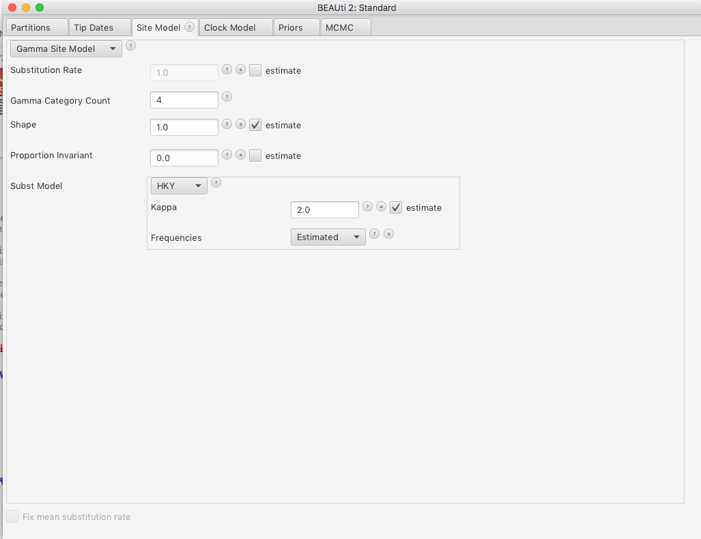
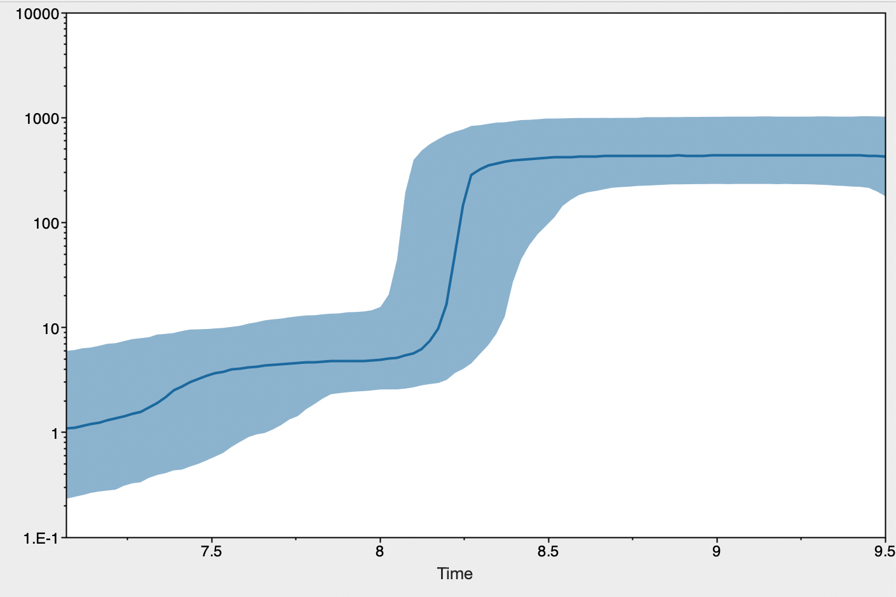
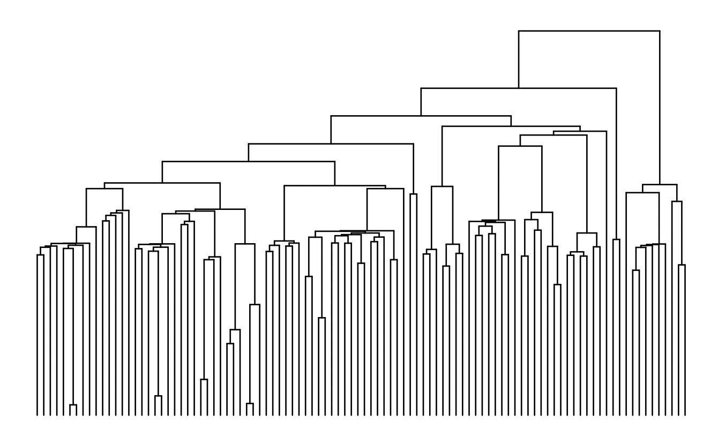

Demographic Inference from Coalescent Genealogies
==========

The evolutionary history of a lineage is often marked by changes in population size. Therefore, estimating historical demographic changes can be a highly informative approach for evolutionary biologists. Coalescent theory provides a powerful framework for this, since the rate of coalescence depends on the (effective) population size. Today we will be impleenting a widely-used approach for demographic inference under the coalescent model: The "skyline" plot. You will some software installed: <a href="https://www.beast2.org/" >BEAST2</a>, a very powerful suite of programs for the inference and analysis of evolutionary trees, and <a href="https://github.com/beast-dev/tracer/releases/tag/v1.7.2" >Tracer</a>, used to visualize the results of Bayesian MCMC analysis. If you haven't please install the first two (locally) on your cumputer.
<!---The third one is already on greatlakes. --->

## Skyline plot

In cases where we can confidently estimate the genealogy of a locus <i>that does not recombine</i>, we can use the coalescence times in this genealogy to estimate the population size at different intervals of our focal lineage's history. In many cases finding non-recombining loci longer than a few base-pairs is very difficult, since recombination is pretty ubiquitous across genomes, and estimating the genealogy of a short sequence is challenging, since it provides very little data to work with. However some types of genetic material, such as mitochondrial/chloroplast DNA or viral DNA/RNA sequences, do not recombine, and have relatively high mutation rates, so we can easily and confidently estimate their genealogies. For today's lab, we will be estimating recent changes in the population size of the SARS-Cov-2 virus, which causes covid 19, in the state of Michigan. 
<br><br>
The National Center of Biotechnology Information (NCBI) maintains a database with a large number of the SARS-Cov-2 sequenced by genetic surveillance efforts. Today we will be analyzing the 911 sequences in this database that come from samples collected from patients in Michigan this month. The file `MI_Covid.aln.fasta` contains an alignment of all of these sequences. Ideally, we would analyze them all together. However, in the interest of time, we will be analyzing 100 randomly chose sequences out of this alignment. Since each of us will be analyzing a different random subset of 100 sequences, we'll be able to evaluate how much our results vary by our smaller sample size. 
  <br><br>
  Lets beging by sub-sampling our alignment. For this we will use the `ape` package in R. 
  ```R
  library(ape)

#Read in alignment. Remember to adjust your path!
aln=read.dna("MI_Covid.aln.fasta", format="fasta")

#Create a new alignment that only includes 100 random rows of the complete alignment
random=aln[sample(1:nrow(aln), 100, rep=F),]

#Write out the new file in nexus format. Remember to adjust your path!
write.nexus.data(random, file="MI_Covid.aln.100random.nex", format="DNA", interleaved=F)
```
  <b>Setting up the analysis in BEAUTi</b><br>
  
Now we'll set up a configuration file for BEAST to run our skyline plot analysis. This can be done using the program BEAUTi, which is distributed with BEAST. When you open BEAUTi, you'll find multiple different tabs at the top of the window. In the "Partitions" tab we will load our alignment. To do so go to `File -> Import Alignment`, and select your file with 100 random sequences. Once the file loads, you should see a new partition appear, with 100 taxa and 29,863 nucleotide positions. 
<br><br>
The "Tip Dates" tab can be used to give BEAST the dates at which out sequences were sampled, which can help callibrate the branch lengths from units of genetic distance to time. Since all of our sequences were collected this month, we will use an experimentally-determinaed mutation rate instead (see below), so we can skip the "Tip Dates" tab . 
<br><br>
In the "Site Model" tab we will specify our mutation model (also known as a model of DNA evolution). Since we are dealing with a relatively short DNA sequence with a high mutation rate, we will use a finitely-many alleles model. This is commonly done for tree-inference, since we need sequences that evolve fast enough to generate enough information that allows us to infer the tree, so back-mutation must be taken into account. We will use a model commonly known as "HKY", which considers all <i>transversions</i>, that is changes between a purine (A, G) and a pyrimidine (C, T), are equally probable, and all <i>transitions</i>, changes between two purines or pyrimidines, as $\kappa$ (kappa) times as probable as transitions. In addition, we will add add an extra parameter called $\Gamma$ (Gamma) that allows for some sites to vary more than others. Specifically, it considers sites as part of four variation categories (something like not too variable, somewhat variable, variable, really variable). This may seem a little confusing if you are not familiar with tree inference methods. Fully understanding this model is not essential for our purposes beyond the fact that it is a finitely-many alleles model. If you are itnerested in learning mroe about this type of nucleotide substitution models, I highly recommend this [site](https://revbayes.github.io/tutorials/ctmc/). 
<br><br> 
To specify this model on BEAUTi change the "Subst Model" item to "HKY", and endet "4" in the number of Gamma categories. 

<br>The "Clock Model" tab deals with how we will callibrate our tree so that branches are in units of time. This can be done in two main ways: Either setting some of the nodes/tips to specific dates to estimate the mutation rate and the ages of the remaining nodes, or by assuming a mutation rate. We will use the mutation rate reported by Castillo Morales and collaborators ([2021](https://doi.org/10.1093/gbe/evab196)), who estimated a rate of ~0.0015 mutations per site per year (that is FAST!). Since months are a more appropriate time scale for our analyses, we will use 0.0015/12=0.000125 mutations per site per month. Enter this rate into the text box. 
  <br><br>
We will be optimizing the parameters in our tree model using an algorithm known as Markov CHain Monte Carlo (MCMC), which is a Bayesian method. HTerefore, we must specify some of our prior beliefs about the data. WHile the analysis is running, we will briefly discuss this algorithm as a class. We can use most of the default priors, excepr for the one regarding the tree structure. The default is a Yule model, which describes a branching process more appropriate for modelling speciation than coalescence (ie. it is more adequate for phylogenetics). We will use a "Coalescent Bayesian Skyline," which models a coalescent genealogy with varying population size. 
  <br><br>
  Finally, the "MCMC" tab deals with the technical aspects of our optimization algorithm. The default number of iterations (labelled as "Chain length" is 10,000,000. In the itnerest of time we will only run 5,000,000. Change the chain length to 5,000,000, and save you configuration file using File -> Save. 
  <br><br>
  <b>Running the MCMC</b>
  <br><br>
 To run BEASTopen the terminal (but don't log into the cluster yet) and use `cd` to navigate to the directory where your files are. Once there run the following command to start the run
  ```bash
/Applications/BEAST\ 2.7.0/bin/beast -threads 2 MI_Covid.aln.100random.xml
#Remember to adjust your path and file name accordingly!
```
While the analysis runs, we will briefly go over how an MCMC algorith works. 
<br><br>
  
  <b> Building the Skyline Plot</b>
<br><br>
When the analysis finishes running, open Tracer and load the log file from your run (e.g. `MI_Covid.aln.100random.log`). After your file loads, you should see the parameters of your model and some statistics regarding how well their ran durring the MCMC. We will briefly discuss the meaning of these parameters as a class before proceeding to generate our skyline plot. Once that is done, on the top menu bar go to "Analysis -> Bayesian Skyline Reconstruction". A new dialog box will open. On the "Trees Log" window select the "trees" file from your BEAST run (e.g. `MI_Covid.aln.100random.trees`). Leave teh rest of fields as defaults, except for the last text box, which asks for the age of the youngest sample. For the purposes of htis lab, we can enter an age of 9.5 months (ie. mid-September), to reflect the fact that our samples were collected throughout the month of September. Click "OK" and wait for the analysis to complete. A plot should appear. 
<br><br>
What does the plot suggest about the history of Covid-19 in Michigan over the last few months? 
<details>
  <summary> Click here to see the plot</summary>
  
  There is a clear ~50-fold population expansion around the first few weeks of August. What may have happened around this time?
</details>
<br>
  <b> Obtaining the Genealogy </b> 
<br><br>
Lets now look at the genealogy of our samples. Being a Bayesian method, BEAST produces a set of "credible" trees. We can summarize these sets into a single "averaged" estimate using the TreeAnnotator program, also distributed with BEAST. Open this program, load your trees file, and pick a name for your new summary tree file. Leave the rest of fields as default and hit the "Run" button. Once the program is finished, you should find the tree fiel in your work directory. We can plot this tree in R.
  
```R
library(ape)
tree=read.nexus(""MI_Covid.aln.100random.tre")
plot(tree, direction="downwards", show.tip.label=F)
```
What do you see? Does this coincide with the skyline plot?
<br>
  
<details>
  <summary> Click here to see the tree</summary>
  
  <br>
 The long branches towards the tips are what we'd expect under a pretty big expansion like the one on the skyline plot!. 

</details>

<!---## Estimating Parameters from the SFS

Lets now switch gears and move on to demographic inference using teh SFS produced from genotypes at multiple loci across the genome. For this we will be using data collected from <i>Drosophila sechellia</i>, a fruit fly species endemic to the Seychelles archipelago. This species is thought to have recently colonized the Seychelles, where it is abundant now, so we are interested in whether it has experienced a bottleneck in the process. To this end we will infer the SFS using Angsd and fastsimcoal2 for demographic inference. 
# <br><br>
# Log into greatlakes, and start a job that uses 8GB of memory and one task per node (ie. one processor). Now load the modules `Bioinformatics bcftools angsd`. -->


