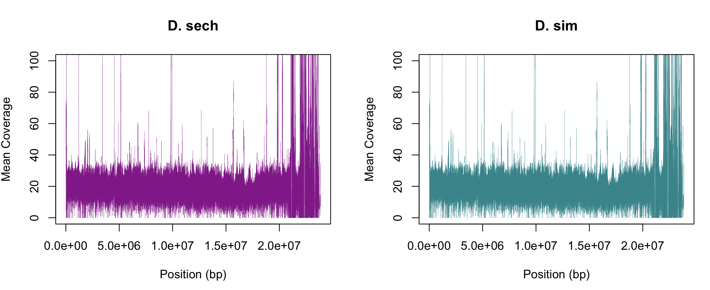
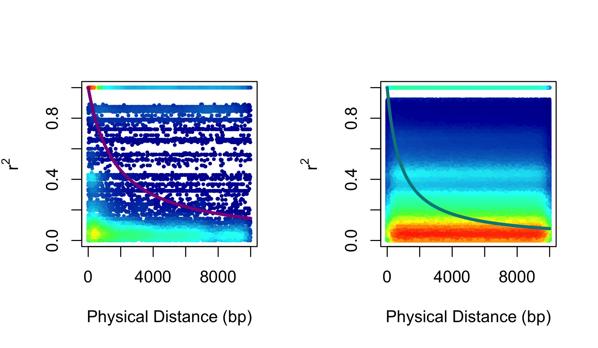

Calculating Linkage Disequilibrium
==============================
Linkage disequilibrium is a very useful source of information in population genetics, which can be used to make inferences about demography, selection, and genome architecture, among others. Today, we will be exploring the decay of LD with physical distance in the genome. 
## Study System
In today's practical, we will focus on populations of two closely-related species of <i>Drosophila</i> flies that inhavit the Seychelles archipelago in West Africa, <i> D. sechellia</i> and <i> D. simulans</i>. The former is endemic to some of the islands in the Seychelles, while the latter is a human commensal with a worldwide distribution. We will be comparing the degrees of LD in populations of both species collected at a single locality in the Seychelles where they coexist. A big thanks to Daniel Matute and Adam Stuckert for making these data available prior to publication. 
## The data
Today we will be using data in the form of called genotypes. That is, reads have already been mapped to the genome, genotype likelihoods have been calculated, and a particular genotype at each site for each individual has been determined based on the GLs. We will therefore be assuming that these genotypes are true, and will not incorporate the unceratainty associated to this process. The data are contained in a file in variant call format, also known as a VCF. This format is basically a very large table where, sites are rows and individuals are columns. For each site, there is inforamtion on genotype, genotype likelihood, depth, and other associated quality measures for each individual. 
<br><br>
Log into the cluster, and start an interactive job and load the relevant modules as follows
```bash
srun --account eeb401s002f22_class --time 1:30:00 --mem 8G --tasks-per-node 1 --pty bash

module load Bioinformatics vcftools
```

Now use `mkdir` to create a directory called `Week6` (or something else that you can remember), move into the directory using `cd` and copy the input files into this directory:
```bash
cp /scratch/eeb401s002f22_class_root/eeb401s002f22_class/shared_data/Dsimulans/Sech_Anro.vcf.gz ./
cp /scratch/eeb401s002f22_class_root/eeb401s002f22_class/shared_data/Dsimulans/Sim_Anro.vcf.gz ./
```
Before begining, take a quick look at what a vcf file looks like on the inside. 
```
less Sech_Anro.vcf.gz
```
Use the "D" key to advance quickly. Advance until you pass the lines starting with "#". Do you see the table with genotype information. Wait here until the rest of the class finishes, and we'll quickly go over the file as a class. 
<br><br>
Now, before jumping into LD calculations, it is a good idea to make sure we have good enough depth to trust our called genotypes. We can get this info using the prgram `vcftools`, which is an excellent tool for processing vcf files and conducting basic popgen analyses off of the data they contain. For time purposes, we will focus all of our analyses on a single chromosome. We specify this using the `--chr` flag in vcftools. 
```bash
vcftools --gzvcf Sech_Anro.vcf.gz --chr NC_052520.2 --out Dsech --site-mean-depth
vcftools --gzvcf Sim_Anro.vcf.gz --chr NC_052520.2 --out Dsim --site-mean-depth
```
This produces two files called `Dsech.ldepth.mean` and `Dsim.ldepth.mean`, which contain tables with the mean depth across all individuals for each site. We could obtain a file with depths for each individual at each site by replacing the `--site-mean-depth` flag with `--geno-depth`, but this file would be very big, so for the purposes of this clas we will work with the average depth across samples. 
<br><br>
Lets take a look inside one of these tables
```bash
head Dsech.ldepth.mean
CHROM	POS	MEAN_DEPTH	VAR_DEPTH
NC_052520.2	2966	4.5	17.1429
NC_052520.2	2967	4.5	17.1429
NC_052520.2	2984	4.5	17.1429
NC_052520.2	2985	4.5	17.1429
NC_052520.2	2986	4.5	17.1429
NC_052520.2	2987	4.5	17.1429
NC_052520.2	2988	4.5	17.1429
NC_052520.2	4953	29.625	559.982
NC_052520.2	5222	50.375	1050.84
```
We can see there are a few sites with low coverage, which then picks up at sire 4953. Now lets get a idea of how coverage varies across the entire chromosome. Open a new terminal and download the files to your local computer
```bash
scp "marquezr@greatlakes.arc-ts.umich.edu:Week6/*.ldepth.mean" .
# Remember to change your user name!
```
Now lets do a couple of quick plots in R. 
```R
#Read in the data
sech_cov=read.table("Dsech.ldepth.mean", h=T)
sim_cov=read.table("Dsech.ldepth.mean", h=T)

##Make a plot with two panels arranged in one row
par(mfrow=c(1,2))

#plot. Note tha twe are capping the y axis at 100. This is done for better visaulization.

plot(sech_cov$POS, sech_cov$MEAN_DEPTH, type="l", xlab="Position (bp)", ylab="Mean Coverage", ylim=c(0,100), lwd=0.25, col="magenta4", main="D. sech")
plot(sim_cov$POS, sim_cov$MEAN_DEPTH, type="l", xlab="Position (bp)", ylab="Mean Coverage", ylim=c(0,100), lwd=0.25, col="turquoise4", main="D. sim")
```

What do you see? Would you use these data?

<details>
<summary> Click here to see the plot and some ideas</summary>

<br><br>
For most sites depth oscilates around 20X, which we have seen in class is a good level of coverage to work with called genotypes. However, there are several sites with very high depth, which suggests there may have been problems with read mapping. Many of these sites are towards the ends of the chromosomes, where repetitive elements are abundant, so this makes sense. To avoid using these suspect sites, moving on we will specify a maximum depth, 50X, beyond which sites will be ignored. Since the end of the chromosome has many sites with high depth, we will ignore it, and focus on the first 2e7 bases. 
</details>

## Estimating LD

Now that we're happy with our data, we can use vcftools to estimate LD. The command below will go ovever all pairs of sites and calculate $r^2$ between them. Doing this for all pairs of sites in this 20,000,000bp chromosome would take an enormous amount of computational resources, and wouldn't give us much information, since LD usually drops to its baseline levels after a few thousand base pairs. Therefore, we will tell vcftools to only look at sites that are at most 10,000 base pairs apart. 

```bash
vcftools --gzvcf Sech_Anro.vcf.gz --chr NC_052520.2 --from-bp 10000 --to-bp 20000000 --max-meanDP 50 --max-missing 0.5 --maf 0.01 --out Dsech --geno-r2 --ld-window-bp 10000
vcftools --gzvcf Sim_Anro.vcf.gz --chr NC_052520.2 --from-bp 10000 --to-bp 20000000 --max-meanDP 50 --max-missing 0.5 --maf 0.01 --out Dsim --geno-r2 --ld-window-bp 10000
```
Note that we specified our region of interest using the `--chr`, `--from-bp`, and `--to-bp`. We aslo specified the maximum depth with `-max-meanDP`, and filtered out sites with more than 50% of the samples missing, and with minor allele frequencies below 0.05 with `--max-missing` and `--maf`, respectively. 

This will produce a table with the positions of the two sites being compared, the corresponding $r^2$ value, and the number of individuals genotyped for both sites. 

```bash
head Dsim.geno.ld 

CHR	POS1	POS2	N_INDV	R^2
NC_052520.2	47039	47100	12	1
NC_052520.2	47039	47114	12	0.454545
NC_052520.2	47039	47127	12	0.00826446
NC_052520.2	47039	47179	12	0.454545
NC_052520.2	47039	47181	12	0.00826446
NC_052520.2	47039	47186	12	0.00826446
NC_052520.2	47039	47188	12	0.00826446
NC_052520.2	47039	47189	12	0.454545
NC_052520.2	47039	47251	12	0.0454545
```
Now that we have our data, it is time to visualize it. Download the two files ending in ".geno.ld" to your computer, and open R. We will need two new packages for this part: `minpack.lm` and `data.table`. The first one allows us to fit non-linear equations to data, and the second one speeds up the reading of large tables. Install them if necessary using `install.packages()`. Once the packages are installed, read in the data and process it a little. 

```
## Load packages
library(minpack.lm)
library(data.table)

#read in the data
ld_sech=fread(file="Dsech.geno.ld", sep='\t', header=T)
ld_sim=fread(file="Dsim.geno.ld",sep='\t', header=T)

#Change the name for the R2 value to avoid problems, having it called "R^2" makes R believe you are elevating an object called R to the second power.
colnames(ld_sech)[5]="R2"
colnames(ld_sim)[5]="R2"
```
As we saw above, the talbe contains the positions of the sites being compared, but not the distance between them, so we must calculate it. 

```R
# Create vectors with the distance
ld_sech$Dist=ld_sech$POS2-ld_sech$POS1
ld_sim$Dist=ld_sim$POS2-ld_sim$POS1
```
Finally, it is time to visualize LD. Since these are pairwise comparisons, there are an enormous number of data points. Therfore, to distill some useful information out of them, we will fit a curve describing the expectation for $R^2$ as a function of physical distance and the population recombination parameter (i.e. $\rho=4N_ec$), where $c$ is the recombination rate par base pair per generation.

$$E[r^2]=\frac{1}{1+\rho}$$
To do so, we can use the `nlsLM()` function in R, which uses least-squares to fit non-linear equations to data (nls stands for non-linear least squares). 
In doing so, we will get an estimate of $\rho$ that we can then use to plot the expected LD decline curve for each species. 
```R
# Fit the model. Trace=T lets you see how the likelihood changes over each iteration. 
fit1=nlsLM(R2~(1/(1+rho*Dist)), data=ld_sech, start = list(rho=0.1), trace=T)
fit2=nlsLM(R2~(1/(1+rho*Dist)), data=ld_sim, start = list(rho=0.1), trace=T)

# Obtain best-fitting rho
fit_rho1=coef(fit1)[1]
fit_rho2=coef(fit2)[1]

## Calculate expected r2 over distance given best-fitting rho
x=1:10000
exp_r1=(1/(1+fit_rho1*x))
exp_r2=(1/(1+fit_rho2*x))

#Plot
plot(x, exp_r1, type="l", lwd=3, col="magenta4", xlab="Physical Distance (bp)", ylab=expression(r^2), ylim=c(0,1))
points(x, exp_r2, type="l", lwd=3, col="turquoise4")
legend(6000,0.95, c("D. sechellia", "D. simulans"), col=c("magenta4", "turquoise4"), lwd=3)
```
What does your plot say? Does this match what we know about these flies' natural and biogeographic history?
<br><br>
Note: You may have noticed that we didn't plot the points at all. This is because plotting such a large number of points would result in a very large computational burden. Below is what it would look like.


