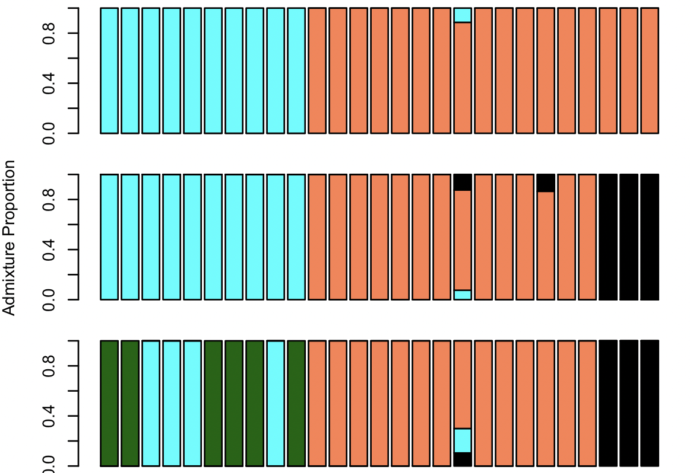

Discrete Population Structure
=============================

Population structure is a universal feature of biological systems, and studying it can provide valuable informationon a variety of their features, ranging from their biogeographic history to their ecological dynamics. Today we will explore population history between populations of <i> Heliconius hermathena</i>, a rare, sparsely distributed butterfly species from the Brazilian Amazon, using data generated by [Massardo et al. (2020)](https://bmcbiol.biomedcentral.com/articles/10.1186/s12915-020-00797-1).


There are multiple subspecies of <i>H. hermathena</i> most of which have quite restricted and fragmented ranges in compariosn to other species of <i>Heliconius</i>. We will focus on <i>H. h. sabinae</i> and <i>H. h. sheppardi</i>, which inhabit the Northwestern Amazon and Japurá/Caquetá river basins (red, yellow, and purple dots in the map above). In today's practical we will explore the extent of population structure between these three localities under the assumptions of discrete population structure models. 

## Setup

Today we will be working on Greatlakes, using data from the paper cited above. The data for today have already been downloaded, quality-trimmed, and mapped to the reference genome for <i>Heliconius melpomene</i> using the approach described in [Week 3](../Week3-IlluminaDataHandling).<br><br>
Log into the cluster, and request a job with 8 processors and 24 Gb RAM. Once the job starts load the `Bioinformatics`, `angsd`, `R`, and `python/3.11.5` modules, and create the following variables:
```bash
ref=/scratch/eeb401s002w24_class_root/eeb401s002w24_class/shared_data/ReferenceGenomes/GCA_013403705.1_ASM1340370v1_genomic.fna
listDir=/scratch/eeb401s002w24_class_root/eeb401s002w24_class/shared_data/W7/
softwareDir=/scratch/eeb401s002w24_class_root/eeb401s002w24_class/shared_data/software
```

## Calculating genotype likelihoods

As we've discussed before, the nature of massively parallel sequencing data allows us to take into account genotype uncertainty by basing our inferences in genotype likelihoods (GLs) instead of assumed genotypes. Therefore, our first step will be to use our bam files to calculate the genotype likelihoods for each individual at each site. We will then use these GLs for for downstream analyses. We can do this en `Angsd`. To save time and storage space, we will ask Angsd to make a decision on whether a particular site is variable (this is called "calling SNPs"), and to only print out geontype likelihods at variable sites. We do so by the `-SNP_pval` flag. Angsd will then do a statistical test for whether each site's minor allele frequency is different from 0, and keep only sites with a p-value below what we specify. In this case we will use 0.01.<br>

```bash
angsd -P 8 -b "$listDir"/All_hermathena.filelist -rf largest_scaffolds.txt -GL 1 -doCounts 1 -doMajorMinor 1 -doMaf 2 -SNP_pval 1e-2  -doGlf 2 -out All_hermathena_GenLik -uniqueOnly 1 -remove_bads 1 -only_proper_pairs 1 -minMapQ 20 -minQ 20
```
Note that, again, we are using the `-rf` flag to restrict our analyses to a few chromosomes (or scaffolds in this case, as the reference assembly is not at the chromosome level). This is due to time constraints, and generally we would want to use sites across the genome. Lets unpack the rest of flags:

`-P 8` Asks Angsd to use 8 processors.<br>
`-GL 1` Specifies the genotype likelihood model to be used.<br>
`-doCounts 1` Asks Angsd to count reads, which is needed for GL estimation.<br>
`-doGlf` Specifies the output file format (more on that later),
`-doMajorMinor 1` and `-doMaf 2` Ask Angsd to internally estimate allele frequencies. This is needed to call SNPs.<br>
`-out All_hermathena_GenLik` specifies the name of the output files <br>
The remaining flags turn on various quality filters.<br><br>
<b>Question 1a:</b> Why is allele frequency estimation necessary to call SNPs?<br>
<b>Question 1b:</b> What do the `-only_proper_pairs 1`, `-minMapQ 20`, and `-minQ 20` flags do?<br>
<br>
Angsd should be done after a few minutes.<br><br>
<b>Question 2:</b> About what percentage of the sites analyzed are variable?<br><br>

 We should now have a file named All_hermathena_GenLik.beagle.gz, which we will use to conduct PCA and estimate admixture proportions. Lets take a quick look inside:
 ``` bash
less All_hermathena_GenLik.beagle.gz
marker		  allele1	allele2	 Ind0  	Ind0	Ind0	Ind1	Ind1	Ind1	Ind2	Ind2	Ind2	Ind3	Ind3	Ind3	Ind4	Ind4	Ind4	Ind5	Ind5	Ind5	Ind6	Ind6	Ind6	Ind7	Ind7	Ind7	Ind8	Ind8	Ind8	Ind9	Ind9	Ind9	Ind10	Ind10	Ind10	Ind11	Ind11	Ind11	Ind12	Ind12	Ind12	Ind13	Ind13	Ind13	Ind14	Ind14	Ind14	Ind15	Ind15	Ind15	Ind16	Ind16	Ind16	Ind17	Ind17	Ind17	Ind18	Ind18	Ind18	Ind19	Ind19	Ind19	Ind20	Ind20	Ind20	Ind21	Ind21	Ind21	Ind22	Ind22	Ind22	Ind23	Ind23	Ind23	Ind24	Ind24	Ind24	Ind25	Ind25	Ind25	Ind26	Ind26	Ind26
JAAIXJ010000013.1_29	1	3	0.000000	1.000000	0.000000	0.000003	0.999995	0.000002	0.999756	0.000244	0.000000	0.888891	0.111109	0.000000	0.006342	0.993658	0.000000	0.000000	0.994943	0.005057	0.888891	0.111109	0.000000	0.992249	0.007751	0.000000	0.999024	0.000976	0.000000	0.941178	0.058822	0.000000	0.888891	0.111109	0.000000	0.800003	0.199997	0.000000	0.666633	0.333314	0.000053	0.992249	0.007751	0.000000	0.984616	0.015384	0.000000	0.996109	0.003891	0.000000	0.941178	0.058822	0.000000	0.999024	0.000976	0.000000	0.969698	0.030302	0.000000	0.888891	0.111109	0.000000	0.800003	0.199997	0.000000	0.800003	0.199997	0.000000	0.888891	0.111109	0.000000	0.998051	0.001949	0.000000	0.666633	0.333314	0.000053	0.888891	0.111109	0.000000	0.969698	0.030302	0.000000
JAAIXJ010000013.1_53	0	2	0.999969	0.000031	0.000000	0.969698	0.030302	0.000000	0.999996	0.000004	0.000000	0.996109	0.003891	0.000000	0.992249	0.007751	0.000000	0.998051	0.001949	0.000000	0.969698	0.030302	0.000000	0.999512	0.000488	0.000000	0.999992	0.000008	0.000000	0.984616	0.015384	0.000000	0.984616	0.015384	0.000000	0.941178	0.058822	0.000000	0.941178	0.058822	0.000000	0.996109	0.003891	0.000000	0.999878	0.000122	0.000000	0.999024	0.000976	0.000000	0.969698	0.030302	0.000000	0.999512	0.000488	0.000000	0.996109	0.003891	0.000000	0.984616	0.015384	0.000000	0.969698	0.030302	0.000000	0.992249	0.007751	0.000000	0.941178	0.058822	0.000000	0.999024	0.000976	0.000000	0.800003	0.199997	0.000000	0.000000	1.000000	0.000000	0.998051	0.001949	0.000000
JAAIXJ010000013.1_63	1	0	0.999992	0.000008	0.000000	0.969698	0.030302	0.000000	0.999999	0.000001	0.000000	0.996109	0.003891	0.000000	0.998051	0.001949	0.000000	0.998051	0.001949	0.000000	0.969698	0.030302	0.000000	0.999939	0.000061	0.000000	0.999999	0.000001	0.000000	0.984616	0.015384	0.000000	0.984616	0.015384	0.000000	0.941178	0.058822	0.000000	0.969698	0.030302	0.000000	0.998051	0.001949	0.000000	0.999878	0.000122	0.000000	0.999512	0.000488	0.000000	0.992249	0.007751	0.000000	0.999756	0.000244	0.000000	0.999512	0.000488	0.000000	0.984616	0.015384	0.000000	0.969698	0.030302	0.000000	0.992249	0.007751	0.000000	0.969698	0.030302	0.000000	0.000103	0.999897	0.000000	0.800003	0.199997	0.000000	0.996109	0.003891	0.000000	0.999512	0.000488	0.000000
```
As you can see, each row corresponds to a diffeerent site. The first three columns contain information about the site (position and alleles), and then there are three columns per individual, which contain genotype likelihoods. <br>
<b>Question 2:</b> Why are there three columns per individual por each site?<br><br>

## Principal Component Analysis

A very common first step when exploring the degree of genetic structure in a dataset is conducting principal component analysis, or PCA. PCA is a widely used statistical technique for <i>dimensionality reduction</i>, a procedure by which a multivariate dataset is summarized by a smaller number of variables that encapsulate the major axes of variation present in the original dataset. In PCA this is achieved by using the covariances between observations (e.g. replicates of an experiment, or measured individuals) to project them along a a set of uncorrelated axes that summarize variation in data, which are called Principal Components. Mathematically this si done by <i>decomposing</i> a matrix containing the pairwise covariances between observations into eigenvectors, which represent the PCs, and eigenvalues, which represent the amount of variance in the data explained by each component. In the case of genetic data each locus in our dataset is a variable, and each individual an observation. We use genotypes (or GLs) to estimate the <i> genetic covariance</i> between individuals, and use it to distill variation in thousands or millions of variables to a few principal components. A more in-depth discussion of PCA is beyond the scope of this practical, but the [Wikipedia](https://en.wikipedia.org/wiki/Principal_component_analysis) entry for PCA is a very complete resource if you are interested in learning further. <br><br>

We can use our genotype likelihoods file to generate a covariance matrix using `PCAngsd`, a python program that conducts PCA based off of genotype likelihoods. 

```bash
/home/marquezr/.local/bin/pcangsd -b All_hermathena_GenLik.beagle.gz -t 8 -o All_hermathena
```

PCAngsd will output a file called `All_hermathena.cov`, which contains our covariance matrix. We can now use this matrix to conduct PCA in R. Download the covariance matrix to your local machine. You will also need a table with information on wach individual's population assignment, which is available on Canvas. We will use this table to color the PCA points according to their population assignment. This table <i>needs</i> to be in the same order as the list of bam files we passed to Angsd, to make sure samples are in the same order across output files.<br><br> 
Lets explore our matrix in `R` first
```R
## Read in the data
covar=as.matrix(read.table("All_hermathena.cov"))
pop=read.table("Individuals.txt", h=T)

## Plot the matrix as a heatmap. Rows and columns are abeled by locality. Darker colors mean higher covariance.

heatmap(covar,covar,Rowv = NA, Colv = NA, labCol=pop$Loc, labRow=pop$Loc,, margins=c(10,10))
```
<b>Question 3:</b> Based on the covariance matrix, would you say there is population structure in our data? Include your plot in your report.<br>

Now lets decompose our matrix to obtain eigenvectors and eigenvalues. 
```R
#Decompose covariance matrix. This is where we actually do the PCA. 

eig=eigen(covar, symm=TRUE)
```
The `eig` object contains our eigenvectors and eigenvalues, organized by the ammount of variance they explain. It is important to consider how much variation a PC explains when interpreting the results of PCA. To have this information handy, we can re-organize the `eig` object into a table with PCs on the columns, where the title of each PC contains information on the variance explained. 
```R
#Extract percentage of variance explained
val=eig$val/sum(eig$val);
PropVar=signif(val, digits=3)*100

#Create a table with PCs.
PC <- as.data.frame(eig$vectors)

# Do some fancy naming to get proportion of variance into the column labels. This bit of code is absolutely aesthetic, feel free to run blindly :-)
colnames(PC) <- gsub("V", "PC", colnames(PC))
for(i in 1:length(colnames(PC))){colnames(PC)[i]=paste(colnames(PC)[i]," (",PropVar[i],"%)",sep="")}

## Finally, plot PC1 vs PC2. Note that we are using the locality of each sample to specify its color. 
## This is a quick trick to color points by some category. 

plot(PC[,1:2], bg=as.factor(pop$Loc), pch=21)
legend("bottomleft", c("Barcelos", "Manaus", "PF"), pt.bg=1:3, pch=21)
```
<b>Question 4a:</b> In your own words, explain how we conducted PCA on our genotype data, and what the purpose of each step was. <br>
<b>Question 4b:</b> Include your PC plot in the report. Does there seem to be genetic structure between sampled localities? <br>
<b>Question 4c:</b> Plot PC3 and PC4, do you gain any additional information with respect to genetic structure? <br>


## Admixture Proportions

As we talked in class, we can use the Hardy-Weinberg expectations to assign individuals, or fractions of their genomes, to one of a pre-defined number of hypothetical ancestral populations. When using models that allow for admixture, this excercise is often known as estimating admixture proportions, since the parameters of interest, ${q_i}_j$ (the fraction of individual $i$'s genotypes tassigned ancestral population $j$) can be interpreted as the proportion of its genome that descends from each population. This is a usefull tool to understand genetic structure, as it provides a comparison of the genetic makeup of individuals. The most commonly used way to estimate admixture proportions is the family of models often referred to as "STRUCTURE" model, named after the first program to implement it. Today we will use a variation of this model implemented in the program NGSadmix, which uses genotype likelihoods as imput.<br>
<br>
Lets run NGSadmix assuming $k=2$ ancestral populations. 
```bash
$softwareDir/NGSadmix/NGSadmix -P 8 -likes All_hermathena_GenLik.beagle.gz -K 2 -outfiles  All_hermathena_K2
```
NGSadmix will fit the STRUCTURE model using maximum likelihood, and produce two files, one called `All_hermathena_K2.qopt`, which is a table with the admixture proportions of each individual to the two hypothetical populations, and one called `All_hermathena_K2.fopt.gz`, which  contains our best guess for what the allele frequencies would have been at each site for the hypothetical ancestral populations. <br><br>

Download the All_hermathena_K2.qopt file to your computer and run the code below in R to plot it. Note that the entries are in the same order as the population table. 

```R
admix=read.table("All_hermathena_K2.qopt")
barplot(t(admix), col=c("coral","cyan"), ylab="Admixture Proportion")
```
<b>Question 5:</b>How does this result compare with what you obtained with PCA? Can you think of ways to explain the similarities and/or differences between both methods?. <br><br>
<br><br>
The number hypothetical populations to which we assign individuasl in STRUCTURE-type analyses need to be assumed prior to running the anlysis. With this in mind, it is alywas useful to explore multiple values of $k$. Try to run NGSadmix for $k=$1–4 by yourself and plotting the results. What do you observe? How does this compare with the results frem PCA? 

<details>
  <summary> Click here to see the code</summary>
  
  ```bash
  
  #Run ngsADmix
$softwareDir/ngsAdmix/NGSadmix -P 8 -likes All_hermathena_GenLik.beagle.gz -K 3 -outfiles  All_hermathena_K3
$softwareDir/ngsAdmix/NGSadmix -P 8 -likes All_hermathena_GenLik.beagle.gz -K 4 -outfiles  All_hermathena_K4
```

<br><br>
 Now in R plot results

  ```R
# Set up the plot for a multi-panel figure. 
par(mfrow=c(3,1), mar=c(1,4.1,1,1))
 
#read and plot k=2 
admix2=read.table("All_hermathena_K2.qopt")
barplot(t(admix2), col=c("coral","cyan"))

#read and plot k=3 
admix3=read.table("All_hermathena_K3.qopt")
barplot(t(admix3), col=c("cyan","coral", "black"),  ylab="Admixture Proportion")

#read and plot k=4 
admix4=read.table("All_hermathena_K4.qopt")
barplot(t(admix4), col=c("black","cyan", "coral", "darkgreen"))
```



<b>Question X:</b> Does restricting our analyses to only variable sites seem appropriate? Explain. 

 </details>

How does your plot look? How does it relate to PCA?

