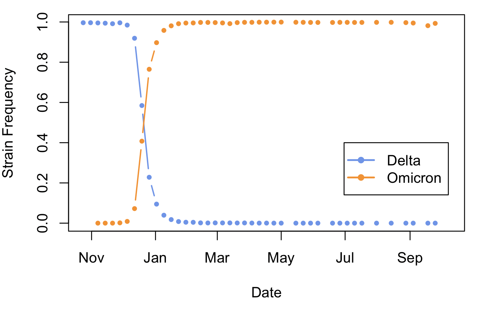
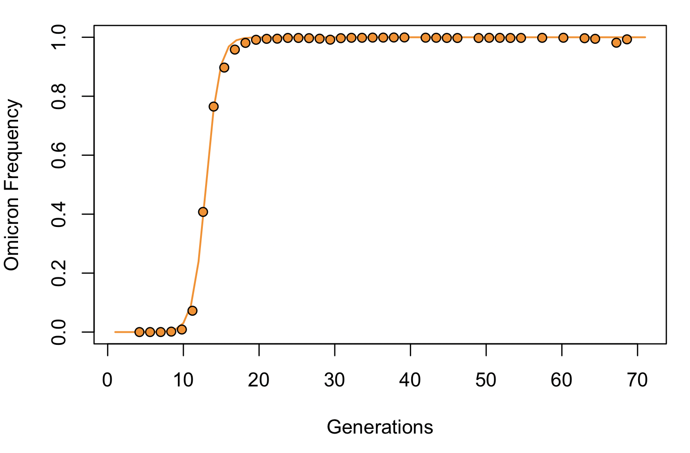

Estimating Selection coefficients from genotype frequency time series
====================
Selection coefficients (usually denoted as $s$) describe the extent to which selection deviates allele frequencies from a given neutral model (e.g. Hardy-Weinberg or Wright-Fisher). As such, they are a very useful tool to gain insight on the strenth of selection experienced by genotypes (and the phenotypes that they code for) in a given environment. In  class we have derived multiple mathematical expressions for the allele frequency change over time and $s$. Today we will be looking at a common way to estimate $s$ from time-series data of genotype frequencies using these equations. In general, our approach will consist on fitting models of allele frequency change to data in order to find the best-fitting values of $s$. We will be working in R, using the packages `minpack.lm`.

## Selection coefficients from haploid allele frequencies: The Omicron takeover

At the end of 2021 and beginning of 2022 the Delta variant of the SARS-Cov2 virus was the most prevalent strain worldwide. Around that time a new lineage named Omicron was first detected, and very quickly took over Delta and all other lineages, to the point where the overwhelming majority of viral strains recovered currently by surveilance efforts belong to the Omicron lineage. This fast takeover suggests that Omicron had a strong selective advantage over Delta. Our goal here will be to estimate the selective coefficient associated to Omicron's takeover.  
<br><br>
The data we will be using was downloaded this week grom the Global Initiative on Sharing Avian Influenza Data (GISAID), a repository that compiles and maintains surveilance data on several infectious diseases. Download it from Canvas and read it into R. 

```R
covidFreqs=read.table("DeltaOmicron.tsv",  h=T)
```
This table contains the number of patients infected with the Delta and Omicron strains in the US for each week between December of 2019 and October of 2022, as well as the total number of cases reported for which the SARS-Cov2 strain was known. To make these data useable for population genetic model fitting we first need to make a few adjustments, namely converting dates to a format that R recognizes as dates (instead of character strings), and calculating the strain frequencies

```R
# Tell R that the "Dates" column contains dates
covidFreqs$Date=as.Date(covidFreqs$Date, format="%Y-%m-%d")

##Get strain frequencies
covidFreqs$DeltaFreq=covidFreqs$Delta/covidFreqs$TotalCases
covidFreqs$OmicronFreq=covidFreqs$Omicron/covidFreqs$TotalCases
```
Now that the data are formatted lets visualize them
```R
# Plot Delta
plot(covidFreqs$Date, covidFreqs$DeltaFreq, type="b", xlab="Date", ylab="Strain Frequency", lwd=1.5, col="cornflowerblue", pch=16, cex=0.75)

#Add Omicron
points(covidFreqs$Date, covidFreqs$OmicronFreq, type="b", lwd=1.5, col="darkorange", pch=16, cex=0.75)

#Add Legend
legend(as.Date("2019-12-10"),1, c("Delta","Omicron"), col=c("cornflowerblue","darkorange"), lwd=2, pch=16)
```


The data clearly show the fluctuating cycles typical of viral strain evolution. The fact that Delta increased rapidly and then decreased implies that its selection coefficient has changed over time, being initially positive as the strain rose in frequency and negative as it declined. Since the models we have considered assume $s$ stays constant over time, and we are mainly interested in the replacement of Delta by Omicron, we need to crop our dataset so that it only includes a relevant time window. 

```R
# Create a new table with only the data collected after Oct. 15, 2021. 
covidFreqs_crop=covidFreqs[covidFreqs$Date>as.Date("2021-10-15"),]

# Plot new range
plot(covidFreqs_crop$Date, covidFreqs_crop$DeltaFreq, type="b", xlab="Date", ylab="Strain Frequency", lwd=1.5, col="cornflowerblue", pch=16, cex=0.75)
points(covidFreqs_crop$Date, covidFreqs_crop$OmicronFreq, type="b", lwd=1.5, col="darkorange", pch=16, cex=0.75)
legend(as.Date("2022-06-30"),0.4, c("Delta","Omicron"), col=c("cornflowerblue","darkorange"), lwd=2, pch=16)
```


Do the data in this new range seem appropriate to analyze with the models we covered in class? Think about why (or why not) for a moment.
<br><br>
Before we estimate $s$ we need to re-express our time axis so that it starts (ie. has a value of 0) close to the benining of our focal time window, and we need to convert it from days to generations. Recently Hart and collaborators ([2022](https://doi.org/10.1016/S1473-3099(22)00001-9)) estimated the generation time for SARS-Cov2 strains Alpha and Delta to be 5.5 and 4.7 days. Since we don't have a specific estimate for Omicron, 5 days per generation seems like a sensible assumption.<br>
<br>
What does the generation time mean for a virus?
<details>
<summary> Click here to see the answer</summary>
<br>
In viruses, the generation time can be seen as the time between someone getting infected and pasing the virus to another person. 
</details>

```R
#Create a new column with the dates converted to number of days after Oct 24
covidFreqs_crop$DateNumeric=covidFreqs_crop$Date-covidFreqs_crop$Date[1]

## Now transform that to number of generations assuming tGen = 5 days

genT=5
covidFreqs_crop$DateGen=as.numeric(covidFreqs_crop$DateNumeric/genT)
```
Now it is finally time to estimate $s$. To do so, we will use non-linear least squares to fit the expression for the expected allele frequency under Hardy-Weinberg given initial frequency $p(0)$ and selection coefficient $s$. 
$$p(t)=\frac{p(0)}{p(0)+(1-s)^t(1-p0)}$$

Run the code below.
```R
covFit=nlsLM(OmicronFreq~p0/(p0+((1-s)^DateGen)*(1-p0)), data=covidFreqs_crop, start=list(p0=1e-5, s=0.01), trace=T)
```
Did everything go as expected? You have likely gotten a warning from R, stating that the algorithm ran for the pre-extablished maximum number of generations. This is not ideal, as it raises the possibility that our algorithm didn'd find parameter values that fit the model appropriately, but rather just ran for a pre-specified maximum ammount of iterations and stopped. Since computational time is not an issue here, it is advisable that we run the algorithm for longer. To do so, we can specify a higher maximum number of iterations. 
```R
covFit=nlsLM(OmicronFreq~p0/(p0+((1-s)^DateGen)*(1-p0)), data=covidFreqs_crop, start=list(p0=1e-5, s=0.01), trace=T, control=list(maxiter=500))
```
OK, the model seems to have converged this time. Lets take a look at the estimated parameters. 
```R
covFit

# Nonlinear regression model
#  model: OmicronFreq ~ p0/(p0 + ((1 - s)^DateGen) * (1 - p0))
#   data: covidFreqs_crop
#       p0         s 
#  3.238e-07 6.829e-01 
# residual sum-of-squares: 0.006012

# Number of iterations to convergence: 57 
# Achieved convergence tolerance: 1.49e-08
```
The morel estimated an initial allele frequency of $3x10^-7$, and a selection coefficient of 0.6829. This is an incredibly high coefficient. Recall from lecture that we were using $s-0.1$ in examples of strong positive selection. Maybe this explains how Omicron took over the world in a few weeks! Now, before buying into our results, we should visualize how well the model with our estimated parameters fits the data. 
```R
#First Get the expected genotype frequencies under the model

#Create vector with the number of generations
gen=1:max(covidFreqs_crop$DateGen)

#Extract parameter estimates from model
p0_exp=coef(covFit)[1]
s_exp=coef(covFit)[2]

#Use parameters to calculate expected allele frequencies under the model
exp=p0_exp/(p0_exp+((1-s_exp)^gen)*(1-p0_exp))
```

Great fit! It looks like even with our very simple model that assumed no mutation and infinite population size fits the data pretty well! 

<!---## Estimating Selection Coefficients in Diploids
Haploid genomes are very ameanable for popualtion genetic modelling, since having a single copy of each locus simplifies things quite a bit. Diploidy is, however, widespread in nature, so we will now use a similar strategy as above to estimate $s$ in a diploid system. We will be considering data of the peppered moth, <i>Biston betularia</i>, which is a moth that exhibits two different color morphs, consisting of individuals with light grey and very dark grey winds and body. 


This color morph is controlled by a single locus, and 
-->
