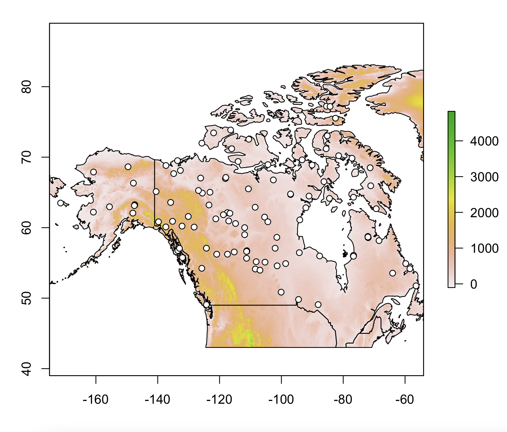
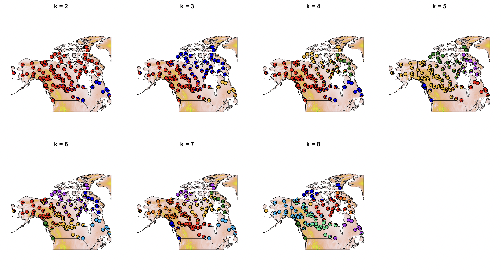

Visualizing Genetic Structure in Space
============

Visualizing the distribution of genetic variation across geography is a powerful tool in studies of biogeogprahy and historical demography. Today we will be using a several approaches to quantify and visualize patterns of both discrete and continuous population structure in relation to geogprahy, which vary in the degree to which they explicitly consider geography in their estimation of demographic parameters. 

## The Data

For today's practical we will be analyzing data obtained from gray wolves across Canada and Alaska by Schweizer et al ([2016](https://onlinelibrary.wiley.com/doi/10.1111/mec.13364)). The authors used a SNP array (i.e. chip) designed for dogs to genotype 111 wolves at roughly 42,000 SNPs.<br><br>

<br><br>

Please download the following files to Canvas to your computer (make sure you save them in an appropriate folder), and upload them to `greatlakes`: `nacanids_111indiv_unrel_noYNP_42Ksnps.tfam`, `nacanids_111indiv_unrel_noYNP_42Ksnps.tped`,	`wolves.outer`, and `wolves.coord`  (<b>hint:</b> you can upload multiple files with similar names using the <i>wildcard</i> character `*`, for example `scp nacanids_111indiv_unrel_noYNP_42Ksnps.* marquezr@greatlakes....`). We will be toggling between our local machine and the cluster today, in order to levererage the cluster's compute power, and the ability to see plots as they are produced on each of our local machines.<br><br>

Before we start, you may need to install some of the following R packages locally on your computer: `conStruct, rcpp, RcppEigen, raster, rgeos, sp, rworldmap`. In addition, you will need to install `conStruct` on `greatlakes`. Please take a minute to install packages as needed.<br><br>

Lets now explore our dataset a little. To begin, plot the collection localities on a map of North America. Use R locally on your computer. For this we will need the file called `wolves.coord`, which contains the coordinate for each one of our samples. 

```R
library(raster)
library(rworldmap)

## Download elevation and coastline/border data
altitude=getData('worldclim', var='alt', res=2.5)
map=getMap(resolution="low")

## crop the data to only include the area of interest: latitudes between 43 and 85 and longitudes between -54 and -175. 
northNA=extent(-175, -54, 43, 85)
altitude_crop=crop(altitude,northNA)
map_crop=crop(map,northNA) ##May throw a warning but seems to work fine regardless

## Load the sampling coordinates
coords=read.table("wolves.coord")
colnames(coords)=c("Lon","Lat")

## Plot the elevation layer
plot(altitude_crop, xlim=northNA[1:2], ylim=northNA[3:4])

## Plot the coastline and borders
plot(map_crop, lwd=1, add=T, xlim=c(-175,-54), ylim=c(43,80))

## Plot the samples
points(coords, pch=21, bg="white")
```
From the map we can see that the sampling was pretty consistent across northern North America, which means we will probably not have artifacts associated to uneven sampling. 



## Admixture proportions on a map

A commonly used way to visualize genetic structure on a map is to estimate admixture proportions and plotting them as pie chars at each collection locality. Since the data were obtained using a SNP array (instead of sequencing), we can't use `ngsAdmix` as we did perviously, since we cannot estimate genotype likelihoods. Instead, we will use [Admixture](https://dalexander.github.io/admixture/index.html), which implements the same model and also optimizes it using maximum likelihood, but assumes genotypes are known. Log into `greatlakes` and start an interactive job with 8Gb and one processor. Then load the follwing modules: `Bioinformatics plink/1.9 clang gcc intel eigen boost`, and define the following variable:<br>

```software_dir=/scratch/eeb401s002w24_class_root/eeb401s002w24_class/shared_data/software```
<br><br>
<b>Question 1:</b> Why can't we estimate genotype likelihoods from SNP array data?

The data provided by Schweizer et al are in a commonly used format for SNP arrays (and also genotypes called from sequencing data) called `plink` after the program it was designed for. The files are `nacanids_111indiv_unrel_noYNP_42Ksnps.tfam` and `nacanids_111indiv_unrel_noYNP_42Ksnps.tped`. Lets take a look inside:

```bash
head nacanids_111indiv_unrel_noYNP_42Ksnps.tped 

1 chr1.3398480 0 3398480 2 2 2 2 2 2 2 2 2 2 2 2 2 2 2 2 2 2 2 2 2 2 N N 2 2 2 2 2 2 2 2 2 2 2 2 2 2 2 2 2 2 2 2 2 2 2 2 2 2 2 2 2 2 2 2 2 2 2 2 2 2 2 2 2 2 2 2 N N 2 2 2 2 2 2 2 2 2 2 2 2 2 2 2 2 2 2 2 2 2 2 2 2 2 2 N N 2 2 2 2 2 2 2 2 N N 2 2 2 2 2 2 2 2 2 2 2 2 2 2 2 2 N N 2 2 2 2 2 2 1 2 2 2 2 2 2 2 2 2 1 1 2 2 1 2 2 2 2 2 2 2 2 2 2 2 2 2 2 2 2 2 2 2 2 2 2 2 2 2 N N 2 2 2 2 2 2 2 2 2 2 2 2 2 2 2 2 2 2 2 2 2 2 2 2 2 2 2 2 2 2 2 2 1 2 2 2 2 2 2 2 2 2 2 2 2 2 2 2
1 chr1.3453895 0 3453895 2 2 2 2 2 2 2 2 2 2 2 2 2 2 2 2 2 2 2 2 2 2 2 2 2 2 2 2 2 2 2 2 2 2 2 2 2 2 2 2 2 2 2 2 2 2 2 2 2 2 2 2 2 2 2 2 2 2 2 2 2 2 2 2 2 2 2 2 2 2 2 2 2 2 2 2 2 2 2 2 2 2 2 2 2 2 2 2 2 2 2 2 2 2 2 2 2 2 2 2 2 2 2 2 2 2 2 2 2 2 2 2 2 2 2 2 N N 2 2 2 2 2 2 2 2 2 2 2 2 2 2 2 2 2 2 2 2 2 2 2 2 2 2 2 2 2 2 2 2 2 2 2 2 2 2 2 2 2 2 2 2 2 2 2 2 2 2 2 2 2 2 2 2 2 2 2 2 2 2 2 2 2 2 2 2 2 2 2 2 2 2 2 2 2 2 2 2 2 2 2 2 2 2 2 2 2 2 2 2 2 2 2 2 2 2 2 2 2 2 2 2
1 chr1.3649882 0 3649882 N N 2 2 N N N N 2 2 2 2 2 2 2 2 2 2 2 2 2 2 1 2 2 2 2 2 2 2 2 2 2 2 2 2 2 2 2 2 2 2 N N N N 2 2 2 2 2 2 2 2 N N N N N N 2 2 N N N N 2 2 N N 2 2 2 2 2 2 2 2 2 2 2 2 2 2 2 2 2 2 2 2 2 2 2 2 2 2 2 2 2 2 2 2 2 2 2 2 2 2 2 2 2 2 2 2 2 2 2 2 2 2 2 2 2 2 1 2 2 2 2 2 2 2 1 2 2 2 2 2 2 2 2 2 1 1 2 2 1 2 2 2 2 2 2 2 2 2 2 2 2 2 2 2 2 2 2 2 2 2 2 2 2 2 2 2 2 2 2 2 2 2 2 2 2 2 2 2 2 2 2 2 2 2 2 2 2 2 2 2 2 2 2 2 2 2 2 2 1 2 N N 2 2 2 2 2 2 2 2 2 2 2 2
1 chr1.3691446 0 3691446 2 2 2 2 2 2 2 2 2 2 2 2 2 2 2 2 2 2 2 2 2 2 1 2 2 2 2 2 2 2 2 2 2 2 2 2 2 2 2 2 2 2 2 2 2 2 2 2 2 2 2 2 2 2 2 2 2 2 2 2 2 2 2 2 2 2 2 2 2 2 2 2 2 2 2 2 2 2 2 2 2 2 2 2 2 2 2 2 2 2 2 2 2 2 2 2 2 2 2 2 2 2 N N 2 2 2 2 2 2 2 2 2 2 2 2 2 2 2 2 2 2 2 2 1 2 2 2 2 2 2 2 1 2 2 2 2 2 2 2 2 2 1 1 2 2 1 2 2 2 2 2 2 2 2 2 2 2 2 2 2 2 2 2 2 2 2 2 2 2 2 2 2 2 2 2 2 2 2 2 2 2 2 2 2 2 2 2 2 2 2 2 2 2 2 2 2 2 2 2 2 2 2 2 2 2 1 2 2 2 2 2 2 2 2 2 2 2 2 2 2 2
1 chr1.3713883 0 3713883 2 2 2 2 2 2 2 2 2 2 2 2 2 2 2 2 2 2 2 2 2 2 1 2 2 2 2 2 2 2 2 2 2 2 2 2 2 2 2 2 2 2 2 2 2 2 2 2 2 2 2 2 2 2 2 2 2 2 2 2 2 2 2 2 2 2 2 2 2 2 2 2 2 2 2 2 2 2 2 2 2 2 2 2 2 2 2 2 2 2 2 2 2 2 2 2 2 2 2 2 2 2 2 2 2 2 2 2 2 2 2 2 2 2 2 2 2 2 2 2 2 2 2 2 1 2 2 2 2 2 2 2 1 2 2 2 2 2 2 2 2 2 1 1 2 2 1 2 2 2 2 2 2 2 2 2 2 2 2 2 2 2 2 2 2 2 2 2 2 2 2 2 2 2 2 2 2 2 2 2 2 2 2 2 2 2 2 2 2 2 2 2 2 2 2 2 2 2 2 2 2 2 2 2 2 2 1 2 2 2 2 2 2 2 2 2 2 2 2 2 2 2
1 chr1.3891091 0 3891091 N N N N 2 2 2 2 2 2 2 2 2 2 2 2 2 2 2 2 2 2 2 2 2 2 2 2 2 2 2 2 2 2 1 2 2 2 2 2 N N 2 2 1 2 2 2 2 2 2 2 2 2 N N 2 2 1 2 2 2 2 2 2 2 1 2 2 2 2 2 2 2 2 2 2 2 1 2 2 2 2 2 1 2 2 2 2 2 2 2 2 2 2 2 2 2 1 2 2 2 2 2 2 2 N N 2 2 2 2 2 2 2 2 2 2 2 2 2 2 2 2 1 2 2 2 2 2 2 2 1 2 2 2 2 2 2 2 2 2 1 1 2 2 1 2 2 2 2 2 2 2 2 2 2 2 2 2 2 2 2 2 2 2 2 2 2 2 2 2 1 2 2 2 2 2 2 2 2 2 2 2 2 2 2 2 2 2 2 2 2 2 2 2 2 2 2 2 2 2 2 2 2 2 2 2 2 2 2 2 2 2 2 2 2 2 2 2 2 2
1 chr1.3897610 0 3897610 2 2 2 2 2 2 2 2 2 2 2 2 2 2 2 2 2 2 2 2 2 2 2 2 2 2 2 2 2 2 2 2 2 2 2 2 2 2 2 2 2 2 2 2 2 2 2 2 2 2 2 2 2 2 2 2 2 2 2 2 2 2 2 2 2 2 2 2 2 2 2 2 2 2 2 2 2 2 2 2 2 2 2 2 2 2 2 2 2 2 2 2 2 2 2 2 2 2 2 2 2 2 2 2 2 2 2 2 2 2 2 2 2 2 2 2 2 2 2 2 2 2 2 2 2 2 2 2 2 2 2 2 2 2 2 2 2 2 2 2 2 2 2 2 2 2 2 2 2 2 2 2 2 2 2 2 2 2 2 2 2 2 2 2 2 2 2 2 2 2 2 2 2 2 2 2 2 2 2 2 2 2 2 2 2 2 2 2 2 2 2 2 2 2 2 2 2 2 2 2 2 2 2 2 2 2 2 2 2 2 2 2 2 2 2 2 2 2 2 2 2 2
1 chr1.3923133 0 3923133 1 2 1 2 2 2 2 2 2 2 2 2 2 2 2 2 2 2 2 2 2 2 2 2 2 2 2 2 2 2 2 2 2 2 1 2 2 2 2 2 2 2 2 2 1 2 2 2 2 2 2 2 2 2 1 2 2 2 1 2 2 2 2 2 2 2 1 2 2 2 2 2 2 2 2 2 2 2 1 2 2 2 2 2 1 2 2 2 2 2 2 2 2 2 2 2 2 2 1 2 2 2 2 2 2 2 1 2 2 2 2 2 2 2 2 2 2 2 2 2 2 2 2 2 1 2 2 2 2 2 2 2 1 2 2 2 2 2 2 2 2 2 1 1 2 2 1 2 2 2 2 2 2 2 2 2 2 2 2 2 2 2 2 2 2 2 2 2 2 2 2 2 1 2 2 2 2 2 2 2 2 2 2 2 2 2 2 2 2 2 2 2 2 2 2 2 2 2 2 2 2 2 2 2 2 2 2 2 2 2 2 2 2 2 2 2 2 2 2 2 2 2
1 chr1.3923407 0 3923407 2 2 2 2 2 2 2 2 2 2 2 2 2 2 2 2 2 2 2 2 2 2 2 2 2 2 2 2 2 2 2 2 2 2 2 2 2 2 2 2 2 2 2 2 2 2 2 2 2 2 2 2 2 2 2 2 2 2 2 2 2 2 2 2 2 2 2 2 2 2 2 2 2 2 2 2 2 2 2 2 2 2 2 2 2 2 2 2 2 2 2 2 2 2 2 2 2 2 2 2 2 2 2 2 2 2 2 2 2 2 2 2 2 2 2 2 2 2 2 2 2 2 2 2 2 2 2 2 2 2 2 2 2 2 2 2 2 2 2 2 2 2 2 2 2 2 2 2 2 2 2 2 2 2 2 2 2 2 2 2 2 2 2 2 2 2 2 2 2 2 2 2 2 2 2 2 2 2 2 2 2 2 2 2 2 2 2 2 2 2 2 2 2 2 2 2 2 2 2 2 2 2 2 2 2 2 2 2 2 2 2 2 2 2 2 2 2 2 2 2 2 2
1 chr1.3999542 0 3999542 2 2 2 2 2 2 2 2 2 2 2 2 2 2 2 2 2 2 2 2 2 2 2 2 2 2 2 2 2 2 2 2 2 2 2 2 2 2 2 2 N N 2 2 2 2 2 2 2 2 2 2 2 2 2 2 2 2 2 2 2 2 2 2 2 2 2 2 2 2 2 2 2 2 2 2 2 2 2 2 2 2 2 2 2 2 2 2 2 2 2 2 2 2 2 2 2 2 2 2 2 2 2 2 2 2 2 2 2 2 2 2 2 2 2 2 2 2 2 2 2 2 2 2 2 2 2 2 2 2 2 2 2 2 2 2 2 2 2 2 2 2 2 2 2 2 2 2 2 2 2 2 2 2 2 2 2 2 2 2 2 2 2 2 2 2 2 2 2 2 2 2 2 2 2 2 2 2 2 2 2 2 2 2 2 2 2 2 2 2 2 2 2 2 2 2 2 2 2 2 2 2 2 2 2 2 2 2 2 2 2 2 2 2 2 2 2 2 2 2 2 2

head nacanids_111indiv_unrel_noYNP_42Ksnps.tfam 

11226.CEL 11226.CEL 0 0 0 -9
11228.CEL 11228.CEL 0 0 0 -9
11232_CLU_NQUE-I 11232_CLU_NQUE-I 0 0 0 -9
11234_CLU_NQUE-I 11234_CLU_NQUE-I 0 0 0 -9
2042_CLU_CANADA-FBG 2042_CLU_CANADA-FBG 0 0 0 -9
2043_CLU_CANADA-FG 2043_CLU_CANADA-FG 0 0 0 -9
2048_CLU_CANADA-FW 2048_CLU_CANADA-FW 0 0 0 -9
2049_CLU_CANADA-FW 2049_CLU_CANADA-FW 0 0 0 -9
2052_CLU_CANADA-FW 2052_CLU_CANADA-FW 0 0 0 -9
2056_CLU_CANADA-FG 2056_CLU_CANADA-FG 0 0 0 -9
```

As you can see, the `.tfam` file contains sample names, while `.tped` contains genotypes. Each line contains the genotypes at one SNP, and there are two entries per sample (222 total).<br><br> 

<b>Question 2:</b> Can you guess how the different alleles and missing genotypes are encoded?<br><br> 

`Admixture` reads a slightly different version of this format, so we first need to convert our files to the appropriate format. We will also take the oportunity to do some filtering. Alleles that ocurr at low frequencies or are genotyped for a small subset of the samples are known to cause problems with admixture proportion estimation, so we will retain only sites genotyped at >75% of individuals, with allele frequencies greater than 0.05. In addition, we will only keep SNPs that are at least 10,000bp away from each other, since `Admixture` and `eems` (which we will use later) assume unlinked sites. 

```bash
plink --tfile nacanids_111indiv_unrel_noYNP_42Ksnps --dog --missing-genotype N --biallelic-only --geno 0.25 --maf 0.05 --bp-space 10000 --make-bed --out wolves_0.25mis_thinned
```
<b>Question 3a:</b>Can you match the filters to the flags passed to `plink`? 
<b>Question 3b:</b>Out of the ~42,000 sites genotyped, how many were retained after filtering? Write this down. You'll need it later.<br><br>

Now that we have our file in the adequate format, we can run `Admixture`. It takes two arguments, the fenotype file, and the number of hypothetical ancestral populations from which our samples descend (i.e. $k$). 

```bash
"$software_dir"/admixture_linux-1.3.0/admixture wolves_0.25mis_thinned.bed 2
```

The above code runs `Admixture` for $k=2$. Considering our dataset contains samples covering a very large extent of land and many possible barriers to gene flow (e.g. the Rocky Mountains, Hudson Bay, etc...), we may want to look at a wider range of values of $k$. We can use a loop to estimate admixture proportions assuming $k=2-8$. In the interest of time we will only run each value of $k$ once but, as usual, it is advisable to run optimization algorithms multiple times to make sure that they consistently arrive at the same solution.

```bash 
for i in {2..8}; do "$software_dir"/admixture_linux-1.3.0/admixture wolves_0.25mis_thinned.bed $i; done
```
<b>Question 4:</b> Briefly explain what the loop above is doing.

 This should result in eight sets of two files, named ` wolves_0.25mis_thinned.k.Q` and ` wolves_0.25mis_thinned.k.P`, which contain the admixture proportions for each individual and the allele frequencies at each of the $k$ hypothetical populations, respectively. Download the admixture proportion files to your computer to plot them in R. <br><br>
 
Instead of the barplots that we have plotted in the past, this time we will plot pie charts with admixture proportions at each one of the sampling localities. Lets begin by plotting the results for $k=2$
 
 ```R
 ## If you closed your session re-load the packages and create the elevation and coastline/border objects again
 
 library(conStruct)

## Read in admixture proportions
q2=read.table("wolves_0.25mis_thinned.2.Q")

## Plot the map
plot(altitude_crop, xlim=northNA[1:2], ylim=northNA[3:4])
plot(map_crop, lwd=1, add=T, xlim=c(-175,-54), ylim=c(43,80))

## Add the pies. This is kind of slow for some reason
make.admix.pie.plot(admix.proportions = as.matrix(q2), coords = as.matrix(coords), add=T, radii=1.5)
```
What can you say from these results? How does genetic variation seem to be structured in this system?<br><br>

<b>Question 5:</b>Use the code above to plot the results for other values of $k$, and include your plot in the report. What do you see as the number of clusters increases? 
<!--
<details> <summary> Click here to see the plot</summary>
  
</details>
--->

## PCA with a map

Principal component analysis is one of the most widely used ways to visualize genetic structure in a sample. Although we can't directly plot PC axes on a map, since they are not in units of longitude/latitude degrees, wa can take advantage of point colorinch schemes to connect our sampling coordinates to our PC plot (or any other plot for that matter). 

## Estimating Effective Migration Surfaces

We can already say a few things about the geographic distrubtuion of genetic structure based on plotting admixture proportions on the map. However, population gentic theory lets us go further, and actually estimate parameters that explicitly incorporate geography. For example, `EEMS` uses genetic distances and sample coordinates to estimate <i> effective migration surfaces </i>, which can be seen as maps of gene flow, wehre we can identify areas of the map that may be allowing more or less migration than others. To run `EEMS` we need two things: A matrix of genetic distances, and the coordinates of our samples. We already have coordinates. To generate genetic distance matrix we can use the program `bed2diffs`, which is distributed with `EEMS`. All this program does is, for each pair of samples ($i$ and $j$) calculate the average genetic distance, $D_{ij}$ defined as

$$Dij = \frac{1}{N_{ij}} \sum_{m=1}^{N_{ij}} (p_{i_m} - p_{j_m})^2$$

Where $N_{ij}$ is the number of sites with data for both samples, and $p_{i_m}$ and $p_{j_m}$ are the allele frequencies of each population at site $m$. Conveniently, `bed2diffs` takes plink-formatted files as input. 

```bash
"$software_dir"/eems/bed2diffs/src/bed2diffs_v1 --bfile wolves_0.25mis_thinned
```
Now we're almost ready to run `EEMS`, we just need to do a bit of housekeeping. First, `EEMS` needs the coordinate and genetic distance files to have the same name (but different file extensions. Our files have different names,`wolves.coord`and `wolves_0.25mis_thinned.diffs`. Let's fix that. 

```bash
cp wolves_0.25mis_thinned.diffs wolves.diffs
```

Second, we need to set some boundaries for `EEMS`. Estimate effective migration across the whole world is effectively impossible, so we need to give `EEMS` an area within which to estimate migration. We do this by passing the coordinates for a polygon that encloses our focal area. These can be found in the file called `wolves.outer`. To understand a little better what this polygon looks like, lets quickly plot it on our map (locally in R).

```R
# Read in the polygon
outer=read.table("wolvesadmix.outer")

# Plot the map as aobve
plot(altitude_crop, xlim=northNA[1:2], ylim=northNA[3:4])
plot(map_crop, lwd=1, add=T, xlim=c(-175,-54), ylim=c(43,80))

# Add samples
points(coords, pch=21, bg="white")

# Add polygon
points(outer, type="l", lty=2, lwd=2, col="magenta")
```

Finally, we need to write a configuration file, which gives `EEMS` all the information it needs to run the analysis. On the terminal (in the cluster) type `nano eems.config`. This will open a blank file in lightweight text editor. Add the following lines to your file, modifying it as appropriate for your own workspace. 

```
datapath = ./wolves 
mcmcpath = ./eems_mcmc
nIndiv = 111
nSites = 23902
nDemes = 300
diploid = true
numMCMCIter = 7500000
numBurnIter = 2500000
numThinIter = 9999
```

Can you tell what most of these arguments do? You may have noticed that the `mcmcpath` line points to a folder that doesn't exist yet. The code below creates it and runs `EEMS`. 

```bash 
mkdir eems_mcmc
"$software_dir"/eems/runeems_snps/src/runeems_snps --params eems.config
```

You should se the MCMC begin to run. Unfortunately, `EEMS` takes some time to run long enough MCMC for chains to propperly optimize the model. In view of this, we can use results from a previous `EEMS` run. Download the `eems_mcmc.zip` from Canvas to your computer for plotting and extract its contents. You will also need to install the `rEEMSplots` package, which is distributedwith `EEMS` as well. To avoid having to install all of `EEMS` into your computer, you can download and extract rEEMSplots.zip from Canvas. Once you've donde this, change the R working directory to rEEMSplots using `setwd()`, and once there run the following command:

```R
install.packages("rEEMSplots", repos = NULL, type = "source")
```
After the package is installed change back the directory to where the eems_mcmc folder is, and run the following to generate the `EEMS` plots. 

```R
ibrary(rEEMSplots)
library(rworldmap)
library(rworldxtra)

## Set up the map projections to be used. This is especially important in our case since we are working close to the north pole, which is a difficult part of the world to project to a 2D flat image. 

projection_none="+proj=longlat +datum=WGS84" 
projection_mercator="+proj=merc +datum=WGS84"

## Generate eems figures, including the grid, the deme locations outer polygon, and coastline/boundaries. 
eems.plots(mcmcpath="eems_mcmc",plotpath="./",longlat=T,add.demes=T,add.grid=T,add.outline=T,out.png=F, add.map=T, col.map="black", lwd.map=1, lwd.grid=0.5, min.cex.demes=0.75, max.cex.demes = 2, projection.in=projection_none, projection.out=projection_mercator)
```
This will generate a series of pdf files that will be saved in your folder. Wait here and we will discuss them as a class. 
